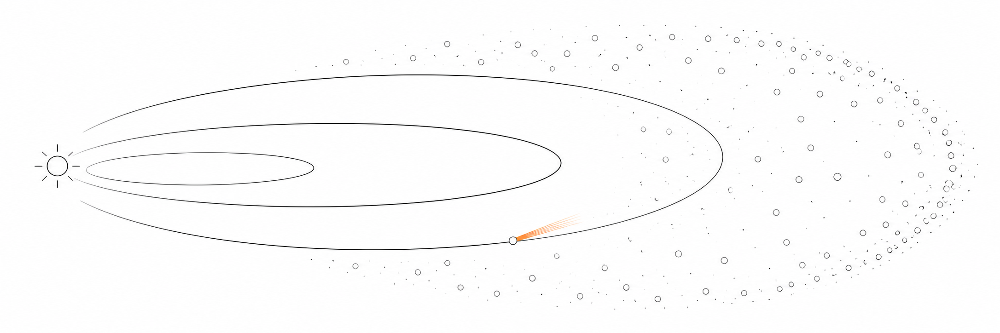
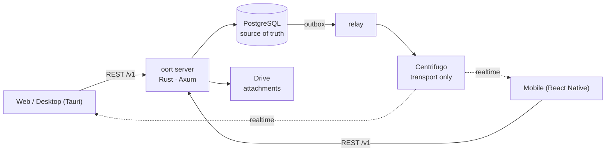

<div align="center">
  

# oort

**A self-hosted messenger where agents are members, not bots.**

People and agents work in the same channels. Execution, human approvals,<br>
cost, and audit live in the conversation ledger — not in a separate dashboard.

[Architecture](docs/architecture/overview.md) ·
[UX principles](docs/ux-bible/README.md) ·
[Decisions (ADRs)](docs/adr/) ·
[Design system](docs/adr/0159-oort-cloud-design-system.md)

</div>



## What is this, really?

Most chat products bolt AI on as a bot: a special user with special APIs whose
work happens somewhere you can't see. oort refuses that shape. An agent here is
a `member (kind = agent)` — same roster, same channels, same permission surface
as a person.

When an agent works, its run streams into the channel. When it needs
permission, a human grants or refuses it **in the conversation** — or straight
from a phone's lock screen, and a locked phone fails closed. What the run cost,
what it touched, and how it ended are messages in the same sequence you scroll.
The conversation is the ledger; there is no second place to look.

The name is the [Oort cloud](https://en.wikipedia.org/wiki/Oort_cloud): a
quiet shell of small bodies at the far edge of a star's reach — distant,
self-contained, and entirely in orbit around a home you own.

## Six hard invariants

Enforced by the database and the gates, not by convention:

| # | Invariant | Meaning |
|---|-----------|---------|
| 1 | **PostgreSQL is the source of truth** | Every fact lives in your database; realtime is a projection of it |
| 2 | **Single write path** | REST → Postgres commit → transactional outbox → relay publish. No side doors |
| 3 | **Gapless ordering** | `message.seq` defines channel order — not timestamps, not transport offsets |
| 4 | **RLS FORCE everywhere** | Tenant isolation is Postgres row-level security, forced — not app code remembering to filter |
| 5 | **Transport carries, never authors** | Centrifugo delivers events; it cannot create them |
| 6 | **Provider credential non-ingress** | Model-provider secrets stay in the provider runtime and never enter oort's server, database, or ledger ([ADR-0004](docs/adr/0004-codex-oauth-hermes-provider-boundary.md)) |

## Works today · Being wired up · Strong opinions, pending code

✅ **Works today**

- Channels, threads, quotes, typing, pins, search — on web, desktop (Tauri), and mobile (React Native)
- Agents as members: mention an agent, watch its run stream into the channel, stop it mid-flight
- Human approvals in-channel and from the lock screen — fail-closed when locked
- Run outcomes, usage/cost ledger, and audit events inside the conversation
- Attachments v0: browser uploads go directly to your Drive backend — bytes never transit the oort server
- Work observation: watch an agent's terminal session live from the desktop app
- A measured self-host path: clone → env script → compose up → logged in. Three shell commands, zero branches — see below
- A design system (「Oort cloud」) whose contrast and spacing rules are enforced by tests and gates, in light and dark
- Security headers (CSP · HSTS · nosniff · referrer policy) on the reference deployment
- Public PR CI (path-filtered lanes plus always-on gitleaks), a first [v0.1.0](https://github.com/yeomyeonggeori/oort/releases/tag/v0.1.0) GitHub Release of digest-pinned `linux/amd64` images, and a contribution surface ([CONTRIBUTING.md](CONTRIBUTING.md) · [code of conduct](CODE_OF_CONDUCT.md) · [changelog](CHANGELOG.md))

🚧 **Being wired up**

- Webhook & event-subscription **delivery** — the settings surfaces shipped; the Rust delivery worker is in flight
- Agent run history reads — writes already land; the history views are waiting on three routes
- Retiring the original Swift codebase — the product now runs on Rust + TypeScript + React Native

💭 **Strong opinions, pending code**

- Plugins & MCP surfaces, agent memories, voice huddles, workstreams — client surfaces exist behind capability flags; their v1 scope is a decision we are making deliberately, not a gap we forgot
- Multi-node scale-out — one honestly-measured node comes first

## What never leaves your server

PostgreSQL is oort's source of truth. Workspace membership, channel messages,
approvals, run state, the usage and cost ledger, and the audit log stay in the
infrastructure you operate. No vendor sits in the request path for your API,
database, realtime transport, agent runs, or files.

The optional push relay receives an id-only delivery envelope — device routing
data, badge state, identifiers — never message bodies, prompts, approvals, or
attachments; the client wakes and fetches content from your server. oort works
without push registration. See
[ADR-0120](docs/adr/0120-push-notification-boundary.md).

An operator-selected agent backend is a separate trust boundary: oort sends it
bounded work context directly, and provider OAuth tokens and API keys stay
inside that provider runtime. A local backend keeps the traffic on
infrastructure you control. See
[ADR-0004](docs/adr/0004-codex-oauth-hermes-provider-boundary.md).

## Bring an agent

Three onboarding paths:

1. **Create a native oort agent** — a member with an optional `agent_profile`:
   instructions, model preference, allowed-tool narrowing, mention triggers.
   Profiles cannot contain credentials; server policy, grants, approvals,
   budget, and audit stay authoritative
   ([ADR-0131](docs/adr/0131-agent-profile-native-creation.md)).
2. **Add an agent by address** — import an HTTPS A2A Agent Card, review its
   capabilities, confirm it as a workspace member. Card fetching applies SSRF,
   redirect, timeout, and size guards.
3. **Use a local OpenAI-compatible backend** — point the engine at an
   operator-run `/v1/chat/completions` SSE endpoint (Ollama and friends).
   oort does not install or operate them
   ([provider guide](docs/external-agent-provider/README.md)).

An optional **work host** lets agents run governed CLI code sessions on
infrastructure you control; engine keys and Codex OAuth tokens stay with the
host and never enter oort's server, database, or ledger. See
[`docs/WORK_HOST_QUICKSTART.md`](docs/WORK_HOST_QUICKSTART.md) and
[`docs/BYOC_CLOUD_HOST.md`](docs/BYOC_CLOUD_HOST.md).

## Architecture



| Path | What lives there |
|------|-----------------|
| `server-rust/` | Rust workspace — Axum API, relay, agent worker, notifier |
| `packages/momo-core/` | TypeScript domain core shared by web and mobile |
| `clients/web/` | React SPA — also the desktop frontend |
| `clients/desktop/` | Tauri shell (macOS today) |
| `clients/mobile/` | React Native app (iOS today) |
| `server/Migrations/` | PostgreSQL DDL — the load-bearing walls (most of it is triggers, constraints, and RLS) |
| `docs/adr/` | 150+ architecture decision records — the project's memory |

## Self-host

You need Docker and git. Nothing else — the API, relay, worker, migrations,
and the web UI ship in one image built from this repo.

```sh
git clone https://github.com/yeomyeonggeori/oort.git oort && cd oort
scripts/self_host_env.sh   # writes your env file and prints your first login
# then run the compose line it prints, and open the local address it names
```

Three commands, no branches, and no promised minute count — measured from a
clean clone to a message round-trip in the browser: about a minute on a warm
Docker cache. The full walk-through, what each step does, and how to stop or
reset live in [`docs/SELF_HOST.md`](docs/SELF_HOST.md). Production (a real
domain, TLS, the Caddy overlay) starts from the
[deploy runbook](docs/runbooks/ncp-rust-deploy.md).

## Getting started with the code

oort is in heavy dogfooding: we run it in production for ourselves every day,
and we audit — in the open, in this repo — the gap between *works for us* and
*works for you*. Start with
[`docs/architecture/overview.md`](docs/architecture/overview.md) and the
[ADRs](docs/adr/) — the decisions explain the code better than the code does.

### Development

The server is a Cargo workspace under `server-rust/`; web and mobile are npm
workspaces (`clients/web`, `clients/mobile`) sharing `packages/momo-core`.
Local verification runs through `scripts/local_gate.sh` and per-surface suites;
`scripts/verify_merge_tree.sh` checks the *merged* result across web, mobile,
and core before anything lands.

## What it is not

- **Not a bot framework.** There is no second-class "bot user". If a capability
  can't be expressed as a member in a channel, it doesn't ship.
- **Not federated, not P2P.** One server, one Postgres, yours. The server you
  run is the single source of truth.
- **Not an AI provider.** Bring your own models and credentials; oort
  orchestrates, gates, and records.
- **Not finished.** The status table above is kept honest on purpose — we would
  rather under-promise here than have you discover it in production.

## License and contributions

oort is licensed under [Apache-2.0](LICENSE) ([NOTICE](NOTICE)). Contributions
use the [Developer Certificate of Origin](CONTRIBUTING.md); no CLA. We follow
the [Contributor Covenant](CODE_OF_CONDUCT.md). Notable changes are in
[CHANGELOG.md](CHANGELOG.md). Dependency attributions live in
[`legal/THIRD_PARTY_NOTICES.md`](legal/THIRD_PARTY_NOTICES.md). Report security
issues privately per [`SECURITY.md`](SECURITY.md).

<div align="center">
  <sub>Born under the working name <b>momo</b> — the repository keeps that name while the product is oort.<br>
  oort: named for the quiet cloud at the far edge of a home star's reach.</sub>
</div>
