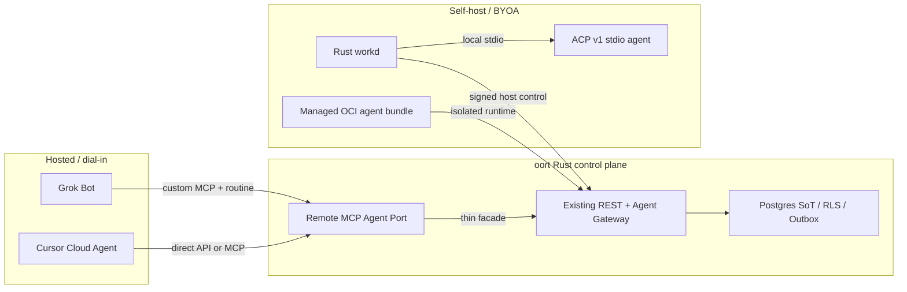

# 외부 에이전트 수용·Grok Bot·ACP·셀프호스팅 계획 감사

- 작성일: 2026-08-12 (Asia/Seoul)
- 코드 기준: `main@541ccdda714622595af308129e5a9e0962900f97`
- 범위: Grok Bot 동향, hosted-agent 수용, MCP Agent Port, ACP 재랜딩, 셀프호스트 에이전트 동봉·카탈로그·업데이트 계획
- 방법: 공식 1차 문서, GitHub 이슈/이력, 현행 Rust/Swift/infra 구현의 독립 교차검수
- 변경 경계: 본 문서는 감사 보고서다. 기존 계획·ADR·ROADMAP·GitHub Issue는 이 단계에서 수정하지 않았다.

## 1. 최종 판정

현재 초안은 방향은 유효하지만 그대로 승인·이슈화·구현하면 안 된다.

1. **Grok Bot 기회는 실재한다.** 다만 제품 포지션은 “Grok 전용 연동”보다 **Bring your hosted agent**가 맞다. Grok Bot은 첫 실증 클라이언트다.
2. **Hosted Grok Bot 수용과 ACP는 다른 계층이다.** Grok Bot은 원격 MCP를 소비하는 다이얼인 경로, ACP는 self-host/BYOA 환경에서 로컬 coding-agent 프로세스를 구동하는 stdio 경로다.
3. **ADR-0162의 Agent Port 6도구 설계는 재작성 필요다.** Rust에 현행 MCP 서버 기반이 없고, 단일 `after_seq`는 채널별 `message.seq`에 맞지 않으며, 새 task 상태기계는 기존 gateway lease/run 상태와 중복된다.
4. **ADR-0163은 카탈로그 UI보다 런타임 패키징 계약이 먼저다.** 현행 adapter들은 동일한 `adapter_image` 형상이 아니며, version heartbeat도 없다. 설치·격리·시크릿·digest·업데이트 권한을 먼저 고정해야 한다.
5. **#1343~#1345는 그대로 실행하기보다 재기술해야 한다.** 세 이슈 모두 Issue+Milestone+Project/claim 메타데이터가 미완이고, #1344의 가격/구독 전제와 #1345의 Rust 구현 전제가 틀렸다.

따라서 권장 상태는 다음과 같다.

- ADR-0162/0163: 계속 `Proposed`, 승인 요청 보류
- #1343: 사실 정정과 로드맵 재편성 이슈로 유지
- #1344: trial-first Grok Bot capability/auth 실측으로 재정의
- #1345: ACP 전체 재건이 아니라 Rust live-chain의 정확한 잔여 gap 감사·분해로 재정의
- 구현: 사실/ADR/issue metadata 정리 후 작은 spike부터 시작

## 2. 확정 사실과 현재 초안의 주요 오류

판정 표기:

- **C**: 공식 출처 또는 현행 코드로 확인
- **H**: 실계정·런타임 실측이 필요
- **M**: 현재 문서의 사실 오류 또는 과도한 단정

### 2.1 Grok Bot

| 항목 | 판정 | 감사 결과 |
|---|---:|---|
| 관심 상승 | C | 2026-08-11 출시 직후 베타 확대가 공지됐다. 다만 공식 활성 사용자·전환율 수치는 없다. |
| Bot 수 | M→C | 계정당 **Bot과 group chat 합계 최대 50**이 공식 수치다. 별도로 Bot당 routine도 최대 50이다. |
| 외부 API | C | Grok Bot ID, roster, group chat, run을 열거·호출하는 문서화된 공개 API는 찾지 못했다. “xAI API 전체가 없다”는 표현은 틀리다. |
| 구조화 접점 | C/H | Bot이 oort의 원격 custom MCP를 소비하는 역방향 연결이 가장 유력하다. 개인 Grok Bot 플랜에서의 실제 노출·인증 방식은 실계정 확인이 필요하다. |
| 구독 전제 | M | one-time trial과 team trial/on-demand 경로가 문서화돼 있다. #1344는 선결제 고정이 아니라 trial-first여야 한다. |
| 가격 | H | Cursor Ultra $200은 공식 출처가 있으나, 현재 확인된 xAI 공식 페이지로 SuperGrok Heavy $300을 고정 사실로 둘 수 없다. live checkout 실측 전 이슈 계약에 숫자를 박지 않는다. |
| 실시간성 | H | routine/event trigger가 깨우는 비동기 팀메이트다. 최소 주기와 Slack/GitHub→MCP 폐곡선은 실측 전 SLA나 런칭 카피로 쓰지 않는다. |
| 격리 | C | 한 사용자의 Bot들은 persistent computer의 파일·쿠키·브라우저 세션·CLI credential을 공유한다. oort self-host 설계의 격리 선례로 복사하면 안 된다. |

공식 근거:

- [Introducing Grok Bot](https://x.ai/news/introducing-grok-bot)
- [Grok Bot — Bots](https://docs.x.ai/grok-bot/bots)
- [Skills, routines and automations](https://docs.x.ai/grok-bot/skills-routines-and-automations)
- [Get started](https://docs.x.ai/grok-bot/get-started)
- [Teams and enterprises](https://docs.x.ai/grok-bot/teams-and-enterprises)
- [Computer and apps](https://docs.x.ai/grok-bot/computer-and-apps)
- [Approvals, security and privacy](https://docs.x.ai/grok-bot/approvals-security-and-privacy)
- [Grok connectors](https://docs.x.ai/grok/connectors)
- [Custom MCP tunneling](https://docs.x.ai/grok/connectors/custom-mcp-tunneling)

정책 경계는 공식 UI, custom MCP, routine, 공개 API로 제한한다. reverse API, credential replay, scraping, 계정 자동화는 제외한다. 이는 법률 자문이 아니며 상용 런칭 전 계약·법무 검토가 필요하다.

- [xAI Acceptable Use Policy](https://x.ai/legal/acceptable-use-policy)
- [xAI Consumer Terms](https://x.ai/legal/terms-of-service)
- [Cursor Terms](https://cursor.com/terms-of-service)

### 2.2 Cursor Cloud Agents는 Grok Bot 우회 API가 아니다

현행 Cursor Cloud Agents API v1 public beta는 초안의 “repo 중심 coding agent API”보다 넓다.

- durable agent와 follow-up run
- repository/environment를 생략한 no-repo agent
- cloud 및 self-hosted pool/machine
- remote/stdio MCP 최대 50
- custom subagent 최대 20
- SSE, artifact, usage 표면

그러나 Grok Bot ID나 group chat을 노출하지 않는다. 따라서 **Grok Bot 통합으로 포장하지 않고 별도의 직접 API 런칭 spike**로 평가해야 한다.

- [Cursor Cloud Agents API endpoints](https://cursor.com/docs/cloud-agent/api/endpoints)

### 2.3 MCP Agent Port

현 초안의 핵심 정정은 네 가지다.

1. `/v1/mcp/drive`는 현행 Rust route가 아니다. 은퇴 중인 Swift 구현과 OpenAPI/검증 스크립트에만 남아 있다. “이미 성립한 Rust MCP 기반”이 아니라 **퇴역 구현의 계약 선례**다.
2. 최신 MCP 2026-07-28은 stateless request, mandatory discovery, 새 authorization 경계를 전제로 한다. 구 Swift의 2025-06-18 `initialize` 형상을 복사하면 안 된다.
3. `message.seq`는 채널별 순번이다. 여러 채널의 mention/assignment를 한 `after_seq`로 폴링하면 충돌·skip이 생긴다. `(channel_id, seq)` cursor vector 또는 별도 durable inbox/global sequence가 필요하다.
4. `task_claim/task_complete/task_release`는 기존 Rust agent gateway의 pending/lease/renew/release/events/complete와 중복된다. MCP는 새 task SoT를 만들지 말고 기존 상태기계의 thin binding이어야 한다.

MCP Tasks는 long-running RPC 결과 handle의 표준이지 oort job queue claim 모델 그 자체가 아니다. 둘을 같은 상태기계로 간주하지 않는다.

- [MCP 2026-07-28 specification](https://modelcontextprotocol.io/specification/2026-07-28)
- [MCP authorization](https://modelcontextprotocol.io/specification/2026-07-28/basic/authorization)
- [MCP 2026-07-28 release notes](https://blog.modelcontextprotocol.io/posts/2026-07-28/)
- [MCP Tasks extension](https://modelcontextprotocol.io/extensions/tasks/overview)

### 2.4 ACP

ACP lane의 “전체 좌초/전체 재건” 전제는 틀렸다.

현행 코드에 이미 있는 것:

- `029_work_tool_profile.sql`, `034_work_tool_profile_env_policy.sql`
- Rust spawn gating 및 signed polling/terminal attach의 일부
- Swift `MomoACPHost`, stdio client, PTY, X-11 relay와 테스트
- `momo-core`/web의 work-session·ACP 관전 UI
- 기존 #600/#601/#604/#623 랜딩 이력

실제 Rust live-chain gap:

- Rust `momo-workd` binary/ACP client 부재
- Rust work-tool-profile list/admin CRUD 및 signed host projection 부재
- signed work-session create/event/lifecycle/PTY binding arms 부재
- auth/capability/cancel/close/terminal bounds를 지키는 ACP v1 client 부재
- `toolCallId/status/kind`를 잃지 않는 lossless projection과 durable approval bridge 부재

ACP stable wire는 v1이고 v2 및 remote HTTP는 draft다. production 기본은 stdio v1로 고정해야 한다. Grok Build는 현재 `grok agent stdio` ACP를 공식 지원하므로 좋은 BYOA/self-host 실증 후보지만, proprietary license이므로 permissive managed bundle에 그대로 동봉할 수 없다.

- [ACP v1 overview](https://agentclientprotocol.com/protocol/v1/overview)
- [ACP v1 transports](https://agentclientprotocol.com/protocol/v1/transports)
- [ACP v2 Draft](https://agentclientprotocol.com/protocol/v2/overview)
- [ACP registry](https://agentclientprotocol.com/get-started/registry)
- [Grok Build headless/ACP](https://docs.x.ai/build/cli/headless-scripting)

### 2.5 셀프호스트 동봉·카탈로그

ADR-0163의 제품 의도는 타당하지만 현재 adapter와 infra는 단일한 `adapter_image` 모델이 아니다.

- Rust app image는 서버·relay·agent-worker 등 여러 역할을 제공하지만 ACP workd와 모든 adapter를 포함하는 “agent host distribution”은 아니다.
- `infra/rust`는 agent-worker를 포함하지만 Rust workd를 포함하지 않는다.
- hermes는 Python plugin 성격이고, prime은 별도 container 경로가 있으며, codex-workbench는 shell/BYOA 성격이다. 모두를 같은 compose profile/image 필드로 다루면 안 된다.
- 현행 heartbeat에는 adapter/image version이 없어 “설치본 vs 최신” 비교를 자동으로 할 근거가 없다.
- #1228/#1229는 이미 닫혔다. ADR-0163의 선행 조건 표기는 stale다.

카탈로그 전에 필요한 최소 패키징 계약:

| 계약 | 최소 요구사항 |
|---|---|
| runtime kind | built-in worker / OCI sidecar / local ACP workd / remote dial-in을 구분 |
| identity | agent member, runtime host identity, provider/ACP identity를 별도 결속 |
| supply chain | immutable OCI digest, supported arch, SBOM/provenance, license/NOTICE, schema/version |
| isolation | agent별 process/container, secret namespace, filesystem/network/resource cap, no app-server Docker socket |
| credentials | provider secret은 host-local, agent별 최소 범위, revoke/audit; server DB 유입 금지 |
| lifecycle | install/health/drain/update/rollback과 호환성 계약; mutable tag 금지 |
| update authority | v0는 검증된 명령 안내, v1은 별도 최소권한 host helper; server의 Docker socket 직접 조작 금지 |

첫 self-host 목표는 “카탈로그 N개”가 아니라 **canonical agent 1종을 선택 설치→provider 연결→mention 응답→업데이트/롤백까지 닫는 vertical slice**여야 한다. catalog/latest UI는 이 패키징·version heartbeat가 실제로 생긴 뒤에 온다.

공개 배포에는 #1332 NOTICE/재배포 귀속과 사람 법무 검토가 계속 hard gate다.

## 3. 권장 제품·프로토콜 경계

경계를 다음처럼 고정하는 것이 안전하다.

- MCP: hosted/dial-in agent가 oort의 기존 대화·job 계약을 소비하는 원격 tool/data 표면
- ACP: trusted self-host workd가 로컬 agent 프로세스와 session/approval/terminal을 주고받는 stdio 표면
- Existing gateway: job/run/lease/events의 유일 SoT
- Postgres/outbox: 메시지 쓰기와 순서의 유일 SoT
- Catalog: runtime package metadata이지 agent 실행 상태의 새 SoT가 아님

## 4. 권장 로드맵 재편성안

이 표는 다음 실행 단계에서 ROADMAP/ADR/Issue에 반영할 **제안**이며 아직 정본 변경은 아니다.

### Wave R — 사실·거버넌스 수리

1. #1343 본문을 감사 결과로 교체
2. Grok research 두 문서의 사실 오류 수정
3. ADR-0162/0163을 계속 Proposed로 두고 blocker 명시
4. #1343~#1345에 assignee, labels, milestone, Project status를 부여
5. #599 등 이미 merge됐으나 열린 상태인 과거 ACP 이슈의 상태 드리프트 정리

### Wave 0 — 작은 병렬 실측

- Grok Bot trial-first custom MCP/auth/routine spike
- Cursor Cloud Agents direct-API/no-repo/MCP spike
- Grok Build ACP v1 인증 handshake 수동 smoke

각 spike는 non-production 데이터만 쓰고, 비용·계정·법무·beta 경계를 명시한다.

### Wave 1 — Agent Port foundation

1. ADR-0162 수정: MCP version/auth, cursor, gateway mapping, token authority
2. Rust MCP 2026-07-28 discovery/transport/auth/revoke/rate-limit/audit 기반
3. 기존 REST의 `thread_read/message_post` thin facade
4. durable cross-channel inbox cursor 결정·구현
5. 기존 gateway pending/lease/events/complete의 MCP binding
6. generic client 경쟁·재접속·revoke E2E
7. Grok Bot 실계정 E2E와 런칭 가이드

### Wave 2 — ACP live-chain 재랜딩

1. ADR-0130 addendum와 v1 conformance matrix
2. Rust profile CRUD/signed projection
3. signed work-session create/event/lifecycle/PTY arms
4. Rust `momo-workd`와 crash/reconcile
5. ACP v1 client의 auth/capability/cancel/close/terminal 계약
6. durable human approval와 lossless `toolCallId` relay/UI folding
7. 격리·공급망과 Goose/OpenCode/Grok Build 등 real-agent matrix
8. Rust cutover 뒤 Swift workd 퇴역

### Wave 3 — self-host agent bundle

1. runtime/package manifest 계약
2. canonical permissive agent 1종 vertical slice
3. signed catalog manifest와 installed-version heartbeat
4. v0 verified update command/rollback
5. v1 최소권한 host helper
6. 이후에만 onboarding catalog UI와 여러 agent 확장

Wave 1과 Wave 2는 구현 파일은 대부분 독립이지만 identity/token/audit 계약을 ADR 단계에서 맞춘다. Wave 3은 Wave 2의 workd와 공급망 계약을 소비한다. 현행 M1 production, #1332 법무/NOTICE, M7 release gate를 우회하지 않는다.

## 5. Issue 정리 제안

### 기존 이슈 수정

| Issue | 권장 수정 |
|---|---|
| #1343 | “두 ADR 승인 준비”가 아니라 사실 오류 정정, protocol boundary 확정, roadmap/issue split 및 governance metadata 완료 |
| #1344 | 가격/구독 선결제를 제거하고 trial-first 실계정 capability/auth spike로 변경 |
| #1345 | `work_tool_profile` 전체 부재 전제를 제거하고 Rust live-chain 잔여 gap과 ACP v1 conformance 분해로 변경 |

### 신규 이슈 후보

| 묶음 | 최소 이슈 |
|---|---|
| Agent Port | MCP foundation/auth, REST facade, durable inbox cursor, gateway binding, Grok E2E |
| Adjacent launch | Cursor Cloud Agents direct API spike |
| ACP | ADR addendum, profile/signed-session arms, Rust workd, ACP v1 client, approval/projection, isolation/test matrix, Swift retirement |
| Self-host | package manifest, canonical bundled agent E2E, catalog/version heartbeat, update helper |

각 구현 이슈는 1 issue=1 PR, 트랙 소유와 gate를 분리한다. `clients/web`/`momo-core` 변경은 engine handoff 후 UXUI/merge-tree gate로 분리한다.

## 6. 필수 수용·보안 게이트

### Hosted/MCP

- revoked/expired/wrong-audience token 즉시 거부
- cross-workspace/channel RLS와 membership 재검증
- `message_post` idempotency와 outbox atomicity
- duplicate consumer, lease expiry, renew/release 경쟁
- cursor reconnect에서 누락/중복 처리
- static bearer/OAuth 선택은 Grok 실측 후 확정

### ACP/workd

- ACP v1 version/auth/capability negotiation
- malformed/oversize NDJSON, unknown extension, cancel/close
- dynamic permission option, expiry/duplicate/late approval
- terminal output limit, signal, kill vs release, root/env escape
- daemon crash, spawn-before-ack, restart orphan/duplicate process
- interleaved `toolCallId` correlation

### Self-host bundle

- immutable digest/attestation/SBOM/license/NOTICE
- agent별 secret/filesystem/network/resource isolation
- server Docker socket 미마운트
- update intent, pull, health, drain, rollback의 fail-closed 폐곡선
- 설치 0-agent와 canonical 1-agent 모두 지원
- 실제 새 기계에서 선택→provider link→mention response 재현

## 7. 남은 불확실성과 계획 이탈

### runtime-unverified

- 개인 Grok Bot 안에서 custom MCP가 실제로 노출되는지
- 지원 인증 방식과 Cursor backend proxy의 네트워크/header 특성
- routine 최소 간격과 Slack/GitHub event trigger의 정확한 동작
- Grok Build ACP authMethods를 현행/새 Rust client가 처리하는 실왕복
- Cursor Cloud Agents no-repo agent를 oort gateway에 연결하는 실제 UX/비용
- self-host S3/실 NCP 및 공개 GHCR 공급망은 기존 런타임 미검증 경계 유지

### 기존 계획 대비 이탈

- Grok Bot API “절대 불가능” → “Bot control 공개 API 미문서화; 공식 MCP/routine 경로 실측 필요”
- bot 50 미확인 → Bot+group 합계 50 공식 확인
- 유료 계정 선결제 → trial-first
- Cursor repo-only → 별도 direct API opportunity
- Grok Build ACP 미확인 → official stdio ACP 지원
- Rust work_tool_profile 부재 → core DDL/gating 존재, CRUD/live workd arms만 잔여
- current Rust Drive MCP 존재 → retired Swift contract reference
- global `message.seq` cursor → invalid, 별도 cursor 결정 필요
- uniform adapter image/catalog → runtime-kind/package contract 선행
- #1228 선행 대기 → 이미 closed, stale dependency 제거

## 8. 다음 실행 단계

다음 단계에서는 이 보고서를 입력으로 다음 원자적 변경을 수행한다.

1. 현재 untracked planning 문서와 ADR의 사실 오류를 수정한다.
2. ROADMAP/STATUS/CURRENT_STATE/JOURNAL을 한 번에 정합화한다.
3. #1343~#1345를 재기술하고 governance metadata를 완성한다.
4. 승인 전 필요한 신규 spike/implementation 이슈를 트랙별로 생성한다.
5. 먼저 Grok trial-first spike와 문서/코드 독립 Cursor spike를 착수한다.
6. ADR 승인 뒤 Agent Port foundation, ACP delta, self-host package contract 순으로 구현한다.

본 연구 단계에서는 위 변경을 실행하지 않았다.
