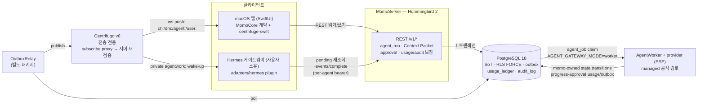
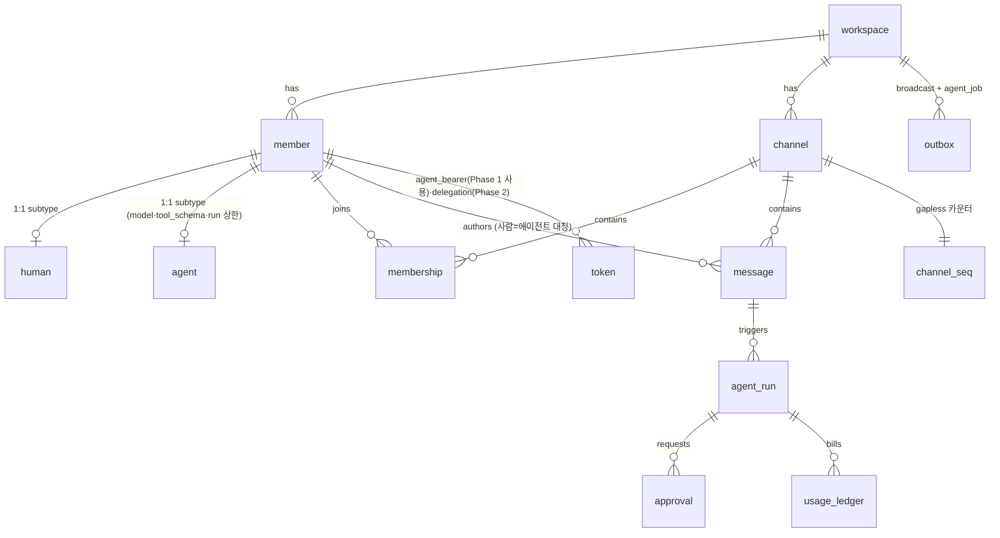

# momo 아키텍처 정본 (Overview)

> 생성: 2026-07-10 · 갱신: 2026-07-12 (ADR-0102 Option C) · 근거: 2026-07-09 6방향 코드베이스 감사 · 관리 규칙: 이 문서와 어긋나는 코드 변경은 같은 PR에서 이 문서를 갱신한다 (ADR-0100)
> 상세 진단(판정표·근거 전문)은 아티팩트 "momo 아키텍처 진단 & 빌드업 가이드 v0" 참조. 결정 이력은 `docs/adr/`.

## 제1불변식 (L4 스펙에서 승계, 여전히 유효)

1. **Postgres = 유일한 진실(SoT). Centrifugo = 전송 전용** (히스토리·권한의 원본 아님).
2. **단일 쓰기 경로**: REST → PG 커밋(메시지+seq+outbox 한 트랜잭션) → OutboxRelay → Centrifugo publish. 클라이언트·에이전트는 Centrifugo에 직접 publish하지 않는다.
3. **순서의 진실은 `message.seq`** — 채널별 gapless 카운터(`channel_seq` 행 잠금). Postgres sequence 금지(롤백 갭).
4. **에이전트는 평범한 `member`다** — 같은 REST, 같은 멱등성, 같은 RLS.
5. **테넌트 격리는 RLS FORCE** (`app.workspace_id` GUC) + 역할 분리(momo_app NOBYPASSRLS / relay·worker BYPASSRLS).
6. **provider 자격증명(Codex OAuth 등)은 momo에 절대 들어오지 않는다** (ADR-0004).

## 시스템 지도



- 로컬 알파: PG·Centrifugo만 Docker, 나머지는 호스트 프로세스 (`scripts/momo` → `scripts/local_alpha_runner.sh`).
- 에이전트 실행 경로는 역할이 분리된 **두 공식 경로**다(ADR-0102): `worker` = momo 소유 managed runtime, `gateway` = 사용자 소유 BYOA runtime. `AGENT_GATEWAY_MODE`는 전달 방식을 선택할 뿐 보장 소유권을 바꾸지 않는다.

## 에이전트 1회 응답의 수명주기 (이중 경로)

```mermaid
sequenceDiagram
    participant U as 사람 (macOS)
    participant S as MomoServer
    participant P as Postgres
    participant R as Relay/Centrifugo
    participant W as AgentWorker (managed)
    participant H as Hermes gateway

    U->>S: POST messages ("@hermes ...")
    S->>P: 한 트랜잭션: message + seq + agent_run(queued) + agent_job outbox
    alt AGENT_GATEWAY_MODE=worker (managed)
        P-->>W: durable agent_job claim
        W->>W: provider OpenAI-compatible SSE
        W->>P: momo-owned progress / approval / usage / outbox transitions
    else AGENT_GATEWAY_MODE=gateway (BYOA)
        P-->>R: relay: agent.job → private agentwork: wake-up
        R-->>H: push (신뢰 입력 아님)
        H->>S: Bearer(agent) GET /gateway/jobs/pending
        H->>S: Bearer(agent) POST /gateway/events
        H->>S: Bearer(agent) POST /gateway/complete
    end
    opt write/spend/admin tool proposal
        S->>P: approval 생성 + run awaiting_approval
        P-->>R: approval.requested
        Note over S,H: human decision 뒤 resume outbox; 두 경로 동일 상태머신
    end
    S->>P: 한 트랜잭션: agent 명의 message + usage_ledger + audit_log + run 종결 (멱등)
    P-->>R: message.new broadcast
    R-->>U: 같은 채널에 응답 표시
```

`agent:`는 공유 채널 멤버가 보는 status/partial progress만 전달하고,
Context Packet을 담은 `agentwork:`는 exact agent bearer만 구독한다. Slack 봇 대비
실질 우위는 `agent_job`이 durable outbox 행이라 at-least-once 회수 가능하고,
최종 응답·비용·감사가 원자적으로 기록된다는 점이다.
`agentwork:` publication은 DB 작업이 있다는 wake-up일 뿐 신뢰 입력이 아니다.
어댑터는 bearer-authenticated pending endpoint에서 작업을 재조회하고, connection
JWT의 `meta.token_id`와 active token 행이 일치할 때만 private stream을 구독한다.

### 서버 소유 보장 매트릭스

| 보장 | 단일 권위 | managed worker | BYOA gateway |
|---|---|---|---|
| 신원·테넌시 | agent member, workspace/channel, token scope, actor/run binding | run-bound worker job | 동일 agent의 scoped `agent_bearer` |
| Context | 서버가 grants/redaction/tool policy/budget 검사 후 bounded packet 생성 | claim payload | actor-bound pending REST payload |
| 승인 | `agent_run` + `approval` + human decision + resume outbox | worker pause/resume | approval callback/resume job (MOMO-349) |
| 비용·감사 | budget/`usage_ledger`/`audit_log` 서버 커밋 | SSE usage evidence | completion usage evidence |
| progress | 서버 검증 후 `agent:`에 status/partial publish | SSE delta | bounded callback delta (MOMO-350) |
| 순서·복구 | Postgres SoT, `message.seq`, transactional outbox | SKIP LOCKED retry | realtime wake-up + pending recovery; lease/takeover는 MOMO-341 |

MOMO-352는 같은 trigger→approval→resume→final 시나리오를 두 경로로 실행해 이 매트릭스의 동등성을 검증한다. 349/350/341/352가 열려 있는 동안 해당 gateway 셀은 Accepted ADR의 규범 계약이지 완료 evidence가 아니다.

### SD-5와 agent identity

ADR-0102는 `POST /v1/auth/realtime-token`, `GET /v1/workspaces/:ws/agents/:agent/gateway/jobs/pending`, `AGENT_GATEWAY_MODE=worker|gateway`를 Option C의 공식 API/운영 표면으로 소급 승인한다. 두 경로는 ADR-0101의 `agent_bearer`로 수렴하며 gateway callback도 actor/run binding을 강제한다.

legacy `X-Momo-Agent-Gateway-Secret`는 기본 거부(`MOMO_ALLOW_LEGACY_GATEWAY_SECRET=0`)인 이관 회귀 경로뿐이다. MOMO-349/350/341 반영 + MOMO-352 clean/root equivalence PASS 직후 별도 보안 정리에서 legacy header와 `AGENT_GATEWAY_SECRET`/flag를 제거하며, 늦어도 M7 진입 전에 끝낸다.

## 엔티티 지도 (요약)



핵심 패턴: **shared-PK 서브타입**(member←human/agent), **자기참조 DAG**(message 스레드, agent_run A2A 체인 — depth≤4·round≤4 DB CHECK), **트랜잭셔널 아웃박스**.

## 현재 판정 요약 (2026-07-09 감사)

| 영역 | 판정 | 비고 |
|---|---|---|
| 골격(불변식·스키마·쓰기경로) | ✅ 견고 | 재설계해도 같은 결론에 도달할 수준 |
| 에이전트 데이터 모델 | ✅ 1급 | Slack 봇 모델보다 앞선 설계 |
| 에이전트 신원/인증 | ✅ Phase 1 | 서버·어댑터·UI가 per-agent bearer·스코프·회전/폐기로 수렴(MOMO-337~339); legacy 물리 제거는 ADR-0102 게이트 뒤 |
| 에이전트 실행 경로 | ⚠️ Option C 구현 중 | gateway=BYOA / worker=managed 결정 완료; gateway parity와 동등성은 MOMO-349/350/341/352 |
| 존재감(프레즌스·타이핑·스트리밍) | ⚠️ 부분 | observable `agent:` status 기반은 있고 gateway partial parity는 MOMO-350; 상시 presence/heartbeat 의미는 ADR-0104 |
| 메신저 기본기(스레드UI·언리드·페이지네이션) | ❌ 미착수 | 스키마는 준비됨 → ADR-0109 |
| 한국어 검색 | ❌ 부적합 | pg_trgm은 CJK 재현율 낮음 → ADR-0105 |
| 배포 경계(CI·이미지·시크릿·TLS·백업) | ⚠️ 스켈레톤 | 전부 example/preflight 단계 → ADR-0107 |

## 결정 큐

ADR-0100(거버넌스, Accepted) → 0101(에이전트 신원, Accepted) → 0102(실행 경로 정본화, Accepted) → 0103(로드맵 정렬) → 0104(존재감 이벤트) → 0105(검색) → 0106(에이전트 정체성 네이밍) → 0107(CI 신뢰 경계) → 0108(서버 스택 지속 판정) → 0109(메신저 기본기 시퀀스)
