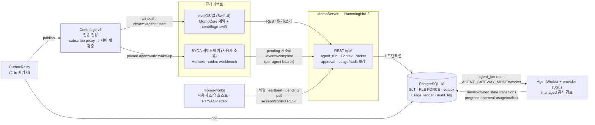
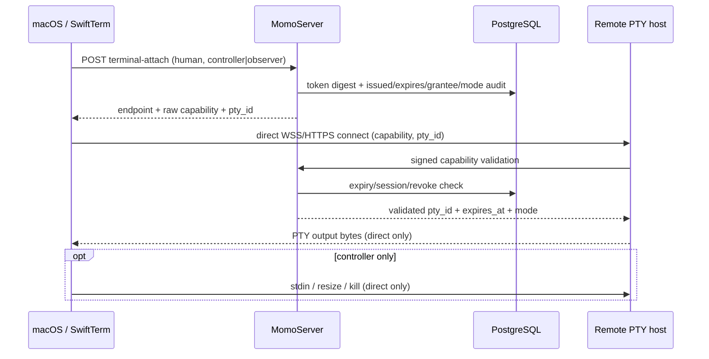
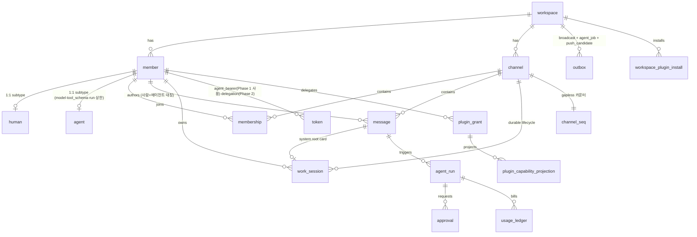

# momo 아키텍처 정본 (Overview)

> 생성: 2026-07-10 · 갱신: 2026-07-22 (MOMO-548 external memory provider consent) · 근거: 2026-07-09 6방향 코드베이스 감사 · 관리 규칙: 이 문서와 어긋나는 코드 변경은 같은 PR에서 이 문서를 갱신한다 (ADR-0100)
> 상세 진단(판정표·근거 전문)은 아티팩트 "momo 아키텍처 진단 & 빌드업 가이드 v0" 참조. 결정 이력은 `docs/adr/`.

## 제1불변식 (L4 스펙에서 승계, 여전히 유효)

1. **Postgres = 유일한 진실(SoT). Centrifugo = 전송 전용** (히스토리·권한의 원본 아님).
2. **단일 쓰기 경로**: REST → PG 커밋(메시지+seq+outbox 한 트랜잭션) → OutboxRelay → Centrifugo publish. 클라이언트·에이전트는 Centrifugo에 직접 publish하지 않는다.
3. **순서의 진실은 `message.seq`** — 채널별 gapless 카운터(`channel_seq` 행 잠금). Postgres sequence 금지(롤백 갭).
4. **에이전트는 평범한 `member`다** — 같은 REST, 같은 멱등성, 같은 RLS.
5. **테넌트 격리는 RLS FORCE** (`app.workspace_id` GUC) + 역할 분리(momo_app NOBYPASSRLS / relay·worker BYPASSRLS).
6. **provider 자격증명(Codex OAuth 등)은 momo에 절대 들어오지 않는다** (ADR-0004).

## 시스템 지도



- 로컬 알파: PG·Centrifugo만 Docker, 나머지는 호스트 프로세스 (`scripts/momo` → `scripts/local_alpha_runner.sh`).
- 푸시 후보(ADR-0120): `message` INSERT와 같은 트랜잭션에서 migration 011의 AFTER INSERT 트리거가 outbox `push_candidate` 행을 기록하고, NotifierWorker(BYPASSRLS `momo_notifier`)가 SKIP LOCKED로 소비해 기존 판정(DM/멘션/승인, 채널 음소거·자기 메시지 억제) 후 id-only v2 페이로드를 PushRelay로 dispatch한다. v2는 `thread_id=root_id ?? channel_id`, `momo.message|mention|approval|work` category, 승인에만 `approval_id`, ADR-0109 unread 합계 badge를 싣고 PushRelay가 APNs `thread-id`/`category`로 변환한다. **outbox 생산자 트리거는 이 1건이 유일하며, 신규 트리거 생산자는 Accepted ADR 없이 추가하지 않는다.** relay(`broadcast`)·AgentWorker(`agent_job`)·notifier(`push_candidate`)는 kind로 상호 배제된다.
- 에이전트 실행 경로는 역할이 분리된 **두 공식 경로**다(ADR-0102): `worker` = momo 소유 managed runtime, `gateway` = 사용자 소유 BYOA runtime. `AGENT_GATEWAY_MODE`는 전달 방식을 선택할 뿐 보장 소유권을 바꾸지 않는다.
- Memory Plane의 `workspace_memory_policy.enabled`와 외부 provider 전송 동의는 별도 축이다. `workspace.memory_external_provider_consent`는 기존 워크스페이스도 기본 false이며, 서버가 admin PUT과 member read projection에서 provider trust(`local-mock|self-hosted|external`) 및 최종 허용 여부를 판정한다. AgentWorker 추출·임베딩은 같은 공유 trust 분류와 서버 소유 원장 값을 소비하며, external 미동의면 원문 provider 호출 전에 건너뛰고 `memory.extraction.consent_required`를 워크스페이스당 한 번 기록한다. local-mock과 literal loopback/RFC1918/ULA self-host는 동의와 무관하게 기존 동작을 유지한다.
- 플러그인 경계(ADR-0113): momo 서버는 검증된 3층 manifest, workspace install 정책, `(workspace, member, plugin, scope)` grant와 Capability Cache projection, audit만 보유한다. provider OAuth/raw credential은 사용자 소유 BYOA 호스트에만 있고 서버 테이블·로그·응답에 들어오지 않는다. install revoke와 grant revoke는 projection을 같은 transaction에서 제거하고, Hermes adapter는 Context Packet마다 위임 사용자와 agent가 함께 속한 채널을 서버에 재검증한 뒤 유효 projection의 MCP 접속 기술자만 tool policy로 조립한다. 조회·manifest가 하나라도 잘못되면 해당 범위를 기본 거부하며 장기 캐시하지 않는다.

  이 호스트 커스터디 모델은 에이전트 호스트가 사용자가 직접 소유·통제하는 머신이라는 전제다. OAuth/PAT 등 MCP 자격증명은 그 호스트의 MCP 클라이언트에만 보관해야 하며 momo 서버나 Context Packet으로 전달하지 않는다. 다중 사용자 workspace에서도 한 에이전트 호스트를 사용자 사이에 공유하지 않고, 각 사용자의 호스트 세션과 토큰 저장소를 분리한다.

  Drive 경로 C는 이 일반 remote 커스터디 모델의 좁은 서버 소유 예외다(ADR-0113 D3/D5). `com.momo.plugins.drive`의 상대 MCP endpoint는 catalog 응답에서 현재 서버의 public origin으로 절대화되고, `POST /v1/mcp/drive`는 agent bearer와 위임 사용자·채널 binding, 매 호출의 활성 `drive:read` grant를 재검증한다. 도구는 공유 드라이브 검색·메타데이터·bounded text export 3개뿐이며 전부 read-only다. 배포 운영자가 SA 키 파일과 공유 드라이브 ID를 환경으로 주입하고 키 바이트는 DB·응답·audit·로그에 들어가지 않는다. SA 생성·공유 드라이브 멤버십·수동 실호출 evidence는 [`docs/GWS_INTERNAL_CONSENT_RUNBOOK.md`](../GWS_INTERNAL_CONSENT_RUNBOOK.md)가 정본이다.

### 클라이언트 roster와 realtime discovery

ADR-0128부터 `workspace_membership`이 owner/admin/member/guest 워크스페이스 역할의
유일한 원장이고 채널 `membership.role`은 채널 안의 역할만 표현한다. 모든 workspace
관리 판정은 `WorkspaceAuthorization` 한 곳에서 active member와 이 원장을 함께 조회한다.
owner는 항상 한 명 이상이어야 하며 마지막 owner의 강등·정지·추방은 409다. suspend는
member 상태 전이와 모든 actor/subject token revoke를, remove는 전 채널 membership과
workspace membership 삭제·deleted 전이를 한 tenant transaction에서 audit과 함께
커밋한다. `workspace_ban`은 정규화 email/handle을 보관하고 authenticated invite redeem과
public join 양쪽에서 재합류를 막는다.

self-leave도 같은 경계를 쓴다. channel leave는 DM을 거부하고 private 최종 멤버가 나가면
membership `left_at`과 channel archive를 한 tenant transaction에서 커밋한다. workspace leave는
마지막 owner를 409로 막고 전 channel/workspace membership 삭제, deleted 전이, 본인 token
revoke를 audit과 함께 커밋하되 authored message는 보존한다. agent suspend/remove의 token revoke는
`agent_bearer`를 포함하므로 gateway의 다음 pending/callback/dispatch 인증이 즉시 실패한다.
reinstate는 폐기 credential을 복구하지 않으며 human admin의 명시적 재발급이 필요하다. agent
생성과 credential pairing은 모두 정규화 handle ban을 재검사한다. owner/admin 전용
`GET /v1/workspaces/:ws/audit`은 기존 FORCE RLS `audit_log`를 action prefix, subject member,
시간 범위와 `(created_at,id)` cursor로만 투영한다.

macOS real-server 세션은 `GET /v1/workspaces/:ws/roster`를 멤버 신원과 active
`channelIds`의 유일한 권위로 사용한다(ADR-0110). 일반 멤버는 active workspace member
전체를 보고, guest는 자신과 채널을 공유하는 멤버 및 공유 `channelIds`만 본다. 채널
목록과 검색도 계속 호출자의 active channel membership 교집합만 투영한다. offline demo
fixture는 `LiveChatBackend`에만 존재한다.

workspace shared identity는 ADR-0118을 따른다. active member는 tenant-scoped
`GET /v1/workspaces/:ws`로 이름과 갱신 버전을 읽고, owner/admin만
`PATCH /v1/workspaces/:ws`로 이름을 변경한다. PATCH는 `expectedUpdatedAtMs`로
lost update를 막고 성공 audit을 같은 transaction에 기록한다. tenant root인
`workspace` 자체도 `id = app.workspace_id` ENABLE/FORCE RLS를 적용한다. 공개 join의
chicken-and-egg만 locked `momo_join_private` schema의 fixed-search-path·static SQL·
schema/function PUBLIC revoke·app-role USAGE+EXECUTE-only인 exact
invite-hash→active workspace UUID 함수로 해소하고, invite 상태 조회부터는 그
UUID의 tenant context로 돌아간다. 일반 identity 경로에는 BYPASSRLS가 없고 기존
platform-admin 전역 조회는 별도 read-only BYPASS connection에만 남는다. 401/403/404는
server-origin + member + workspace 범위의 해당 클라이언트 캐시까지 삭제하며,
transient 5xx/transport 실패에만 마지막 이름을 표시한다. privileged private schema/function은
migration 009가 정확히 생성하므로 pre-existing object drift에서 transaction이 fail-closed 된다.
내부 smoke는 roles absent → migrate → test-only bootstrap 순서를 허용하지만, production의
`MOMO_BOOTSTRAP_RUNTIME_ROLES=0`은 secret manager/IaC가 app(NOBYPASSRLS)과
relay/worker(BYPASSRLS)를 먼저 안전하게 provision해야 하며 누락·속성 불일치 시 migration 전에
실패한다. ephemeral PG18 gate는 두 순서와 app-only exact ACL을 모두 검증한다.
bootstrap/refresh/conflict
reload/subscription 응답은 session+workspace generation이 바뀌면 상태와 오류 모두
폐기한다.

direct message는 ADR-0112의 "하나의 타임라인, 두 개의 밀도" 원칙에 따라 일반 채널과
같은 timeline/read-state 경로를 사용한다. `GET /v1/workspaces/:ws/dms`는 active DM과
참여자를, 같은 경로의 `POST {memberId}`는 정렬한 두 member ID의 SHA-256 `dm_key`로
기존 방을 재사용하거나 새 방을 만든다. 서버는 요청자·상대의 active workspace member
권한을 확인하고, channel·channel_seq·두 membership을 한 tenant transaction에서
보장한다. macOS 멤버 디렉터리는 roster를 사람/에이전트 구분과 검색의 권위로 쓰며,
사이드바 진입점과 채널 헤더의 멤버 수 control은 production root의 같은 directory sheet로
수렴한다. 생성된 DM은 기존 사이드바 unread/read-state 표면에 즉시 합류한다.

read-state는 Postgres `read_state`가 유일한 권위다(ADR-0109). 클라이언트는 bulk GET으로
자신의 channel cursor/head/unread/mention projection을 읽고, actor-bound PUT으로 cursor를
단조 증가시킨다. cursor 전진 알림은 같은 트랜잭션의 outbox를 거쳐 exact actor의
`user:read-state#<member-id>` user-limited channel로 전송되며 Centrifugo는 계속
전송계층일 뿐 read-state를 보관하거나 판정하지 않는다.

로그인과 invite join 응답은 `realtimeWebSocketUrl`을 함께 반환한다. 앱은 이 서버 소유
주소로 centrifuge-swift transport를 구성하고 앱 환경의 `MOMO_CENTRIFUGO_WS_URL`은
이전 서버/개발용 fallback으로만 사용한다. REST API와 realtime 공개 도메인은 계속
분리할 수 있으며(ADR-0002), 클라이언트는 API URL에서 realtime 주소를 추론하지 않는다.

### 첨부 저장 어댑터

ADR-0127에 따라 첨부 REST·클라이언트 계약은 하나이고 저장 구현만 부팅 env로 선택한다.
기본 `drive`는 기존 Google Drive archive를, `s3`는 AWS SigV4 호환
MinIO/AWS/R2/B2를 사용한다. S3 업로드와 다운로드 바이트는 각각 presigned PUT/GET으로
클라이언트와 오브젝트 스토리지 사이를 직접 흐르며, MomoServer는 세션 발급·채널
membership·HEAD 메타 검증·메시지 결속만 소유한다. Postgres는 계속 첨부 lifecycle과
권한의 SoT이고 capability query와 S3 자격증명은 DB·로그·감사 원장에 유입하지 않는다.

### Signed webhook ingress

ADR-0115의 외부 수신 경로는 두 모드가 같은 원장을 사용한다. native는
`POST /v1/webhooks/{workspace}/{installation}`에 per-install HMAC-SHA256과
key ID/timestamp/delivery ID를 보내며 5분 replay window를 강제한다. DB에는
server master와 domain-separated KDF에 넣을 opaque key reference만 남고, 파생
secret은 발급·회전 응답에서 한 번만 보인다. Slack-compatible은
`POST /hooks/{token}`의 URL 자체가 시크릿이며 전체 token 대신 SHA-256만 저장한다.
전역 요청 logger는 이 경로를 `/hooks/[REDACTED]`로 치환한다.

Slack 변환기의 v0 화이트리스트는 Mattermost 선례와 같은 top-level `text`,
legacy `attachments`의 `fallback/color/pretext/author_name/author_link/author_icon/
title/title_link/text/fields/image_url/thumb_url/footer/footer_icon` 및 field의
`title/value/short`다. `<url|text>`, `<@member>`, `<!channel>`을 번역하고,
`<!everyone>`/`<!here>`/legacy pipe mention은 평문으로, `*bold*`는 그대로
렌더한다. Mattermost 선례와 동일하게 **미지원 필드(mrkdwn/parse/link_names,
username/icon_* identity override, attachment `ts`/`mrkdwn_in`, unknown 키)는
거부가 아니라 무시**해 기존 Slack 도구가 URL 교체만으로 동작하게 한다(username/
icon override를 무시함으로써 author 사칭도 차단). **`blocks`만 명시적 400**이다.

두 모드 모두 검증 뒤 `webhook_receipt`와 deterministic `client_msg_id`,
`channel_seq` bump, `message`, broadcast `outbox`를 한 tenant transaction에서
기록한다. 설치별 전용 service member가 author가 되며 props의
`source=external_webhook`이 사람/실제 agent output과 구분한다. 이 멤버는
schema_v0 호환을 위해 `agent` 저장 타입을 쓰지만 agent row·token·provider·실행
권한은 갖지 않는다. relay만 outbox를 Centrifugo에 publish한다.

### Work v0 run 표면

ADR-0111의 Work는 새 실행 개체가 아니라 기존 `agent_run`이다. active human channel
member는 `POST /v1/workspaces/:ws/channels/:ch/agent-runs`에 target agent,
`clientRunId`, `{type:"work",title,brief,repo?,branch?}` input을 보내며, 서버는 shape를
트랜잭션 전에 검증한다. 한 tenant transaction이 run, gateway `agent_job`, private
`agentwork:` wake-up outbox, audit을 함께 기록한다. 실행은 항상 target agent의 BYOA
호스트에서 이루어지고 provider·repo 자격증명은 momo에 들어오지 않는다.

같은 channel route의 GET은 Work run 목록, `GET /v1/workspaces/:ws/agent-runs/:run`은
상세 projection을 제공한다. 사람의 두 읽기 경로는 active channel membership를 요구하고,
agent bearer에는 공개되지 않는다. gateway callback은 계속 bearer actor의 자기 run에만
결속된다. approval callback은 `read_only|workspace_write|network_write` tier를 approval
payload와 timeline card metadata에 보존하며 danger 상당 값은 400으로 fail-closed한다.

### Interactive Work Console session ledger

ADR-0114의 `work_session`은 user-owned execution host의 프로세스를 실행하거나 복제하는
개체가 아니라, 채널에 공유할 최소 lifecycle 원장이다. active channel member가
`POST /v1/workspaces/:ws/work-sessions`로 host ID·tool·label을 보내면 서버는 기존
`channel_seq`를 한 번 올려 system root card, session row, `message.new`,
`work.session.started`를 한 tenant transaction에 기록한다. root card의 기존 message
thread가 협업 표면이므로 별도 session comment 모델은 없다.

owner의 `PATCH .../work-sessions/:session {status:"ended"}`는 session lifecycle과 card
props를 갱신하고 `work.session.ended`를 같은 transaction에 기록한다. 이 projection은
card의 기존 `message.seq`를 재사용하므로 `message.new`가 소유한 Centrifugo version과
경합하지 않도록 publish `version`을 보내지 않으며, Core replay cursor도 전진시키지
않는다. Postgres가 lifecycle/history의 SoT이고, cwd·worktree/path·PID/process state·
terminal output·provider credential은 계속 host-local이다. `host_id`는 ADR-0125의
`work_host` registry FK이며, 활성·미철회 host와 tenant/scope 결속을 REST 경계에서 검증한다.

ADR-0125 D11의 host-loss fallback은 NotifierWorker의 기존 bounded polling에만 가산된다.
`MOMO_HOST_OFFLINE_GRACE_S`(기본 90초)를 넘긴 running session은 같은 transaction에서
`work.session.orphaned` outbox와 감사 원장을 남긴다. 유효 정책은 member override→workspace
default→`ask` 순이다. `ask`는 같은 root thread에 기존 `approval_request` 문법의
`resume_offer`를 쓰고 notifier가 `momo.work` id-only push를 만든다. `t1_only`는 카드 없이
ended(orphaned)로 닫고, `auto`는 허용된 active target에 새 session과 기존 spawn control을
직접 기록한다. human owner의 `POST .../work-sessions/:id/resume`도 같은 경로를 재사용하며,
새 row의 `resumed_from_session_id`와 동일 `root_message_id`만으로 git 재개 계보·스레드 지속을
표현한다. clone/prompt/process/PTY와 경로·자격증명 이전은 host 책임이며 서버 원장에 없다.

### Interactive Work Console control gate

ADR-0114 D4/D5의 `work_control`은 agent bearer가 자기 `queued|running` run과 channel에
결속해 요청하는 closed control 원장이다. `spawn` payload는 `tool+label`, `input`은
`text`, `read`는 optional `tail_lines`, `kill`은 빈 object만 허용하며 migration CHECK와
route 검증이 path/cwd/env/process state/provider credential을 함께 거부한다.
`target_host_id`는 등록·활성·미철회 `work_host` FK다. member scope는 owner의 세션만,
workspace scope는 같은 workspace 멤버의 세션을 수용하며 control 생성 시 이를 검증한다.

`spawn`은 owner의 tool별 `work_auto_approve` whitelist가 있으면 즉시 dispatch되고,
없으면 기존 `approval` + `approval_request` system card 경로를 거친다. whitelist 변경과
audit은 한 tenant transaction이다. linked approval이 pending/denied이면 host ack로
우회할 수 없고, 승인 decision transaction만 control을 dispatch할 수 있다. `input`과
`kill`은 같은 requester가 승인·ack한 running session 계보에서만 승인 없이 dispatch되며,
`read`는 같은 계보 확인만 하고 session 종료 뒤에도 허용한다.

`work.control.dispatched|acked`는 card/message ordering과 독립인 no-version projection이다.
각 outbox는 control/event별 고유 idempotency key를 가지며 Core replay cursor를 전진시키지
않는다. 성공한 spawn ack는 owner/channel/host가 일치하는 running `work_session` FK를
결속한다. 따라서 Postgres가 control/approval/session history의 SoT이고 Centrifugo는
전송계층으로만 남으며, Relay와 canonical REST message write path는 변경되지 않는다.

AgentWorker는 Hermes/OpenAI-compatible function surface에 `work_spawn`, `work_input`,
`work_read`, `work_kill`을 closed schema로 추가하고 MOMO-484의 기존 `POST work-controls`만
호출한다. 현재 channel과 v0 host ID는 모델이 선택하지 못하며 run context와 worker-local
설정에 고정된다. 호출 credential도 agent별 raw bearer를 process env로만 받아 DB/job payload에
복제하지 않는다. pending spawn은 승인 대기 thread 답글로 해당 run을 끝내며, 승인 decision은
control dispatch만 수행하고 일반 tool approval처럼 worker run을 재개하지 않는다. 이후 상태는
session card와 `work.control.*`/`work.session.*` event가 담당한다. 성공한 spawn/input/kill은
채팅 성공 문구를 만들지 않고 `work_read` 결과만 normal response body에 포함하며, 서버가 돌려준
계보 위반 HTTP 403은 축약하거나 성공으로 바꾸지 않는다.

### Work Host Fabric v0 daemon

ADR-0125 D1/D2의 `momo-workd`는 사용자 호스트에서 실행되는 outbound-only 프로세스다.
최초 실행은 로컬에 mode `0600` Ed25519 raw private key를 만들고, 일회성 human bearer로
`type=workd` host를 등록한 뒤 bearer 파일을 삭제한다. 이후 heartbeat는
`momo.work_host.heartbeat.v1` 바이트 계약을, pending poll·session 생성/종료·control ack는
`momo.work_host.request.v1`의 method/path/workspace/host/timestamp 계약을 서명한다. 서버는
이 서명 주체에 pending poll·session 생성/종료·control ack·terminal attach validation의
정확히 다섯 REST action만 허용하며 revoke와 owner 활성 상태를 요청마다 재검증한다.

데몬은 `GET .../work-hosts/:id/pending-controls`로 자기 앞 `dispatched` 행만 polling한다.
`spawn`은 기존 session REST를 먼저 기록한 뒤 profile의 host-local PTY 또는 ACP stdio
subprocess를 시작하고, `input`은 PTY stdin 또는 ACP `session/prompt`, `kill`은 terminate와 session end REST로 처리한다. effect 뒤 ack 응답이
유실돼도 같은 control을 중복 실행하지 않도록 로컬 control/session 결속을 유지한다. command
template, environment, key/path/PID와 stdout/stderr는 host-local이며 raw 출력은 mode `0600`
파일에만 남는다. ACP `session/update`는 카드 최소 공통분모로만 투영하고 extension은 `_meta`
host-local 저장이며, permission은 human decision 전 fail-closed한다. Centrifugo control
subscription은 후속 범위다.

### Remote PTY attach control plane

ADR-0125 D10에서 원격 host/workd/provisioner는 도구를 PTY로 `create`하고 안정적인
`pty_id`와 credential-free HTTPS/WSS `attach_endpoint`를 signed `work_session` 생성 요청에
결속한다. 같은 `pty_id`에 대한 `connect`, `send_stdin`, `resize`, `kill`이 하나의 세션을
조작한다는 것이 E2B-compatible 추상 계약이며, 실제 host PTY adapter는 후속 구현이다.

human bearer는 `POST /v1/workspaces/:ws/work-sessions/:id/terminal-attach`에
`mode=controller|observer`를 요청한다. 기본 controller는 기존처럼 세션 소유자 전용이고,
observer는 같은 workspace의 active human이면서 세션 채널 멤버이고 세션
`observation=open`일 때만 발급된다. 소유자는 PATCH로 observation을 `open|owner_only`로
바꿀 수 있으며 owner_only 전환은 기존 observer grant도 즉시 무효화한다. 서버는 60초
ephemeral capability를 발급해 `{attach_endpoint, capability_token, pty_id}`를 한 번 응답하고,
DB에는 SHA-256 digest와 발급·만료·수령 human·mode만 남긴다. audit에도 raw token은 없다.

host의 signed validation은 capability 만료, running session, PTY binding,
`work_host.revoked_at`, 수령 human의 active/channel membership, observation과 mode를 매 요청
다시 확인하고 mode를 응답한다. host는 observer 연결에서 stdout만 허용하며 send_stdin,
resize, kill을 거부한다. 따라서 이미 발급된 capability도 host revoke나 observer 권한 상실에
즉시 무효다. 세션 read projection은 raw endpoint/token 없이 `observation`, 현재 유효한
`observerGrantCount`, PTY 결속 여부인 `remoteAttachAvailable`만 제공한다. observer 발급 시
count-only `work.session.observer` 이벤트가 transactional outbox를 거치며 terminal raw는
여전히 이 이벤트에 포함되지 않는다.



MomoServer에는 terminal WebSocket, stdin/stdout, resize, publish, outbox route가 없고 Relay와
Centrifugo도 이 데이터 경로에 참여하지 않는다. 서버는 capability control plane만 담당하며
터미널 raw 바이트는 client↔host 직결로만 흐른다.

## 에이전트 1회 응답의 수명주기 (이중 경로)

```mermaid
sequenceDiagram
    participant U as 사람 (macOS)
    participant S as MomoServer
    participant P as Postgres
    participant R as Relay/Centrifugo
    participant W as AgentWorker (managed)
    participant H as Hermes gateway

    U->>S: POST messages ("@hermes ...")
    S->>P: 한 트랜잭션: message + seq + agent_run(queued) + agent_job outbox
    alt AGENT_GATEWAY_MODE=worker (managed)
        P-->>W: durable agent_job claim
        W->>W: provider OpenAI-compatible SSE
        W->>P: momo-owned progress / approval / usage / outbox transitions
    else AGENT_GATEWAY_MODE=gateway (BYOA)
        P-->>R: relay: agent.job → private agentwork: wake-up
        R-->>H: push (신뢰 입력 아님)
        H->>S: Bearer(agent) GET /gateway/jobs/pending (atomic claim)
        loop provider turn + callback
            H->>S: POST /gateway/jobs/:job/lease/renew
            S-->>H: bounded lease expiry
        end
        H->>S: Bearer(agent) POST /gateway/events
        H->>S: Bearer(agent) POST /gateway/complete
    end
    opt write/spend/admin tool proposal
        S->>P: approval 생성 + run awaiting_approval
        P-->>R: approval.requested
        Note over S,H: human decision 뒤 resume outbox; 두 경로 동일 상태머신
    end
    S->>P: 한 트랜잭션: agent 명의 message + usage_ledger + audit_log + run 종결 (멱등)
    P-->>R: message.new broadcast
    R-->>U: 같은 채널에 응답 표시
```

`agent:`는 공유 채널 멤버가 보는 status/partial progress만 전달하고,
Context Packet을 담은 `agentwork:`는 exact agent bearer만 구독한다. Slack 봇 대비
실질 우위는 `agent_job`이 durable outbox 행이라 at-least-once 회수 가능하고,
최종 응답·비용·감사가 원자적으로 기록된다는 점이다.
`agentwork:` publication은 DB 작업이 있다는 wake-up일 뿐 신뢰 입력이 아니다.
어댑터는 bearer-authenticated pending endpoint에서 작업을 재조회하고, connection
JWT의 `meta.token_id`와 active token 행이 일치할 때만 private stream을 구독한다.

### 서버 소유 보장 매트릭스

| 보장 | 단일 권위 | managed worker | BYOA gateway |
|---|---|---|---|
| 신원·테넌시 | agent member, workspace/channel, token scope, actor/run binding | run-bound worker job | 동일 agent의 scoped `agent_bearer` |
| Context | 서버가 grants/redaction/tool policy/budget 검사 후 bounded packet 생성 | claim payload | actor-bound pending REST payload |
| 승인 | `agent_run` + `approval` + human decision + resume outbox | worker pause/resume | approval callback/resume job (MOMO-349) |
| 비용·감사 | budget/`usage_ledger`/`audit_log` 서버 커밋 | SSE usage evidence | completion usage evidence |
| progress | 서버 검증 후 `agent:`에 status/partial publish | SSE delta | bounded callback delta (MOMO-350) |
| 순서·복구 | Postgres SoT, `message.seq`, transactional outbox | SKIP LOCKED retry | realtime wake-up + actor-bound SKIP LOCKED claim; 30s renewable single-owner lease + expiry takeover |

MOMO-352는 같은 trigger→approval→resume→final 시나리오를 두 경로로 실행해 이 매트릭스의 동등성을 검증한다. 349/350/341/352가 열려 있는 동안 해당 gateway 셀은 Accepted ADR의 규범 계약이지 완료 evidence가 아니다.

### SD-5와 agent identity

ADR-0102는 `POST /v1/auth/realtime-token`, `GET /v1/workspaces/:ws/agents/:agent/gateway/jobs/pending`, `AGENT_GATEWAY_MODE=worker|gateway`를 Option C의 공식 API/운영 표면으로 소급 승인한다. MOMO-341은 pending GET을 원자 claim으로 강화하고 exact-owner `POST .../jobs/:job/lease/renew|release`를 추가했다. 두 경로는 ADR-0101의 `agent_bearer`로 수렴하며 gateway callback도 actor/run/job/lease binding을 강제한다.

legacy `X-Momo-Agent-Gateway-Secret`는 기본 거부(`MOMO_ALLOW_LEGACY_GATEWAY_SECRET=0`)인 이관 회귀 경로뿐이다. MOMO-349/350/341 반영 + MOMO-352 clean/root equivalence PASS 직후 별도 보안 정리에서 legacy header와 `AGENT_GATEWAY_SECRET`/flag를 제거하며, 늦어도 M7 진입 전에 끝낸다.

## 엔티티 지도 (요약)



핵심 패턴: **shared-PK 서브타입**(member←human/agent), **자기참조 DAG**(message 스레드, agent_run A2A 체인 — depth≤4·round≤4 DB CHECK), **트랜잭셔널 아웃박스**.

## 현재 판정 요약 (2026-07-09 감사)

| 영역 | 판정 | 비고 |
|---|---|---|
| 골격(불변식·스키마·쓰기경로) | ✅ 견고 | 재설계해도 같은 결론에 도달할 수준 |
| 에이전트 데이터 모델 | ✅ 1급 | Slack 봇 모델보다 앞선 설계 |
| 에이전트 신원/인증 | ✅ Phase 1 | 서버·어댑터·UI가 per-agent bearer·스코프·회전/폐기로 수렴(MOMO-337~339); legacy 물리 제거는 ADR-0102 게이트 뒤 |
| 에이전트 실행 경로 | ⚠️ Option C 구현 중 | gateway=BYOA / worker=managed 결정 완료; gateway parity와 동등성은 MOMO-349/350/341/352 |
| 존재감(프레즌스·타이핑·스트리밍) | ⚠️ 부분 | observable `agent:` status 기반은 있고 gateway partial parity는 MOMO-350; 상시 presence/heartbeat 의미는 ADR-0104 |
| 메신저 기본기(스레드UI·언리드·페이지네이션) | ❌ 미착수 | 스키마는 준비됨 → ADR-0109 |
| 한국어 검색 | ❌ 부적합 | pg_trgm은 CJK 재현율 낮음 → ADR-0105 |
| 배포 경계(CI·이미지·시크릿·TLS·백업) | ⚠️ 스켈레톤 | 전부 example/preflight 단계 → ADR-0107 |

## 결정 큐

ADR-0100(거버넌스, Accepted) → 0101(에이전트 신원, Accepted) → 0102(실행 경로 정본화, Accepted) → 0103(로드맵 정렬) → 0104(존재감 이벤트) → 0105(검색) → 0106(에이전트 정체성 네이밍) → 0107(CI 신뢰 경계) → 0108(서버 스택 지속 판정) → 0109(메신저 기본기 시퀀스)
