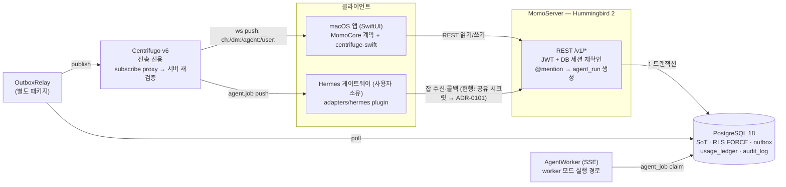
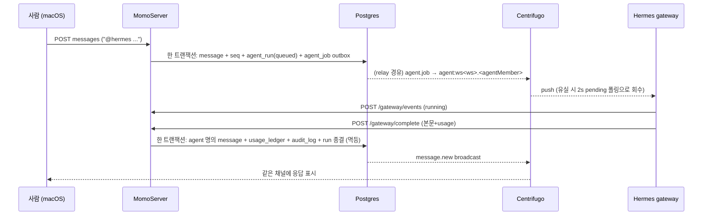

# momo 아키텍처 정본 (Overview)

> 생성: 2026-07-10 · 근거: 2026-07-09 6방향 코드베이스 감사 · 관리 규칙: 이 문서와 어긋나는 코드 변경은 같은 PR에서 이 문서를 갱신한다 (ADR-0100)
> 상세 진단(판정표·근거 전문)은 아티팩트 "momo 아키텍처 진단 & 빌드업 가이드 v0" 참조. 결정 이력은 `docs/adr/`.

## 제1불변식 (L4 스펙에서 승계, 여전히 유효)

1. **Postgres = 유일한 진실(SoT). Centrifugo = 전송 전용** (히스토리·권한의 원본 아님).
2. **단일 쓰기 경로**: REST → PG 커밋(메시지+seq+outbox 한 트랜잭션) → OutboxRelay → Centrifugo publish. 클라이언트·에이전트는 Centrifugo에 직접 publish하지 않는다.
3. **순서의 진실은 `message.seq`** — 채널별 gapless 카운터(`channel_seq` 행 잠금). Postgres sequence 금지(롤백 갭).
4. **에이전트는 평범한 `member`다** — 같은 REST, 같은 멱등성, 같은 RLS.
5. **테넌트 격리는 RLS FORCE** (`app.workspace_id` GUC) + 역할 분리(momo_app NOBYPASSRLS / relay·worker BYPASSRLS).
6. **provider 자격증명(Codex OAuth 등)은 momo에 절대 들어오지 않는다** (ADR-0004).

## 시스템 지도

- 로컬 알파: PG·Centrifugo만 Docker, 나머지는 호스트 프로세스 (`scripts/momo` → `scripts/local_alpha_runner.sh`).
- 에이전트 실행 경로가 **2개 존재** (worker SSE / hermes gateway) — 어느 쪽이 정본인지 미결. **ADR-0102의 주제.**

## 에이전트 1회 응답의 수명주기 (gateway 모드)

Slack 봇 대비 실질 우위: `agent_job`이 durable outbox 행이라 at-least-once 회수 가능, 최종 응답·비용·감사가 원자적으로 기록.

## 엔티티 지도 (요약)

핵심 패턴: **shared-PK 서브타입**(member←human/agent), **자기참조 DAG**(message 스레드, agent_run A2A 체인 — depth≤4·round≤4 DB CHECK), **트랜잭셔널 아웃박스**.

## 현재 판정 요약 (2026-07-09 감사)

| 영역 | 판정 | 비고 |
|---|---|---|
| 골격(불변식·스키마·쓰기경로) | ✅ 견고 | 재설계해도 같은 결론에 도달할 수준 |
| 에이전트 데이터 모델 | ✅ 1급 | Slack 봇 모델보다 앞선 설계 |
| 에이전트 신원/인증 | ❌ 봇 수준 | 전역 공유 시크릿 1개 → **ADR-0101** |
| 존재감(프레즌스·타이핑·스트리밍) | ❌ 부재 | 서버에 이벤트 자체가 없음 → ADR-0104 |
| 메신저 기본기(스레드UI·언리드·페이지네이션) | ❌ 미착수 | 스키마는 준비됨 → ADR-0109 |
| 한국어 검색 | ❌ 부적합 | pg_trgm은 CJK 재현율 낮음 → ADR-0105 |
| 배포 경계(CI·이미지·시크릿·TLS·백업) | ⚠️ 스켈레톤 | 전부 example/preflight 단계 → ADR-0107 |

## 결정 큐

ADR-0100(거버넌스) → 0101(에이전트 신원) → 0102(실행 경로 정본화) → 0103(로드맵 정렬) → 0104(존재감 이벤트) → 0105(검색) → 0106(에이전트 정체성 네이밍) → 0107(CI 신뢰 경계) → 0108(서버 스택 지속 판정) → 0109(메신저 기본기 시퀀스)
