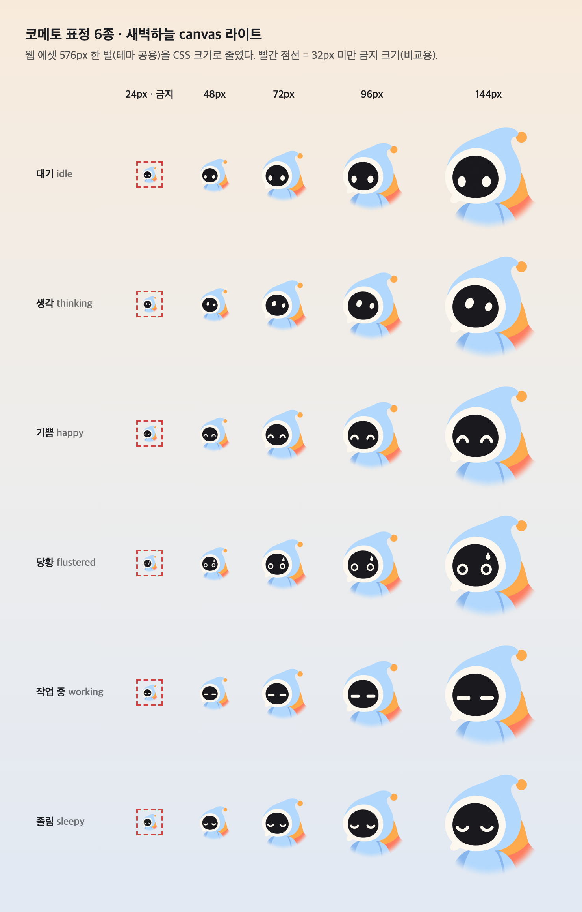
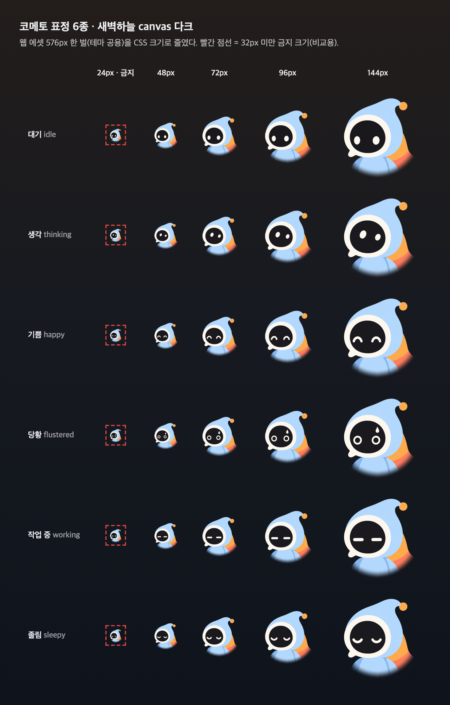
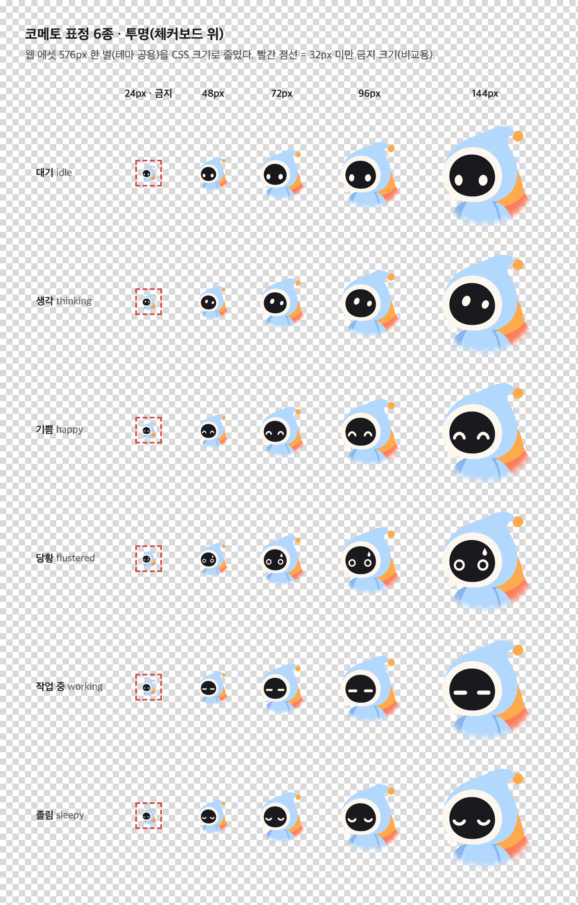
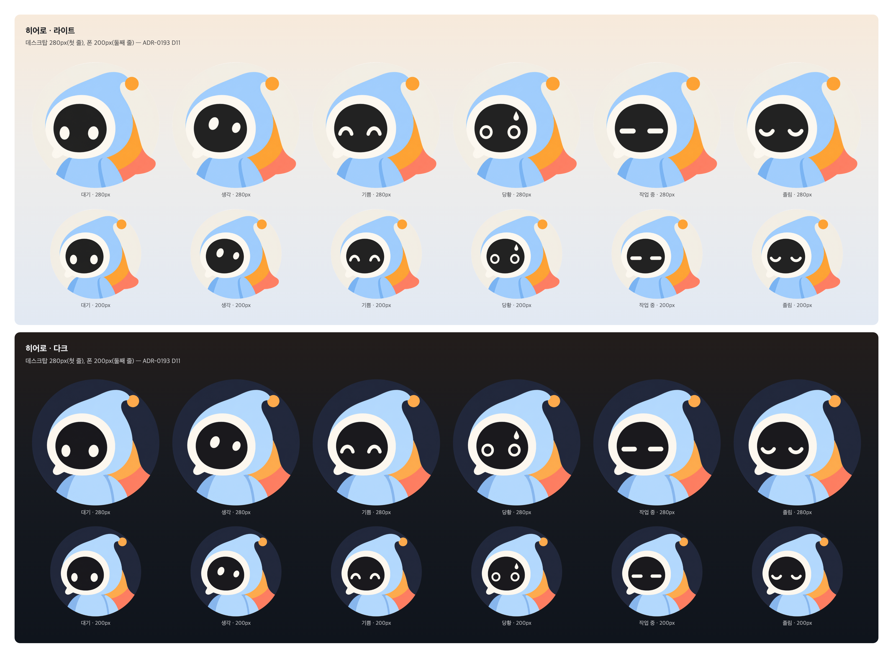
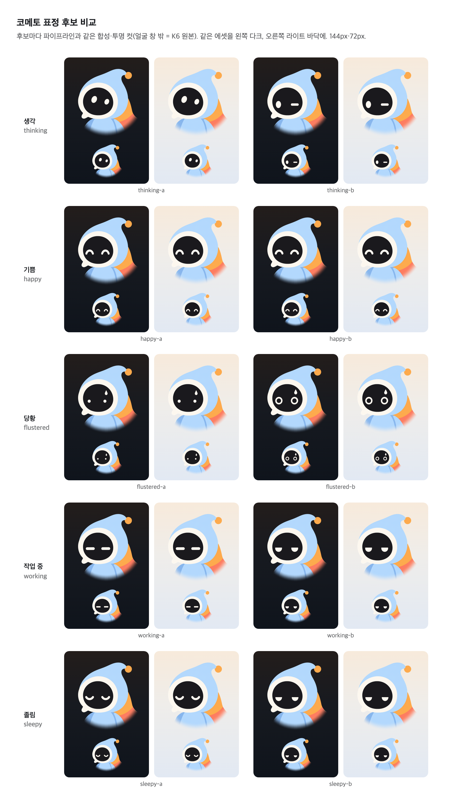

# 코메토 플랫 표정 6종 — 규격 시트 (#2806, ADR-0193 D9·D11)

> **결정 대기 — M2(이슈 #2806 댓글, 2026-09-26 planner):** 「표정 자산은 투명 배경 전신 플랫 컷」. 이 시트의 에셋은 K6 플랫 **배지(흉상 + 원판)**다. owner 승인 K6 시리즈에 플랫 전신 원본이 없어(`K6-turnaround`는 3D, `K6-flat-mini`는 얼굴만) 전신 컷은 새 정본 드로잉이 된다. 방향 결정 전까지 이 배지판이 현행이다.

코메토 표정 6종의 정본이다. owner가 고른 **K6 플랫**(`../K6-flat-dark.png`, `../K6-flat-light.png`)을 형태·비례·색 그대로 두고, **검은 얼굴 창 안의 눈만** 바꿨다. 물방울 후드, 무광 흰 점 눈(빛나지 않는 크림 단색), 말풍선 림은 원본 픽셀 그대로다. 3D 클레이 표정 시트(`claudedocs/brand-2.0/round3/K6-expressions.png`)는 표정 모양의 참고로만 썼다.

## 1. 경로 계약 (#2807 OB2-1이 쓴다)

| 무엇 | 경로 | 규격 |
|---|---|---|
| 원본(합성 결과) | `docs/brand/kometto/faces/kometto-{id}-{theme}.png` | 1254×1254, 알파 없음(대기) 또는 알파 전부 255(나머지, canvas 인코딩), sRGB. K6 플랫 원본과 같은 캔버스 |
| 생성 크롭(표정의 원본) | `docs/brand/kometto/faces/src/kometto-{id}-gen.png` | 452×416. codex 생성물의 얼굴 창 부분(K6-flat-dark 좌표 x 280, y 440) |
| 웹 에셋 | `clients/web/src/assets/brand/kometto-faces/{id}-{theme}.png` | 576×576 RGBA, sRGB. 배지 밖 투명 |
| 시트 캡처 | `docs/brand/kometto/faces/sheets/*.png` | 이 문서의 그림 |

- `id`: `idle` · `thinking` · `happy` · `flustered` · `working` · `sleepy`
- `theme`: `dark`(남색 원, K6-flat-dark) · `light`(크림 원, K6-flat-light)
- 웹 에셋은 `clients/web/scripts/render-brand-icons.mjs`(`kometto-faces.mjs`)가 떠내고 검사한다. 손으로 고치지 않는다.
- `idle-dark` 웹 에셋은 기존 S0 배지(`src/assets/brand/kometto-badge.png`)와 같은 그림이다.
- 테마를 고르는 법: 새벽하늘 **라이트** 바닥에는 `light`, **다크** 바닥에는 `dark`. 두 테마의 표정 모양은 같다(한 생성 크롭에서 나온다).

## 2. 표정 → 상태 (ADR-0193 D11)

상태와 표정은 1:1이다. **표정만으로 상태를 전하지 않는다.** 코메토의 해요체 한 문장이 항상 함께 간다.

| id | 표정 | 쓰는 상태(D11) | 눈 모양 | 참고한 3D 시트 칸 |
|---|---|---|---|---|
| `idle` | 대기 | 질문을 기다림 | 세로 타원 두 개(원본 그대로) | 윗줄 왼쪽 |
| `thinking` | 생각 | 감지·확인·연결 중 | 오른쪽 위를 올려다보는 작은 타원 | 아랫줄 가운데 |
| `happy` | 기쁨 | 완료·감지 성공 | 위로 볼록한 웃는 아치 ^ ^ | 윗줄 오른쪽 |
| `flustered` | 당황 | 오류·오프라인 | 크게 뜬 링 눈 + 창 안 땀방울 | 아랫줄 왼쪽(점 눈은 72px에서 사라져 링으로 키웠다) |
| `working` | 작업 중 | 에이전트가 준비 중 | 가로 일자 눈 — — | 윗줄 가운데 |
| `sleepy` | 졸림 | 건너뛰고 나중에 할 때 | 아래로 볼록한 감은 눈 ︶ ︶ | 아랫줄 오른쪽 |

3D 시트의 창 밖 장식(생각의 손·말줄임 점, 작업 중의 방울 진동선, 기쁨의 꼬리 흔들기, 졸림의 웅크린 자세)은 가져오지 않았다. 코메토는 제자리에서 표정만 바꾼다(D11, 120ms 크로스페이드). 꼬리 흔들기는 모션(#2807)의 몫이다.

## 3. 크기

| 크기 | 쓰는 곳 | 규칙 |
|---|---|---|
| 24px | — | **금지.** 32px 미만에서 눈과 말풍선 꼬리가 읽히지 않는다(`docs/brand/mark/README.md` 「작은 크기」). 그 자리는 C2-04 small 타일(`OortMark`). 시트에는 금지 예시로만 있다 |
| 48px | 목록·배너 같은 보조 자리 | 최소 권장 크기. 기쁨(∩)·작업 중(—)·졸림(∪)이 가는 크림 선 셋이라 가장 가깝고 당황의 땀방울은 거의 사라진다. 이 크기에서는 문장이 주 신호다 |
| 72px | 온보딩 모든 화면의 머리(D11) | 기본 |
| 96px · 144px | 빈 화면·큰 카드 | |
| 200px · 280px | 히어로: 폰 200, 데스크탑 280 — 첫 화면·완료·첫 대화만(D11) | 웹 에셋 576px = 192px×3x. 데스크탑 280px@2x는 560px라 576 안이다. **폰 200pt@3x는 600px라 576을 약 4% 키운다** — 폰 소비처(#2819)가 쓸 때 원본 1254에서 600 이상으로 따로 떠내야 한다 |






## 4. 배경

| 배경 | 에셋 | 확인 |
|---|---|---|
| 새벽하늘 `canvas` 라이트 `#F7EADB → #EFEDEA → #E2E9F3` | `*-light` | `sheets/sizes-light.png`, `sheets/hero.png` |
| 새벽하늘 `canvas` 다크 `#231D1B → #171A20 → #0F141C` | `*-dark` | `sheets/sizes-dark.png`, `sheets/hero.png` |
| 투명 | 둘 다. 배지 원 밖 알파 0 | `sheets/sizes-transparent.png`(체커보드) |

- 배지 원이 캐릭터의 바탕을 들고 다닌다. 다크: 남색 원이 다크 바닥과 구분된다. **라이트: 크림 원판(`#F3EFE5`)과 새벽하늘 라이트 세 정지점의 대비는 1.03 · 1.02 · 1.06:1이라 원판이 사실상 보이지 않는다**(design-review 실측). 캐릭터 실루엣이 바닥에 바로 서는 모양이 되고, 원판 가장자리는 아래쪽에만 옅게 남는다. 테두리·그림자를 더하지 않는 것은 원판을 드러내지 않고 이 모양을 유지하려는 것이다. 원판 없는 라이트판이 필요한지는 M2 결정과 함께 정한다.
- `light`는 혜성 꼬리 끝이 원 밖으로 나온다(K6-flat-light 원본 그대로). 알파는 원을 자르지 않고 바깥 흰 바탕을 걷어 낸다: 모서리에서 바탕을 flood fill해 투명, 나머지는 불투명, 바탕에서 2px 안의 가장자리만 투영 매팅(흰 테 없음).
- `dark`는 기존 S0 배지와 같은 원 자르기다. 원본의 남색 원이 정원이 아니라 아래 가장자리에 원본 바깥 바탕(`#141418` 근처)이 1px 남짓 걸린다. 새벽하늘 다크 바닥 위에서는 드러나지 않고, S0 배지(#2732)와 같은 그림을 유지하려고 그대로 뒀다.
- 입력 그릇(`surface`) 위에는 두지 않는다. 코메토는 `canvas` 위 머리 자리에 선다(D11).

## 5. 금지

- 표정만으로 상태 전달 — 문장 없이 당황 얼굴만 띄우지 않는다.
- 32px 미만 사용.
- 변형: 늘이기·기울이기·색 바꾸기·외곽선·그림자·광택·3D 질감 추가, 배지 원 잘라 내기.
- 다른 그래픽과 합성(말풍선·배지·아이콘을 캐릭터 위에 겹치기). 말풍선은 캐릭터 옆에 둔다.
- 테마 섞기(라이트 바닥에 `dark` 에셋) — 원이 바닥에 구멍처럼 보인다.
- 표정을 알림처럼 스스로 바꾸기. 코메토는 화면 상태가 바뀔 때만 표정을 바꾼다.

## 6. 만드는 법과 검사

1. **생성.** codex CLI(`codex exec -c model_provider=openai -m gpt-5.6-sol`, 이미지 도구 gpt-image)에 K6-flat-dark와 3D 표정 시트를 참고 이미지로 넣어 「창 안 눈만 바꾼 편집본」을 만든다. 레포 밖 폴더에서 실행했다. 프롬프트는 7절.
2. **크롭.** 생성물은 창 밖이 원본과 미세하게 어긋난다(기쁨 실측: 창 밖 평균 차 2.88, 16 초과 1.58%). 그래서 얼굴 창 부분만 무손실로 잘라 `src/`에 둔다.
3. **합성**(`kometto-faces.mjs`). K6 원본의 얼굴 창을 찾아 가장자리 10px 안쪽만, 생성 크롭의 밝기로 원본의 창 검정 ↔ 원본 눈 크림을 섞는다. 창 밖은 원본 픽셀 그대로다. 라이트는 두 원본의 대기 눈 쌍 상자를 잇는 사상으로 옮긴다.
4. **떠내기.** 합성물에서 576 웹 에셋을 뜬다.

`node scripts/render-brand-icons.mjs --faces-only --check-only`(또는 전체 `--check-only`)가 검사한다.

- sha256 고정: K6-flat-dark·K6-flat-light·I4, 생성 크롭 5장
- 합성물 창 밖 = K6 원본(다른 픽셀 0개), 창 안 = 생성 크롭에서 다시 합성한 것(평균 차 ≤ 0.5)
- 대기 = K6 원본 바이트. 나머지는 대기와 창 안 1% 이상, 서로 0.5% 이상 다르다
- 사상 검증: 다크 대기 눈을 라이트로 옮긴 것이 K6-flat-light의 실제 눈과 평균 차 ≤ 3
- 웹 에셋: 576 RGBA·sRGB, 합성물에서 파생(평균 차 ≤ 0.5, 16 초과 ≤ 0.1%, 알파 어긋남 ≤ 0.2%), 배지 밖 투명, `idle-dark` = S0 배지(평균 차 ≤ 3). 처음엔 파생 임계를 3 / 2%로 두었더니 다른 표정 에셋으로 바꿔 끼워도 통과했다(표정 차이는 576 캔버스의 1–2%). 그래서 조였다

시트는 `node scripts/kometto-faces-sheet.mjs`가 커밋된 웹 에셋을 그대로 놓고 캡처한다.

## 7. 후보와 선택 기록

후보는 표정마다 둘(a·b)이다. 모두 codex CLI 생성 원본이며, 합성은 파이프라인과 같다(`kometto-faces-sheet.mjs --candidates`).



**선택 상태: owner 선택 대기.** 지금 커밋된 크롭은 워커 추천안이다. 성재가 고르면 `src/kometto-{id}-gen.png`를 그 후보의 크롭으로 바꾸고 `kometto-faces.mjs`의 `GEN_SHA256`을 갱신한 뒤 `npm --prefix clients/web run icons:brand`(또는 `--faces-only`)를 돌린다. 경로·파일명은 바뀌지 않는다.

| 표정 | 추천 | 근거 |
|---|---|---|
| 생각 `thinking` | thinking-a | b는 한쪽 눈 일자라 윙크(장난)로 읽힌다 |
| 기쁨 `happy` | happy-a | a·b가 거의 같다. a가 아치 끝이 조금 더 둥글다 |
| 당황 `flustered` | flustered-b | a의 점 눈은 72px에서 눈이 거의 사라진다. b의 링 눈은 48px까지 읽힌다 |
| 작업 중 `working` | working-a | b(위가 평평한 반달)는 「시큰둥」으로 읽히고 졸림-b와 거의 같은 그림이다 |
| 졸림 `sleepy` | sleepy-a | b는 작업 중-b와 같은 그림이라 두 상태가 섞인다 |

| 선택 기록 | 후보 | 날짜 | 인용 |
|---|---|---|---|
| (대기) | — | — | owner 선택 전 |

### 생성 설정

- 도구: `codex exec -c model_provider=openai -m gpt-5.6-sol -C <레포 밖 폴더> -s workspace-write --skip-git-repo-check -i K6-flat-dark.png -i K6-expressions.png < 프롬프트` (codex-cli, 이미지 도구 gpt-image, 2026-09-26)
- 참고 이미지: 1번 `K6-flat-dark.png`(불투명, 편집 대상), 2번 `K6-expressions.png`(3D 시트, 표정 모양만). 투명 참고 이미지는 쓰지 않았다(배경이 검정으로 나온다).
- 출력: 1254×1254. 창 밖이 원본과 조금 어긋나고 배지 밖 알파에 번짐이 있어 창 부분만 쓴다(6절).
- 대기(`idle`)는 생성하지 않았다. K6 원본 그대로다.

| 후보 | 표정 | | 프롬프트의 「표정」 줄 |
|---|---|---|---|
| `thinking-dark-a` | 생각 | **추천** | 생각. 두 번째 이미지 아랫줄 가운데 칸처럼 두 타원 눈이 오른쪽 위를 올려다본다: 두 눈 모두 원래보다 조금 작은 타원이고 오른쪽 위로 치우쳐 있으며, 왼쪽 눈이 오른쪽 눈보다 약간 더 크다. |
| `thinking-dark-b` | 생각 |  | 생각. 왼쪽 눈은 원래 타원 그대로, 오른쪽 눈은 가로로 짧은 일자 선(한쪽 눈을 가늘게 뜸)으로 바꿔 골똘히 생각하는 느낌. |
| `happy-dark-a` | 기쁨 | **추천** | (아래 기쁨-a 원문) |
| `happy-dark-b` | 기쁨 |  | 기쁨. 두 번째 이미지 윗줄 오른쪽 칸처럼 눈을 위로 볼록한 웃는 아치(^ ^)로. 아치는 짧고 둥글며 굵다(원래 눈 폭 정도). |
| `flustered-dark-a` | 당황 |  | 당황. 두 번째 이미지 아랫줄 왼쪽 칸처럼 두 눈을 아주 작은 동그란 점으로 줄이고(원래 눈의 1/3 크기), 얼굴 창 안 오른쪽 위에 크림색 작은 땀방울 하나를 둔다. 땀방울은 얼굴 창 안에만 있다. |
| `flustered-dark-b` | 당황 | **추천** | 당황. 두 눈을 크게 뜬 동그란 링(가운데가 검은 원형 테두리, 원래 눈보다 약간 큼)으로 바꾸고, 얼굴 창 안 오른쪽 위에 크림색 작은 땀방울 하나를 둔다. 땀방울은 얼굴 창 안에만 있다. |
| `working-dark-a` | 작업 중 | **추천** | 작업 중(집중). 두 번째 이미지 윗줄 가운데 칸처럼 두 눈을 가로로 긴 둥근 끝의 굵은 일자 선(— —)으로 바꾼다. 선 길이는 원래 눈 폭의 1.3배 정도. |
| `working-dark-b` | 작업 중 |  | 작업 중(집중). 두 눈을 가로로 납작한 반달(위가 평평하고 아래가 둥근 모양)로 바꿔 살짝 눈을 가늘게 뜨고 집중하는 느낌. 두 눈 모양은 같다. |
| `sleepy-dark-a` | 졸림 | **추천** | 졸림. 두 번째 이미지 아랫줄 오른쪽 칸처럼 두 눈을 아래로 볼록한 감은 눈 곡선(︶ ︶)으로 바꾼다. 곡선은 가늘지 않고 원래 눈에 어울리는 굵기, 둥근 끝. |
| `sleepy-dark-b` | 졸림 |  | 졸림. 두 눈을 반쯤 감은 눈으로: 원래 타원 눈의 위쪽 절반이 수평으로 잘린 반원(아래 절반만 남음) 모양. 두 눈 모양은 같다. |

공통 프롬프트(`{후보}`·`{표정}` 자리에 위 표의 값):

```text
이미지 생성 툴($imagegen)로 첫 번째 첨부 이미지(K6-flat-dark.png)를 편집한 이미지를 한 장 생성해서 ./{후보}.png 로 저장해줘. 코드 작성·설명 없이 이미지만 생성·저장. 생성 결과는 후처리(합성·마스킹·ffmpeg·리사이즈) 없이 생성된 파일 그대로 복사한다.
편집 규칙: 첫 번째 이미지와 완전히 같은 캔버스·구도·크기·색·형태를 유지한다. 남색 원형 배지, 하늘색 물방울 후드와 끝의 주황 방울, 크림색 말풍선 모양 림(왼쪽 아래 말풍선 꼬리 포함), 검은 얼굴 창, 몸통, 주황·산호색 혜성 꼬리는 그대로 둔다. 바뀌는 것은 검은 얼굴 창 안의 두 눈뿐이다. 얼굴 창 밖에는 아무것도 더하지 않는다.
표정: {표정}
눈은 원래 눈과 같은 크림색 무광 단색이고 빛나지 않는다(하이라이트·반사광 없음). 원래 두 눈과 같은 높이·간격을 기준으로 한다. 입은 그리지 않는다.
스타일: 플랫 벡터, 단색 면, 그라데이션·광택·그림자·3D·클레이 질감 금지. 두 번째 첨부 이미지(3D 표정 시트)는 표정 모양 참고로만 쓰고 그 3D 질감은 절대 따라하지 않는다.
```

기쁨-a는 첫 시험 생성이라 문구가 조금 다르다(원문). 이 회차에서 codex가 생성물을 원본에 스스로 합성해 저장했기에, 합성 전 생성 원본(`~/.codex/generated_images/…`)을 후보로 썼다. 이후 회차는 「후처리 없이 그대로 복사」를 프롬프트에 넣었고, 후보 파일마다 codex 생성 폴더의 원본과 sha256이 같음을 확인했다.

```text
이미지 생성 툴($imagegen)로 첫 번째 첨부 이미지(K6-flat-dark.png)를 편집해서 ./happy-dark-a.png 로 저장해줘. 코드 작성·설명 없이 이미지만 생성·저장.
편집 규칙: 첫 번째 이미지와 완전히 같은 캔버스·구도·크기·색·형태를 유지한다. 남색 원형 배지, 하늘색 물방울 후드와 끝의 주황 방울, 크림색 말풍선 모양 림(왼쪽 아래 말풍선 꼬리 포함), 검은 얼굴 창, 몸통, 주황·산호색 혜성 꼬리는 픽셀 단위로 그대로 둔다. 바뀌는 것은 검은 얼굴 창 안의 두 눈뿐이다.
표정: 기쁨. 두 번째 첨부 이미지(3D 표정 시트) 윗줄 오른쪽 칸처럼 두 눈을 위로 볼록한 웃는 아치(^ ^) 모양으로 바꾼다. 아치는 원래 눈과 같은 크림색 무광 단색 선, 굵기는 원래 눈 크기에 어울리게 두툼하게, 원래 두 눈과 같은 위치·간격. 입은 그리지 않는다.
스타일: 플랫 벡터, 단색 면, 그라데이션·광택·그림자·3D·클레이 질감 금지. 두 번째 이미지는 표정 모양 참고로만 쓰고 그 3D 질감은 절대 따라하지 않는다.
```

## 8. 라이선스·귀속

- 캐릭터: oort 브랜드 자산(코메토 K6, owner 확정 2026-09-25). 저장소 라이선스를 따른다.
- 생성 도구: OpenAI 이미지 생성(gpt-image, codex CLI 경유, ChatGPT 로그인). 출력물 권리는 OpenAI Terms of Use의 출력물(Output) 소유 조항을 따른다([S], 법률 검토 아님). 생성 원본 PNG에는 C2PA 출처 청크(`caBX`)가 들어 있다. 커밋한 크롭·합성물은 다시 인코딩해 그 청크가 없다. 생성 원본은 저장소에 넣지 않았다.
- 합성·떠내기: 저장소 스크립트(`clients/web/scripts/kometto-faces.mjs`), 새 의존 없음.
