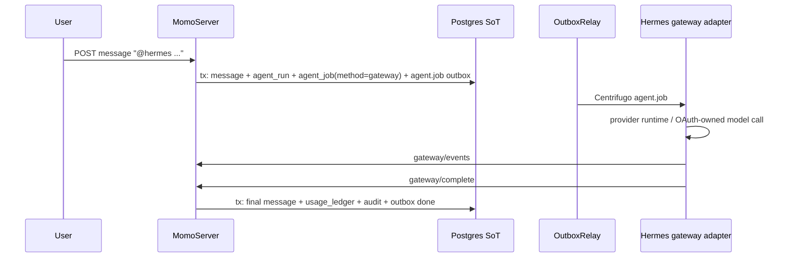

# Hermes Gateway Native Platform Integration

> Status: MOMO-326 in progress. Repo-local mock gateway harness is verified.
> Real Hermes CLI/plugin/provider smoke is now scripted, but this machine has no
> Hermes install yet, so the real roundtrip remains
> `runtime-unverified(real hermes gateway missing)` until the operator installs
> Hermes and completes provider OAuth/login inside Hermes.

## Product Boundary

Momo supports two Hermes integration paths:

| Path | Owner of agent turn | When to use |
|---|---|---|
| AgentWorker SSE | momo worker polls `agent_job`, calls an OpenAI-compatible `/v1/chat/completions` provider, writes the final message | deterministic local gates, existing runtime path, hosted worker control |
| Hermes gateway native platform | Hermes treats momo as a messaging platform, receives `agent.job`, runs its provider runtime, then reports status/result to momo REST | local 1-person dogfood where Hermes should behave like Slack/Telegram adapter sync |

Both paths keep the same invariant: **momo is the source of truth for the agent
execution ledger**. The Hermes adapter must not write directly to Postgres or
publish directly to Centrifugo. Every user-visible write enters through momo
REST and is persisted as `message` + `outbox` with `message.seq` ordering.

## Runtime Flow

1. A user sends a channel message mentioning `@hermes`.
2. MomoServer creates `agent_run` plus Context Packet projection and audit shell.
3. In `AGENT_GATEWAY_MODE=gateway`, MomoServer writes:
   - `outbox(kind='agent_job', method='gateway')` for ledger tracking.
   - `outbox(kind='broadcast')` on `agent:ws<workspace>.<agentMember>` with
     `data.type='agent.job'`.
4. OutboxRelay publishes the realtime job; AgentWorker intentionally skips
   `method='gateway'`.
5. Hermes gateway adapter receives `agent.job`, invokes its provider runtime,
   and reports progress/result to momo REST:
   - `POST /v1/workspaces/:workspace/agent-runs/:run/gateway/events`
   - `POST /v1/workspaces/:workspace/agent-runs/:run/gateway/complete`
6. MomoServer records `agent.gateway.*` audit events, writes the durable final
   agent response message, writes minimal `usage_ledger`, and marks the gateway
   `agent_job` outbox row `done`.



## Configuration

Server-side opt-in:

```sh
AGENT_GATEWAY_MODE=gateway
AGENT_GATEWAY_SECRET=<strong shared momo-facing gateway secret>
```

Adapter-side env generated by:

```sh
scripts/momo hermes-gateway-init
```

The helper writes `$HOME/.momo/hermes-gateway.env` outside the repo. It contains
only momo-facing connection values:

```sh
MOMO_API_URL=http://127.0.0.1:28180
MOMO_CENTRIFUGO_WS_URL=ws://127.0.0.1:28100/connection/websocket
MOMO_WORKSPACE_ID=00000000-0000-7000-8000-000000000001
MOMO_AGENT_MEMBER_ID=00000000-0000-7000-8000-000000000103
MOMO_AGENT_HANDLE=hermes
MOMO_AGENT_GATEWAY_SECRET=<same value as AGENT_GATEWAY_SECRET>
```

`MOMO_AGENT_EMAIL` and `MOMO_AGENT_PASSWORD` are optional for realtime
subscription in local setups where the gateway logs in as an agent operator.
They are not provider OAuth credentials.

The `agent:` work stream is a Centrifugo subscription, not a durable write path.
It still goes through MomoServer's subscribe proxy. Dev, local-alpha, and prod
Centrifugo configs must all allow `agent:ws<workspace>.<agentMember>` through
the same workspace-qualified regex and proxy check. If Hermes logs
`permission denied` for `agent:...`, the adapter is connected but cannot receive
jobs; in local alpha, inspect the generated `centrifugo.local-alpha.json` before
debugging provider/OAuth.

## Credential Boundary

Codex/OpenAI OAuth access tokens, refresh tokens, OpenAI API keys, and provider
account secrets belong inside the Hermes/provider runtime. They must not be
written to momo `.env`, momo DB, diagnostics, local gate evidence, or adapter
manifest files.

The momo-facing shared secret authorizes gateway callbacks only. It is not a
provider credential and is scoped to the local gateway integration.

## Local Helpers

```sh
scripts/momo hermes-gateway-init
scripts/momo hermes-gateway-status
scripts/momo hermes-gateway-install-plugin
scripts/momo hermes-gateway-smoke
scripts/momo hermes-gateway-smoke --real
```

`hermes-gateway-smoke` runs the repo-local mock gateway harness:

```sh
scripts/verify_hermes_gateway_adapter.sh
```

Expected coverage:

- `@hermes` mention creates `agent_run`.
- `agent_job` outbox uses `method='gateway'`.
- `agent.job` broadcast is produced on the agent realtime channel.
- Missing gateway secret is rejected with 401.
- Gateway event and completion callbacks are accepted with the shared secret.
- Final agent response is written as a durable channel message.
- `usage_ledger` and `audit_log` rows are created.
- The gateway job is marked `done`.

## Real Hermes Gateway

The repo includes `adapters/hermes/plugin.yaml`, `adapters/hermes/adapter.py`,
and `adapters/hermes/momo_adapter.py` in the documented Hermes plugin shape.
On the default macOS case-insensitive filesystem this also resolves for Hermes
runtimes that probe `PLUGIN.yaml`; use copy mode if a case-sensitive plugin
directory requires an uppercase manifest file.

- `kind: platform`
- `entrypoint: adapter.py`
- `requires_env`: `MOMO_API_URL`, `MOMO_WORKSPACE_ID`,
  `MOMO_AGENT_MEMBER_ID`, `MOMO_AGENT_GATEWAY_SECRET`
- `optional_env`: Centrifugo URL, local momo operator login, and handle

Operator flow:

1. Install or run Hermes gateway locally.
2. Generate momo-facing pairing env:
   ```sh
   scripts/momo hermes-gateway-init
   ```
3. Link the repo plugin into the local Hermes plugin directory:
   ```sh
   scripts/momo hermes-gateway-install-plugin
   ```
   The default target is `$HERMES_HOME/plugins/momo`, usually
   `$HOME/.hermes/plugins/momo`. Set `MOMO_HERMES_PLUGIN_INSTALL_MODE=copy` if a
   symlink is not acceptable for the local runtime.
4. Complete provider OAuth/login inside Hermes. The OAuth/token material stays
   inside Hermes/provider runtime and is not copied into momo.
5. Start Hermes gateway through the user's Hermes flow, for example
   `hermes gateway start` after provider setup.
6. Start momo with `AGENT_GATEWAY_MODE=gateway` and the matching
   `AGENT_GATEWAY_SECRET`.
7. Send `@hermes` from momo and confirm the final response lands in the same
   channel timeline.

Real evidence commands:

```sh
# Status/readiness only; safe to run before install/login.
scripts/momo hermes-gateway-smoke --real

# After the user has completed provider OAuth/login inside Hermes:
MOMO_HERMES_PROVIDER_READY=1 scripts/momo hermes-gateway-smoke --real

# Real 1-roundtrip: sends @hermes through momo REST and waits for a same-channel
# agent response. This expects momo to be running in AGENT_GATEWAY_MODE=gateway
# and Hermes gateway to be connected.
MOMO_HERMES_PROVIDER_READY=1 scripts/momo hermes-gateway-smoke --real --trigger
```

The real verifier writes a summary and events under
`${TMPDIR:-/tmp}/momo-hermes-gateway-real/<timestamp>/`. It reports separate
states for:

- `NEEDS_USER_INSTALL`: Hermes CLI is not installed or not on `PATH`.
- `NEEDS_PLUGIN_INSTALL`: the momo adapter is not visible in the Hermes plugin
  directory.
- `NEEDS_PROVIDER_LOGIN`: Hermes exists but the operator has not marked provider
  OAuth/login as complete.
- `NEEDS_MOMO_SERVER`: momo `/health` is not reachable in gateway mode.
- `PASS`: `@hermes` produced a same-channel durable response from the agent
  member.

If step 1 is unavailable, keep the real gateway plugin load and provider call as
`runtime-unverified(real hermes gateway missing)` while relying on the mock
harness for momo-side ledger guarantees.
