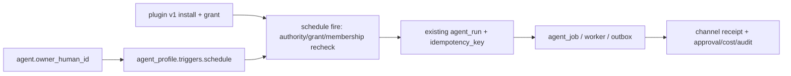

# Agent-platform 계획 독립 레드팀 검수

> Status: `review-ready` — **결론: 조건부 반려(conditional reject)**
> Planning ID: `PLN-20260728-01` · Reviewer: GPT 5.6 독립 red team · 기준일: 2026-07-28
> 기준 main: `747c9b120762dd60c46d357acb9312f19f81959b` · 트랙: **engine planning 주도 / UXUI read-only 검수**
> 검수 대상: `2026-07-28-tauri-rn-agent-platform-gap-audit.md`
> 효력: 상충하는 실행 권고는 이 문서가 대체한다. 기존 감사 문서는 사실·경쟁사 증거로 보존한다.

## 0. 판정

방향은 맞지만, 제안된 builder DAG를 그대로 발급하는 것은 반려한다.

- **유지**: React/Vite+Tauri, bare RN, Postgres/RLS/audit, 기존 `agent_run`, 현재 xterm.js+PTY, CSS-first motion.
- **신뢰 경계 4건**: plugin delegated subject와 terminal 공개·보존은 해당 레인의 현재 출하 차단이다. WorkHost 서명은 원격/Windows 확장 전 P1 hardening, 개인 자격증명 승인 주체는 OAuth/write 도입 전 High blocker다.
- **첫 제품 슬라이스**: “사용자 소유의 first-party read-only 앱 하나를 기존 agent가 정해진 시간에 읽어 요약하고, 소유자·권한·비용·결과가 기존 원장에 남는다.”
- **지금 만들지 않을 것**: plugin v2 플랫폼, skill store/recorder, generic trigger engine, MCP Apps iframe host, 새 motion runtime/skill, PTY 교체 spike, community marketplace.

원 계획은 6개 결정/spike와 10개 구현 후보를 한 번에 열어 실제 dogfood보다 플랫폼을 먼저 짓는다. 최소 경로는 기존 객체를 재사용하면 된다.

## 1. 위협 모델: 한 줄로 이어져야 하는 책임 사슬

모든 자동 실행에서 아래 값이 서버가 검증 가능한 상태로 연결되어야 한다.

`agent actor → human sponsor/subject → source credential owner → fixed destination channel → requested action → authorized approver → run/audit`

현재 계획은 install, connect, grant, schedule, approve를 각각 설명하지만 이 사슬을 하나의 불변식으로 묶지 않았다. 특히 “같은 채널 멤버”는 “그 사람의 외부 계정 권한을 대신 쓸 수 있음”이나 “그 사람 대신 승인할 수 있음”과 동치가 아니다.

## 2. 신뢰 경계 4건과 영향 레인

아래는 정적 코드 검증 결과다. 실제 공격을 실행했다는 뜻은 아니며, **현재 authorization contract로 허용되는 경로**를 적었다.

### SEC-P0-1 — agent가 같은 채널의 임의 human grant를 고를 수 있다

- 증거: [`PluginRoutes.policyMemberID`](../../../server/Sources/MomoServer/Routes/PluginRoutes.swift#L657-L697)는 agent 요청의 `delegatedMemberId`와 `channelId`를 신뢰하고, agent와 대상 human이 같은 채널에 활성 상태인지까지만 확인한다.
- 증거: [`DriveMCPRoutes.callTool`](../../../server/Sources/MomoServer/Routes/DriveMCPRoutes.swift#L128-L170)은 그 human의 `plugin_grant`를 조회해 tool을 실행한다.
- 실패 모드: agent가 같은 채널의 Alice 대신 Bob을 query에 넣어 Bob의 read grant를 차용할 수 있는 BOLA/confused-deputy 경로가 성립한다.
- 기존 설계와의 충돌: ADR-0101 Phase 2와 `token.kind='delegation'`은 run-scoped actor/subject 추적을 이미 요구하지만 이 호출 경로는 그 토큰에 묶이지 않는다.

**출하 게이트**

1. caller가 subject를 query로 고르지 못한다.
2. 서버가 active run 또는 단기 delegation capability에서 subject를 도출한다.
3. capability는 `workspace + agent actor + human subject + run + channel + plugin release/tool/scope + expiry + nonce`에 묶인다.
4. subject/channel/tool/scope 변경, replay, revoke, run 종료 뒤 호출을 각각 red test로 거부한다.

### SEC-P1-1 — WorkHost 서명이 body/query/nonce를 묶지 않고 5분간 replay 가능하다

- 증거: [`WorkHostAuthenticator.requestSigningPayload`](../../../server/Sources/MomoServer/Auth/WorkHostAuthenticator.swift#L87-L106)는 method, path, workspace, host, timestamp만 서명한다.
- 증거: [`validateTimestamp`](../../../server/Sources/MomoServer/Auth/WorkHostAuthenticator.swift#L215-L221)는 ±5분만 확인하며 nonce/replay 원장이 없다.
- 증거: [현재 단위 테스트](../../../server/Tests/MomoServerTests/MomoServerTests.swift#L3221-L3238)도 v1 payload가 body/query를 포함하지 않음을 고정한다.
- 심각도: impact High / 현재 likelihood Low. non-loopback WorkHost가 HTTPS를 강제해 유효 서명 헤더 획득이 선행되어야 한다. 다만 TLS는 application-level request integrity와 replay 방지의 대체물이 아니므로 public proxy/Windows/다중 host 확대 전에는 닫아야 한다.
- 실패 모드: 같은 서명 요청을 허용 창 안에서 재전송할 수 있고, body가 있는 control route는 서명된 의도와 실제 요청 내용이 달라질 수 있다. query 영향 route는 별도 재현 전까지 추정으로 둔다.

**출하 게이트**

1. `v2` canonical payload에 정렬된 query, body SHA-256, content type, request ID/nonce를 포함한다.
2. 서버는 `(host_id, request_id)` replay cache 또는 단조 counter를 원자적으로 집행한다.
3. body 1바이트 변경, 실제 의미 있는 query route가 있다면 query 변경, 동일 요청 replay, timestamp 경계, canonicalization ambiguity red test를 추가한다.
4. 호환 기간과 v1 폐기 시점을 ADR/런북에 적는다.

### SEC-P1-2 — 개인 OAuth/write를 붙이면 같은 채널의 다른 사람이 보고 승인할 수 있다

- 증거: [`ApprovalDecisionRoutes`](../../../server/Sources/MomoServer/Routes/ApprovalDecisionRoutes.swift#L136-L185)는 active human이며 approval channel 멤버이면 결정을 허용한다.
- 증거: [`fetchApprovals`](../../../server/Sources/MomoServer/Routes/ApprovalDecisionRoutes.swift#L503-L585)는 같은 채널 멤버에게 approval payload 전체를 투영한다.
- 현재 영향: 팀 공용 채널 액션에는 의도된 정책일 수 있다.
- 확장 영향: Alice의 개인 GitHub/Drive/OAuth 계정으로 write하는 `PLUGIN-CONNECT`를 열면 Bob이 payload를 보고 승인하는 권한 상승이 된다.
- 심각도: 현재 policy-dependent/Medium, 개인 credential 또는 write 도입 전 High blocker. 현재 continuity 전체를 막는 P0로 분류하지 않는다.

**출하 게이트**

1. run-bound delegation token/capability를 actor/subject 권한의 단일 SoT로 삼는다. approval은 그 reference와 immutable audit/display snapshot만 가지며 별도 수정 가능한 subject SoT를 만들지 않는다.
2. `approver_policy`를 명시하고 개인 credential action 기본값은 `subject_only`; workspace 공용 action만 명시적으로 admin/channel 정책을 고른다.
3. 비권한자는 결정뿐 아니라 민감 payload 목록도 보지 못한다.
4. grant owner 탈퇴·credential revoke·run sponsor 변경 시 pending approval을 취소한다.

### SEC-P0-4 — terminal은 기본 공개이며 raw output이 무기한 로컬 파일에 남는다

- 증거: [`024_observer_attach.sql`](../../../server/Migrations/024_observer_attach.sql#L9-L17)은 `work_session.observation` 기본값을 `open`으로 둔다.
- 증거: [`TerminalAttachRoutes`](../../../server/Sources/MomoServer/Routes/TerminalAttachRoutes.swift#L157-L173)는 open session이면 같은 채널 멤버에게 observer attach를 허용한다.
- 증거: [`ProcessManager`](../../../workers/WorkHostDaemon/Sources/WorkHostDaemon/ProcessManager.swift#L50-L70)는 PTY byte를 mode `0600` 파일에 모두 쓰고, 종료 시 close만 한다. 기본 디렉터리는 [`~/.momo/workd-output`](../../../workers/WorkHostDaemon/Sources/WorkHostDaemon/Config.swift#L98-L105)이다.
- 실패 모드: prompt, 경로, 환경 출력, token/error dump가 의도보다 넓은 사람에게 보이거나 host disk에 남는다. “server DB에 저장하지 않음”은 “저장하지 않음”이 아니다.

**출하 게이트**

1. observation 기본값을 `owner_only`로 바꾸고 session별 명시적 opt-in만 허용한다.
2. 관전자 수/신원을 owner에게 실시간 표시하고 즉시 revoke할 수 있게 한다.
3. raw disk log 기본값은 off. 필요 시 size cap, TTL, quota, rotation, delete UI/runbook을 모두 둔다.
4. channel에는 raw terminal이 아니라 semantic run event를 기본 공유한다.
5. raw fidelity가 필요한 owner-local memory ring은 bounded/ephemeral로 두고 end/timeout/manual clear 뒤 canary가 사라지는지 확인한다. 비소유자는 명시적 관전 없이는 replay를 받지 못하고, disk/channel에는 기본 저장하지 않는다. 불완전한 secret redaction으로 PTY fidelity를 깨지 않는다.

## 3. 후속 확장 전에 막힐 추가 경계와 runtime 사실

### 3.1 plugin release와 publisher 신뢰

- [`PluginManifestValidator`](../../../server/Sources/MomoServer/Plugins/PluginManifestValidator.swift#L107-L133)의 `publisher.verified`와 `provenance.verified`는 manifest가 스스로 선언한 boolean이다.
- [`plugin_registry`](../../../server/Migrations/013_plugin_registry.sql#L10-L24)는 `plugin_id` 단일 mutable row이며 version이 key가 아니다.
- [`031_github_manifest_search_issues.sql`](../../../server/Migrations/031_github_manifest_search_issues.sql#L11-L51)은 기존 release를 in-place 변경한다.

현재 first-party migration fixture에는 즉시 취약점으로 보지 않는다. 그러나 custom/community publishing, 자동 update, 역할 배포는 아래가 생기기 전까지 차단한다.

- immutable `(plugin_id, version, digest)` release
- 검증 가능한 signer trust root와 revoke/downgrade 방지
- artifact/UI/skill 각각의 digest
- update permission diff와 staged rollout/rollback

### 3.2 read-only도 기밀 유출을 만들 수 있다

외부 앱을 읽어 공개 채널에 요약하면 provider write가 없어도 source confidentiality가 깨진다. 첫 dogfood는 source grant owner와 destination을 고정하고, 실행 시 둘의 membership/grant를 재검증한다. content나 model output이 destination을 바꾸지 못하게 한다. 초기 대상은 owner DM 또는 비공개 테스트 채널로 제한한다.

### 3.3 scope consent 기본값이 최소 권한이 아니다

[`PluginScopeConsentDialog`](../../../clients/web/src/features/plugins/PluginSection.tsx#L865-L890)은 모든 scope를 초기 선택한다. optional/write/admin scope는 기본 off, 가능하면 default-none으로 바꾼다. install, connect, grant, agent assignment, schedule은 서로 다른 행위이며 한 번의 동의로 합치지 않는다.

### 3.4 skill/recorder의 공급망과 prompt injection

Skill은 문서처럼 보여도 agent가 실행하는 instruction supply chain이다. 외부 URL include, archive/symlink, executable payload, dynamic fetch를 v0에서 금지한다. recorder는 password field, clipboard, terminal, OAuth callback을 수집한 뒤 redaction하는 방식이 아니라 **수집 자체를 차단**해야 한다.

### 3.5 first-party plugin의 실제 실행 경로는 아직 하나로 닫히지 않았다

- repo-local [`ToolResumeExecutor`](../../../workers/AgentWorker/Sources/AgentWorker/ToolResumeExecutor.swift#L3-L7)는 external provider를 범위 밖으로 두고 deterministic echo만 허용한다.
- [`ACPClient`](../../../workers/WorkHostDaemon/Sources/MomoACPHost/ACPClient.swift#L117-L122)는 현재 `mcpServers: []`로 초기화한다.
- [`docs/RUN.md`](../../RUN.md#L928)의 generic `/v1/mcp/tools/call`도 stub이며, real Hermes/provider credential E2E는 `runtime-unverified` 범위가 남아 있다.

따라서 “기존 agent가 plugin을 읽는다”를 이미 닫힌 사실로 쓰지 않는다. Gate 2 전에 Hermes capability-specific runtime, host ACP/MCP bridge, 또는 first-party direct adapter 중 **한 경로만** 선택해 mention/schedule→run→tool→result E2E를 닫는다. 호출에는 현재 mutable registry에서도 최소 `{plugin_id, version, manifest_digest, tool_schema_digest}`를 pin하고 drift/revoke를 fail-closed한다.

## 4. UX 레드팀 판정

### 4.1 최상위 문제는 기능 부족보다 책임 모호성이다

한 화면에서 다음 역할을 구분해 보여야 한다.

| 역할 | 사용자가 알아야 할 질문 |
|---|---|
| agent owner/sponsor | 이 agent가 사고를 내면 누가 멈추고 책임지는가 |
| connection owner | 어느 사람의 외부 계정을 읽는가 |
| automation creator | 누가 반복 실행을 만들거나 바꿨는가 |
| approver | 이 액션을 누가 승인할 수 있는가 |
| destination audience | 결과가 누구에게 공개되는가 |

v0는 복잡한 역할 정책을 만들지 말고 **다섯 역할을 `agent.owner_human_id` 한 사람으로 제한**한다. 공유 소유와 대리 승인은 후속 결정으로 미룬다.

### 4.2 새 top-level IA 3개는 만들지 않는다

현재 Settings만 이미 9개 section이다. 별도 Plugin/Skills/Automations 탭을 추가하면 사용자가 제품 객체 모델을 먼저 배워야 한다.

v0 surface는 세 곳뿐이다.

1. 기존 **Settings → Apps**: install, connection/grant, risk.
2. 기존 **Agent Detail/Hub**: owner, app access, 한 개 schedule, next 3 runs, pause/run now, recent runs.
3. **Channel receipt**: 누가 무엇을 언제 실행했고 무엇이 바뀌었는지.

MCP server 토글, skill marketplace, recorder, publisher console은 숨기는 것이 아니라 아직 만들지 않는다.

### 4.3 실패 상태를 “offline” 하나로 합치지 않는다

[`SettingsRoute`](../../../clients/web/src/features/settings/SettingsRoute.tsx#L124-L140)는 websocket disconnected를 전체 저장 불가 offline으로 해석한다. 최소한 server REST, realtime, WorkHost, provider connection을 분리해 표시한다. 예약 실행에는 “이 Mac이 켜져 있어야 함”과 cloud/server 실행을 같은 문구로 보여 주지 않는다.

### 4.4 schedule의 예측 가능성이 기능 수보다 먼저다

- 생성 전에 timezone과 **다음 3회**를 보여 준다.
- v0 missed run은 `skip`, overlap은 `skip`; 재접속 후 몰아서 실행하지 않는다.
- no-delta 성공은 run history/audit에는 남지만 channel/OS 알림은 0개다.
- grant revoke, owner offboarding, agent pause 시 schedule도 자동 pause되고 이유와 복구 동선을 보여 준다.
- write action은 v0에 없다. 미래 write는 provider idempotency가 없으면 자동 retry하지 않는다.

### 4.5 RN v0를 authoring surface로 만들지 않는다

ADR-0137의 첫 모바일 가치는 chat, status, approval, artifact 확인이다. plugin 설치, OAuth 연결, skill 녹화/publish, automation authoring은 데스크톱/웹에서 검증되기 전 모바일에 복제하지 않는다.

## 5. 오버엔지니어링 판정표

| 원 계획 항목 | 판정 | 지금의 대체안 / 다시 열 조건 |
|---|---|---|
| `ADR-PLUGINS-V2` | **발급하지 않음** | ADR-0113과 plugin v1으로 first-party read-only 1개 dogfood. 실제로 한 bundle에 2개 이상 component가 필요하고 first-party plugin 2개가 살아 있을 때 증보 |
| `PLUGIN-BUNDLE-V2` | **defer** | immutable release/trust 문제를 먼저 별도 결정. multi-component 필요가 실사용으로 증명될 때 |
| `PLUGIN-CONNECT` | **범용 구현 차단** | delegation/custody를 먼저 닫고 personal write 전 approval authority도 닫는다. ADR-0113의 host-owned credential 원칙을 암묵적으로 server broker로 바꾸지 않는다. dogfood에는 provider 1개짜리 host-owned connect+secret-free readiness probe만 허용 |
| `PLUGIN-LIBRARY-PARITY` | **흡수** | 기존 Apps와 Agent Detail에 connection·grant·owner만 추가. Codex 화면 복제나 새 top-level IA 금지 |
| `ADR-SKILL-LIFECYCLE` / `SKILL-STORE` | **defer** | 수동 skill 3개가 각 10회 이상 실행되고 2명/2 agent 이상이 재사용하며 실제 rollback 사례가 생길 때 |
| `SKILL-RECORDER` | **반려** | 성공한 semantic run을 draft로 저장하는 작은 기능부터. seeded secret/PII recall 100%, semantic coverage 95%, 20회 중 19회 replay가 되기 전 recorder 발급 금지 |
| `ADR-0140` | **schedule-only로 축소** | generic trigger schema/framework 금지. 기존 owner/profile/run을 재사용한 한 agent당 schedule 1개 |
| `AUTOMATION-ENGINE` / `SURFACE` | **두 ticket으로 키우지 않음** | scheduler+Agent Detail의 한 vertical slice. DST/clock/offline 결정 행렬과 accelerated soak 뒤 두 번째 trigger 요구가 생길 때 generic engine 검토 |
| `ADR-MCP-APPS-HOST` / spike | **defer** | 현재 Tauri CSP의 `frame-src 'none'` 유지. typed card로 풀 수 없는 실제 상호작용 2건이 생긴 뒤 read-only synthetic chart 하나로 재검토 |
| `TERM-DECISION-SPIKE` | **발급하지 않음** | 원 계획의 “병목 전 spike 금지”와 자기모순. Windows/50MB/10 session에서 현재 backend가 수치로 실패한 뒤에만 current/Rust/Herdr 비교 |
| `MOTION-CONTRACT` | **삭제** | 기존 design-taste-web의 feedback-only/reduced-motion 규칙과 CSS로 충분. 실제 shared-layout interaction이 생기기 전 dependency/별도 skill 없음 |
| `PLUGIN-PUBLISHING` | **defer** | first-party 3개 + 외부 pilot publisher 2곳 + update/revoke/rollback 실증 뒤 |
| `WINDOWS-WORKHOST` | **제품 결정 뒤** | #837/RN과 현재 continuity batch를 밀어내지 않는다. Windows release가 승인된 뒤 current backend부터 검증 |

## 6. 수정된 최소 실행 순서

일정 약속이 아니라 **다음 단계 진입 조건**이다.

### Gate 0 — 네 finding을 레인별 출하 게이트로 등록

- **Plugin read lane**: SEC-P0-1 run-scoped delegation binding이 Gate 2를 차단한다.
- **Interactive Work lane**: SEC-P0-4 terminal privacy/default/retention이 #857의 공유 관전 확대를 차단한다.
- **Remote/Windows Work lane**: SEC-P1-1 signature v2/replay 방지는 public proxy, Windows, 다중 host 확대 전에 닫는다.
- **Personal credential/write lane**: SEC-P1-2 subject-only approval/payload visibility는 개인 OAuth 또는 write tool 전에 닫는다.

서로 무관한 레인을 전역 직렬화하지 않는다. 네 finding은 GitHub에서 기존 goal과 먼저 dedupe한다. 현재 세션은 GitHub 인증이 유효하지 않아 원격 dedupe를 끝내지 못했으며, 새 Issue를 만들지 않았다.

### Gate 1 — 이미 열린 continuity 회수

- #865 contract verifier
- #857은 terminal privacy gate와 함께 owner-approved main sync
- #859/#858
- #861 global run projection → #860 Agent Detail/Hub
- #837 RN physical-device spike는 별도 승인 경로 유지

### Gate 1.5 — 한 개의 runtime/connect 경로를 고정

- provider 1개에 한해 ADR-0113을 지키는 host-owned connect와 **secret-free readiness probe**만 만든다.
- Hermes, ACP/MCP bridge, direct adapter 중 실행 경로 하나를 골라 실제 `mention → agent_run → read tool → result/audit`를 닫는다.
- capability/run에 `plugin_id + version + manifest_digest + tool_schema_digest`를 pin하고 queue 뒤 registry/grant 변경을 거부한다.
- token/code/verifier는 server response, Context Packet, iframe, terminal, log를 통과하지 않는다.

### Gate 2 — plugin v1 read-only dogfood

- first-party/private plugin 1개, read tool만
- default-none grant
- owner = connection subject = schedule sponsor
- owner DM 또는 private test channel에 destination 고정
- permission revoke/offboarding/agent pause red tests
- install과 grant가 서로를 자동 수행하지 않음

### Gate 3 — schedule-only v0

새 `automation_definition`이나 `automation_run`을 만들지 않는다.

- `agent.owner_human_id`가 non-null인 agent만 허용하고 owner만 생성/수정한다.
- `agent_profile.triggers.schedule`에 one schedule: daily/weekly, IANA timezone, owner DM/private channel 고정. 공개 channel 승격은 후속 결정이다.
- due query용 `agent_profile.next_fire_at`은 schedule에서 계산한 파생 cursor일 뿐 두 번째 SoT가 아니다.
- `agent_run.idempotency_key = schedule:<agent-id>:<profile-version>:<config-digest>:<scheduled-at-utc>` 형식으로 DST fold와 설정 변경을 구분한다.
- run input/Context Packet/audit에 sponsor, profile version, schedule/config digest, scheduled-for UTC+civil slot, destination, pinned plugin/tool digest를 immutable snapshot으로 남긴다.
- schedule 수정은 이전 version의 queued fire를 block하고 commit 시각보다 **엄격히 뒤인** next fire부터 적용한다. spring gap은 skip, fall fold는 첫 occurrence 한 번만 실행하며 preview에 UTC offset을 함께 보인다.
- fire 직전에 owner/agent/channel membership, profile version, paused, plugin install/grant를 재검증한다.
- missed=`skip`, overlap=`skip`, write tools=deny.
- UI는 next 3, last run, run now, pause와 실패 이유만 제공한다.

### Gate 4 — 결정적 시간 행렬 + accelerated soak 후 다음 결정

DST spring gap/fall fold, timezone 변경, clock skew, host offline, overlap, queue 뒤 owner/grant/profile 변경, run insert 전후 crash를 먼저 결정적으로 통과한다. 그 뒤 accelerated 예정 slot 100개에서 각 slot이 정확히 한 terminal outcome(`ran | skipped_missed | skipped_overlap | skipped_dst_gap | blocked_revoked | blocked_profile_changed`)으로 귀결되고 unaccounted slot 0, 중복 run 0, 잘못된 destination 0, revoke 뒤 tool 실행 0, no-delta 알림 0을 충족해야 한다. 그 뒤에만 두 번째 trigger, multi-schedule, shared sponsor를 검토한다.

## 7. 필수 검증 행렬

### 보안 red tests

- delegated subject/channel/tool/scope 변조와 replay 전부 403/401.
- WorkHost body/query/nonce 변경 및 동일 요청 replay 거부.
- personal credential approval은 subject 외 사용자에게 목록·결정 모두 비가시.
- terminal canary는 비소유자 replay와 disk/channel에 기본 비노출이고, owner-local bounded ring은 end/timeout/manual clear 뒤 제거됨.
- grant revoke, member offboarding, plugin revoke, schedule pause가 다음 fire 전에 fail-closed.
- queue 뒤 sponsor/profile/destination/grant 변경과 crash 전후 retry에서 TOCTOU·중복 실행 0.
- model/tool output이 source account나 destination channel을 바꾸지 못함.

### UX acceptance

- actor/owner/connection owner/approver/destination을 한 run에서 식별 가능.
- grant dialog 최초 선택은 0개; install ≠ grant ≠ connect ≠ schedule.
- timezone 변경 시 next 3가 즉시 갱신되고 DST 경계가 설명됨.
- missed run burst 0. no-delta는 model 문장이 아니라 provider cursor/content digest/typed diff로 판정하며, 동일 source snapshot의 자연어 요약이 달라도 channel/OS notification 0.
- server/realtime/WorkHost/provider 장애를 서로 다른 상태로 표시.
- cancel은 “이미 끝난 일”과 “앞으로 실행될 일”을 구분.
- 900px/1280px, keyboard-only, light/dark, reduced-motion에서 focus 복원과 list anchor 유지.
- RN v0에서는 authoring 버튼이 노출되지 않고 desktop 제한을 정직하게 안내.
- RN approval은 sponsor/connection owner/destination/영향을 표시하고 offline, expired, already-decided 409를 구분한다. 맥락이 부족하면 승인 대신 desktop handoff를 제공한다.

## 8. 검수 도구를 실제로 써 본 결과

### NVIDIA SkillSpector

- Apache-2.0인 [NVIDIA SkillSpector](https://github.com/NVIDIA/SkillSpector)를 `/private/tmp`의 격리된 `uv` 환경에 설치해 `.claude/skills/momo-design-taste-web`을 no-LLM static scan했다.
- 결과: risk score `17`, overall `LOW/SAFE`.
- 동시에 디자인 문서의 평범한 “keychain” 문구를 credential access로 잡은 **HIGH false positive 1건**이 있었다.
- 설치에는 96개 Python package가 따라왔다. 따라서 지금 repo dependency나 merge gate로 넣지 않는다.
- 검수 뒤 격리 temp tree를 삭제했으며 repo dependency/설정 변경은 0이다.
- 후속 사용법: publish-time advisory scan + pinned isolated environment + 사람이 finding을 판정. 자동 차단 권한은 주지 않는다.

### 지금 유용한 조합

| 도구/기준 | 쓰임 | 채택 |
|---|---|---|
| 기존 Playwright `gate:shell`/wire/CSP와 design-review | keyboard, viewport, focus, offline, reduced-motion 회귀 | **현재 primary** |
| [OWASP Agentic Skills Top 10](https://owasp.org/www-project-agentic-skills-top-10/) | skill supply-chain threat checklist | **계획 체크리스트** |
| SkillSpector | skill 정적 advisory scan | **격리 pilot만** |
| [promptfoo](https://github.com/promptfoo/promptfoo) | 미래 skill/agent prompt-injection regression corpus | runtime corpus가 생긴 뒤 pilot |
| Slack/Atlassian/Figma 등 외부 plugin | 이 검수의 신뢰 경계와 무관 | **설치하지 않음** |

## 9. 공식 기준과의 대조

- [MCP Security Best Practices](https://modelcontextprotocol.io/docs/tutorials/security/security_best_practices): per-client consent, token passthrough 금지, SSRF 방어, session ID를 인증으로 쓰지 않기, local command 명시와 sandbox, least privilege.
- [MCP Apps specification](https://github.com/modelcontextprotocol/ext-apps/blob/main/specification/2026-01-26/apps.mdx): host/sandbox origin 분리, capability 승인, CSP, resource review와 malicious UI 위협. iframe sandbox만으로 hard CPU/memory isolation이 생긴다고 가정하지 않는다.
- [RFC 9700](https://www.rfc-editor.org/rfc/rfc9700.html), [RFC 8252](https://www.rfc-editor.org/rfc/rfc8252.html): exact redirect, PKCE, native app external browser. Tauri를 server-side confidential client처럼 취급하지 않는다.
- [OpenAI prompt-injection guidance](https://openai.com/index/designing-agents-to-resist-prompt-injection/): untrusted content와 tool authority를 분리하고 영향이 큰 action에 확인 경계를 둔다.

## 10. Fable/성재 결정 큐

1. 네 finding의 severity와 영향 레인을 기존 Issue와 dedupe하고 필요한 goal만 발급할지.
2. #857 main sync를 terminal privacy 수리와 같은 gate로 묶을지.
3. schedule v0를 owner-only, one schedule, read-only로 승인할지.
4. plugin v2/skill recorder/MCP Apps/terminal spike/motion ticket을 모두 evidence gate 뒤로 미루는 데 동의할지.
5. Gate 1.5/2의 단일 runtime 경로, source app, private destination을 무엇으로 정할지.

승인 전에는 ROADMAP, BUILD_TICKETS, STATUS, GitHub Issue를 변경하지 않는다.
