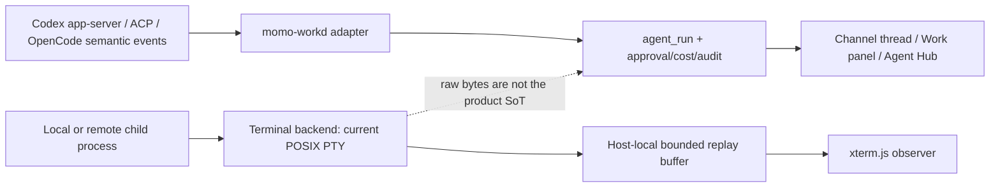
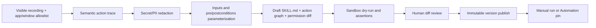
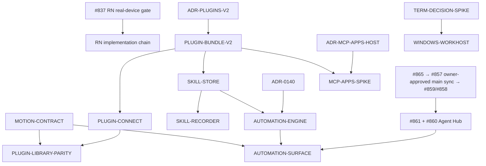

# Tauri/RN 이후 agent-native messenger 갭 감사와 builder 후보

> Status: `review-ready` · Planning ID: `PLN-20260728-01`
> 작성: GPT 5.6 (`momo-main`) · 기준일: 2026-07-28 · 기준 main: `747c9b120762dd60c46d357acb9312f19f81959b`
> 트랙: **engine 기획/통합 주도**, UXUI 파생은 별도 goal로 분리
> 이 문서는 **리서치와 제안**이다. 성재 승인과 Fable 검수 전에는 ROADMAP/BUILD_TICKETS 계약도, GitHub Issue도 아니다.

## 0. 결론

momo의 큰 방향은 맞다. 데스크톱은 React/Vite + Tauri, 모바일은 bare React Native로 가고, Rust는 네이티브 경계와 Windows 이식이 필요한 곳부터 쓰는 현재 결정이 경쟁사 흐름과도 맞는다. 지금 필요한 것은 또 한 번의 전면 재작성이나 terminal renderer 교체가 아니라 다음 네 층을 제품으로 닫는 일이다.

1. **에이전트 통제면**: #860 Agent Hub와 #861 전역 run 이력을 먼저 완결한다.
2. **플러그인 번들**: 현재의 MCP 도구 카탈로그에 다중 skill, 사용자 연결, 버전/서명, 역할 배포를 더한다.
3. **Skill + Automation**: skill을 버전된 절차로 만들고, 일정·메시지·리액션·웹훅이 같은 `agent_run` 실행 경로를 안전하게 격발하게 한다.
4. **대화 안의 실행 UI**: 텍스트 답변을 넘어 승인·폼·차트·대시보드를 안전하게 보여 주는 MCP Apps 호스트를 검토한다.

터미널은 현재 **xterm.js + 실제 POSIX PTY**가 이미 동작하고 #857 replay까지 track/engine에 랜딩했다. Ghostty나 Herdr로 지금 교체하면 완료된 계약을 다시 푸는 셈이다. Windows work host를 열 때 기존 Swift PTY, Rust PTY, Herdr sidecar를 같은 수용기준으로 비교하는 좁은 spike만 정당하다.

## 1. 감사 범위와 신뢰도

- main 코드, ADR, planning 문서, 로컬 worktree와 GitHub Issue/PR을 교차확인했다.
- GitHub 실측: #837, #857~#861, #865 및 PR #868을 2026-07-28에 조회했다.
- 경쟁사는 가능하면 공식 문서·공식 저장소·공식 changelog만 썼다.
- Jack Dorsey의 X 발언은 직접 게시물과 답글을 구분했다. 제3자의 주장을 Jack의 원문 주장으로 바꾸지 않았다.
- 사용자 제공 Codex 스크린샷 3장은 2026-07-28 제품 표면의 1차 시각 증거로 취급했다. repo에는 임시 캡처 파일을 복사하지 않았다.

## 2. 지금 실제로 어디까지 왔나

| 축 | 코드/결정 사실 | 현재 상태 | 다음 실제 관문 |
|---|---|---|---|
| 데스크톱 | ADR-0133 Accepted. `clients/web` React 18/Vite 6/Tailwind 4/Radix/React Query/virtuoso/cmdk, `clients/desktop` Tauri 2 | **main 정착**. Rust는 keychain/mDNS/deep-link/notification/updater 같은 네이티브 경계에 한정 | Windows installer/signing/실기기 QA는 아직 별도 P3 |
| 모바일 | ADR-0137 Accepted. bare RN + 선택적 Expo 모듈, New Architecture, `packages/momo-core` 예정 | **결정 완료, 구현 미착수**. #837 실기기 6관문 open, RN scaffold와 `packages/` 없음 | #837 한글 IME부터 실제 기기 판정. 하나라도 실패하면 계획 재검토 |
| Codex/T3 연결 | `CodexJSONRPCAdapter.swift`, `OpenCodeHTTPAdapter.swift`, ACP adapter, `codex-workbench.py` | **이미 채택됨**. “Codex JSON-RPC 미채택”이라는 옛 문장은 stale | terminal scraping보다 semantic Thread/Turn/Item/approval 이벤트 우선 |
| 터미널 관전 | `@xterm/xterm` 6 + fit addon lazy-load, `ObserverTerminal.tsx` | **main 동작**. 현재 표면은 read-only observer | #858에서 idle/re-attach UX |
| PTY/재부착 | Swift `momo-workd`가 macOS `openpty`, Linux PTY shim 사용 | PR [#868](https://github.com/Dawn-kim-official/momo/pull/868)이 **track/engine에 merge**. host-local 256 KiB replay, 로그인 셸/idle marker 포함. main에는 아직 미동기화 | #857 open+`needs-review`는 계약상 정상. 성재의 track→main 승인 뒤 #859→#858 |
| T3 | 프로비저너와 활성시간 원장이 track/engine에 랜딩 | #859용 worktree는 PR #868 merge commit에서 갈라졌지만 구현 commit은 아직 없음 | #859 idle=pause, 이후 #858 소비 |
| Agent Hub | 프로필·권한·memory·run 조각이 분산 | #860, #861 open. Memory REST 13 endpoints는 서버 완비, 웹 소비자 0 | #861 엔진과 #860 UX를 병렬 개발하되 #861→#860 순으로 통합 |
| 플러그인 | 서버 6 route, manifest 검증, install/grant/audit, 웹 browse/detail/install/consent | #838 결과는 main. #839/#842 코드도 main에 있으나 Issue 상태는 stale | 사용자 OAuth 연결, 다중 skills, custom/community registry, MCP Apps 없음 |
| skill | `momo.plugin.v1`에 `skill { reference, optional }` 자리 | 모든 공식 fixture가 `reference: null`; fetch/install/version/run UI 없음 | versioned skill lifecycle 결정이 선행 |
| schedule | `agent_profile.triggers.schedule` 예약 필드 | 실행기·run history·UI 없음 | ADR-0140 선행. raw cron이 아니라 durable Automation/Loop로 설계 |
| motion | CSS caret/spinner와 짧은 transition만 존재 | Motion/Reanimated/Rive/Lottie 의존 0 | 공용 motion token과 reduced-motion gate부터 |

### 2.1 현재 상태판 drift

기능보다 먼저 정리할 작은 운영 부채가 있다.

- PR #868은 track/engine에 merge됐고 #857은 open + `status:needs-review`다. 이는 worker가 track landing 뒤 멈추고 `momo-main`이 owner-approved main gate를 닫는 운영 계약과 일치하므로 drift가 아니다.
- #839와 #842도 구현이 main에 있는데 Issue는 open + `status:needs-review`다.
- 로컬 `track/engine` worktree 포인터는 오래됐고, #859 worktree가 보는 `origin/track/engine`은 PR #868 merge commit `e4bae196`이다.
- `infra/prod/docker-compose.prod.yml`은 opt-in workhost의 `MOMO_WORKHOST_IMAGE`·`MOMO_WORKHOST_WORKSPACE_ID`를 config 시 요구하지만 `infra/prod/.env.example`에는 두 값이 없다. 그래서 깨끗한 shell의 `scripts/local_gate.sh --profile docs`는 eve profile drift 검사에서 멈춘다. 이번 감사 게이트는 비밀이 아닌 fixture 값을 process env로 주입해 41/41을 닫았지만, 정본 example/verifier drift 자체는 별도 수리가 필요하다.
- 이는 기능 미완과 metadata 미정리를 구분해야 한다는 뜻이다. Fable 검수 때 상태판/Issue 정리를 별도 ops 항목으로 묶는다.

## 3. 경쟁사에서 실제로 커지는 축

| 신호 | 확인된 움직임 | momo가 취할 것 | 취하지 않을 것 |
|---|---|---|---|
| Slack | [AgentExchange·Slackbot MCP Client·Block Kit](https://slack.com/blog/news/slack-is-where-agents-work), 공유 skill과 schedule/message/reaction trigger | Agent directory + governance, channel 안 interactive action, trigger/run history | Slack API 호환을 제품 코어로 만들기 |
| Microsoft | [MCP Apps/Apps SDK로 대화 안 interactive UI](https://www.microsoft.com/en-us/microsoft-365/blog/2026/04/13/bring-your-everyday-business-apps-into-the-flow-of-work-with-agents-in-microsoft-365-copilot/), [Agent 365 identity·observability](https://learn.microsoft.com/en-us/microsoft-agent-365/developer/agent-365-sdk) | 에이전트별 identity, permission, audit, rich in-chat app | Microsoft control plane 종속 |
| Linear | [agent는 delegate이고 human은 owner](https://linear.app/docs/agents-in-linear), activity/insights와 team access | human accountability와 agent execution을 분리해 표시 | agent를 인간 assignee와 완전히 동일 취급 |
| Notion | [Custom Agent trigger·worker·run history](https://www.notion.com/help/custom-agents), [공유 credit와 실행 빈도 비용](https://www.notion.com/help/buy-and-track-notion-credits-for-custom-agents) | schedule, run history, budget, 연결 복제 시 credential 비상속 | 단순 cron 문자열만 저장 |
| OpenAI Codex | [plugin = skills + apps + app templates](https://help.openai.com/en/articles/20001256-plugins-in-codex/), 역할별 자동 설치와 원본 app 권한 상속 | plugin과 permission을 분리, required/optional app·skill, role rollout | skill 설치가 권한을 부여한다고 가정 |
| Claude | [browser workflow recording](https://support.claude.com/en/articles/12012173-get-started-with-claude-in-chrome), [Cowork recurring tasks](https://support.claude.com/en/articles/13854387-schedule-recurring-tasks-in-claude-cowork) | record→draft→review→schedule, remote run과 local-host run 구분 | 좌표 macro를 곧바로 신뢰·배포 |
| MCP | [MCP Apps stable extension](https://github.com/modelcontextprotocol/ext-apps), [Tasks extension](https://modelcontextprotocol.io/seps/2663-tasks-extension) | sandboxed iframe UI와 async task를 adapter 뒤에서 progressive enhancement | 2026-07-28 RC를 final처럼 즉시 hand-roll |
| Buzz | [사람·agent가 같은 room과 signed log를 공유](https://github.com/block/buzz), ACP/MCP, workflow/persona/git/huddle | “결과가 개인 탭이 아니라 팀 원장에 남는다”는 중심 원칙 | Nostr로 Postgres SoT 교체, provider key 서버 유입 |
| Dorsey/Bitchat | [Buzz launch X](https://x.com/jack/status/2079605800998146171), [Bitchat dual transport](https://github.com/permissionlesstech/bitchat), [store-and-forward whitepaper](https://github.com/permissionlesstech/bitchat/blob/main/WHITEPAPER.md) | self-host/BYO runtime, exportable audit, reconnect와 outbox의 정직한 degraded mode | BLE mesh/Nostr를 기업 메신저 핵심 경로에 이식 |
| Discord | [React Native + Hermes 전환 사례](https://discord.com/blog/supercharging-discord-mobile-our-journey-to-a-faster-app) | RN 표면과 native/Rust hot path의 선택적 분리, 실측 후 최적화 | “Rust core부터” 선행 재작성 |

### 3.1 Jack Dorsey/X를 과장하지 않는 해석

Jack은 2026-07-26 답글에서 “Buzz는 multiplayer agent harness”라는 제3자 표현에 [“yes!”](https://x.com/jack/status/2081409291785785735), agent의 로컬 암호학적 소유 주장에 [“yes”](https://x.com/jack/status/2081484649386135761)라고 답했다. 이 문장은 원 게시자의 주장이고 Jack의 직접 발언은 동의다.

제품 신호는 충분하다. 경쟁 프레임이 “Slack에 AI를 붙인다”에서 **여러 사람과 여러 agent가 같은 실행 기록을 공유하는 multiplayer harness**로 옮겨 가고 있다. momo의 `member.kind='agent'`, channel thread, approval/cost ledger는 이 프레임에 이미 맞는다. 필요한 것은 보이는 통제면과 반복 실행 제품화다.

### 3.2 Buzz의 plugin 약세를 정확히 표현하면

Buzz에 확장 기능이 없는 것은 아니다. 공개 repo에는 ACP/MCP, YAML workflow, persona, repo-local skill, BYOH가 있다. 다만 Codex/Slack/Cursor와 비교했을 때 다음 공개 제품 표면이 약하다.

- 검색 가능한 governed directory와 private team marketplace
- plugin 안의 app/MCP/skill을 분리해 보여 주는 상세/토글
- 역할별 자동 설치와 사용자별 연결 상태
- version/signature/update/permission diff
- skill authoring/recording/evaluation lifecycle

momo는 반대 모양이다. registry/install/grant/audit와 risk/egress/provenance는 강하지만, 실제 연결·skill·developer marketplace가 비어 있다. 따라서 “Buzz보다 plugin 개수가 많다”가 아니라 **권한과 원장을 가진 plugin 운영면을 먼저 완성한다**가 차별화다.

## 4. Herdr, Hermes, hermes를 분리한다

이름이 비슷한 세 기술이 섞이기 쉽다.

| 이름 | 정체 | momo 관계 |
|---|---|---|
| **Herdr** | [Rust agent-aware terminal multiplexer](https://github.com/ogulcancelik/herdr). persistent server, pane/workspace, detach/attach, semantic wait/socket API. 현재 master의 [Cargo.toml](https://github.com/ogulcancelik/herdr/blob/master/Cargo.toml)·LICENSE 기준 Apache-2.0 | 현재 미사용. Buzz/T3/Codex가 내부 공용 기반으로 쓴다는 근거 없음 |
| **Hermes (React Native)** | Meta의 RN JavaScript engine. Discord RN 전환 사례의 Hermes | RN #837에서 쓰게 될 모바일 런타임 축. terminal과 무관 |
| **momo hermes gateway** | `adapters/hermes`와 AgentWorker가 대화하는 OpenAI-compatible agent gateway | 현재 agent 실행 경로. RN Hermes나 Herdr와 무관 |

Herdr에서 빌릴 것은 상태 문법(`working/blocked/done`), wait API, tool별 resume ID, worktree 계층, detach/attach다. 이 중 상태·worktree·replay 상당수는 이미 momo에 구현됐거나 #857~#860으로 진행 중이다.

## 5. 터미널: 현재 구조와 결정

### 5.1 현재 답

- 화면 renderer: `@xterm/xterm` 6 + fit addon.
- 프로세스: Swift `momo-workd`의 실제 POSIX PTY.
- 제어 의미론: Codex app-server JSON-RPC, ACP, OpenCode adapter.
- 재부착: PR #868에서 host-local 256 KiB ringbuffer와 replay 계약이 track/engine에 랜딩.
- Herdr/Ghostty/WezTerm/Alacritty 의존: 0.

### 5.2 선택 판정

| 선택 | 지금 판정 | 이유 |
|---|---|---|
| xterm.js 유지 | **채택 유지** | Tauri/Web 공용, 이미 CSP·a11y·observer gate가 있고 병목 증거가 없음 |
| Ghostty 앱 내장 | **기각** | 외부 앱은 session/approval/handoff를 분리하고 Windows 답이 아님 |
| `libghostty` renderer | **보류** | 공식 문서도 standalone stable API가 아니라고 밝힘. renderer 교체가 replay/agent 상태를 해결하지 않음 |
| Herdr sidecar | **조건부 spike 후보** | persistence와 wait API는 강하지만 0.x protocol, Windows beta, supply-chain/update 경계가 추가됨 |
| Rust `portable-pty` 계열 | **Windows spike 후보** | ConPTY 경로가 있으나 blocking reader, kill-tree, resize/IME를 직접 검증해야 함 |

결론은 **#857~#859를 버리지 않는다**다. Windows work host 착수 직전에 같은 benchmark로 현재 backend와 두 후보를 비교한다. Ghostty는 “외부 터미널에서 열기” escape hatch만 허용하고, 기본 UX는 semantic run timeline + 필요할 때 terminal drawer다.

비교 spike의 최소 관문:

- macOS + Windows: Korean IME, zsh/PowerShell, vim/TUI, resize, paste, 50 MB output, 10 sessions.
- detach와 terminate 분리, crash 후 reconciliation, process group/Job Object kill-tree.
- #857 replay의 중복·유실 0과 bounded memory를 그대로 통과.
- argv array, cwd/env allowlist, secret redaction, OSC/clipboard/hyperlink 방어.
- semantic approval을 화면 scraping으로 대체하지 않음.

## 6. Codex 스크린샷 방향은 얼마나 반영됐나

| 스크린샷 표면 | momo 현재 | 판정 |
|---|---|---|
| plugin 검색/목록/상세 | `PluginSection.tsx`, catalog/detail API | **반영** |
| 설치/삭제 | workspace install/uninstall | **반영** |
| scope 동의와 위험/egress/provenance | #839, manifest metadata | **momo가 더 강한 부분** |
| top-level “플러그인 / 스킬” IA | 설정 > 앱 한 곳 | **미반영** |
| plugin 내부 MCP 서버 목록/토글 | manifest는 단일 MCP endpoint + tools, per-module toggle 없음 | **미반영** |
| plugin 내부 여러 skill과 토글 | v1은 optional skill reference 하나, 공식 fixture 전부 null | **미반영** |
| “지금 계정 연결” | 사용자별 third-party OAuth 없음 | **미반영** |
| plugin 만들기 / marketplace 추가 | custom/community registry·signing·review 없음 | **미반영** |
| skill 녹화 | recorder/compiler/eval 없음 | **미반영** |

따라서 예전 참고 요청은 **기능의 절반은 반영됐고 정보구조와 skill/app lifecycle은 아직**이라고 답하는 것이 정확하다.

권장 제품 표면은 한 거대한 plugin 화면이 아니다.

1. **Apps Directory**: 관리자 install, publisher, connection, scopes, risk.
2. **Agent Hub / Capabilities**: 특정 agent가 쓸 app·MCP·skill·permission을 모아봄.
3. **Automations / Skills**: 만들기·녹화·검수·publish·schedule·run history.

## 7. Skill 녹화는 macro가 아니라 compiler다

### 7.1 객체 경계

- **Plugin**: 배포 번들. apps/MCP servers/skills/templates와 요구 권한을 묶는다.
- **App/MCP**: 외부 데이터와 action capability. credential과 source-system permission을 가진다.
- **Skill**: 재사용 가능한 절차와 입력/출력 계약. 권한을 새로 주지 않는다.
- **Automation**: published skill/agent를 언제 어떤 정책으로 실행할지 정한다.
- **Agent run**: 한 번의 실제 실행. channel thread, approval, cost, artifact, audit의 SoT.

### 7.2 안전한 녹화 파이프라인

기본 기록 단위는 화면 좌표가 아니라 `app/tool id + typed action + input slot + precondition + result assertion`이다. DOM/Computer Use 좌표는 의미론적 tool이 없는 마지막 fallback node로만 둔다. raw keystroke, clipboard, terminal bytes, password field, token은 기본 저장 금지다.

필수 안전 계약:

- visible recording indicator와 즉시 stop.
- app/window/domain allowlist.
- secret/PII detector + 사용자에게 보여 주는 redaction diff.
- required capability와 write risk를 draft에 자동 명시.
- publish 전 replay fixture, dry-run, human review.
- immutable version, rollback, deprecation.
- Automation은 `latest`가 아니라 승인된 `skill_version_id`를 기본 pin.

## 8. Cron이 아니라 channel-native Automation/Loop

ADR-0140은 `triggers.schedule`에 cron parser 하나를 다는 문서가 되어서는 안 된다.

최소 실행 계약:

- trigger: schedule, message, reaction, webhook. v0는 schedule부터 열어도 schema는 trigger kind를 구분.
- timezone/DST, jitter, missed-run 정책, next fire 미리보기.
- unique `(automation_id, scheduled_for)`와 외부 write idempotency.
- overlap 기본 `forbid`, 명시적 `allow/replace`.
- lease/fencing, retry/backoff, dead-letter와 run-now.
- max runtime, cost, tool set, approval mode, quiet hours.
- plugin/skill version pin과 permission recheck.
- 실행은 별도 비밀 경로가 아니라 기존 `agent_run → agent_job → approval/cost/audit/outbox`.
- 한 실행은 channel thread 하나. `working/blocked/done`, approval, artifacts, cost, cancel/retry를 같은 곳에 표시.
- local T1은 WorkHost offline이면 `waiting-for-host`; T2/T3만 앱이 닫혀도 계속할 수 있다.
- 성공 알림이 아니라 **의미 있는 delta**를 channel receipt/digest로 남긴다.

`agent_profile.triggers.schedule`를 유지할지 별도 `automation_definition`으로 정규화할지는 ADR-0140이 결정한다. 실행 SoT는 새 `automation_run`을 중복 도입하기보다 기존 `agent_run`을 재사용하는 쪽이 현재 아키텍처와 맞다.

## 9. 대화 안의 rich UI: MCP Apps가 새 핵심 후보다

Slack Block Kit, Microsoft Apps SDK, OpenAI Apps, MCP Apps가 같은 방향으로 수렴한다. agent 답변이 “링크를 눌러 다른 앱으로 가라”가 아니라 채널 안에서 폼, 승인, 차트, 문서 preview를 보여 준다.

MCP Apps는 2026-01-26 stable extension으로 `ui://` resource, tool metadata, sandboxed iframe, CSP, JSON-RPC `postMessage` bridge를 정의한다. momo가 만들 때의 경계:

- host가 capability를 협상하지 못하면 기존 typed card/text로 graceful fallback.
- third-party remote URL을 임의 iframe으로 열지 않음.
- install 시 UI resource digest/CSP domains를 검토·pin하고 same-origin proxy/cache 검토.
- sandbox iframe과 per-resource CPU/memory/size limit.
- app-only tool도 기존 plugin grant, approval, audit 경로를 통과.
- host가 보여 주는 publisher/risk/egress boundary를 iframe이 가릴 수 없음.
- 2026-07-28 MCP RC는 adapter/conformance test로 흡수하고 final 전 protocol-wide migration은 금지.

이는 기존 ArtifactCard를 버리는 프로젝트가 아니다. 첫 spike는 read-only chart/form 한 개와 text fallback 한 개로 끝내야 한다.

## 10. 자연스러운 UI motion

repo의 `momo-design-taste-web` 계약은 motion 2~3/10, feedback-only, 보통 200 ms 미만, reduced-motion 필수다. 이 제약을 유지한다.

### Tauri/Web

1. **기본**: CSS transition/animation과 상태 class. opacity/transform 중심, 120/180/240 ms token.
2. **복잡한 shared layout만**: Web View Transition을 feature-detect하거나 Motion `LazyMotion` spike.
3. Motion 도입 시 현재 “code-authored inline style 금지” 규칙과 CSP/preflight 충돌 여부를 먼저 증명하고, 필요하면 명시적 vendor exception을 ADR/skill에 기록.
4. terminal output와 token streaming은 매 token layout animation 금지. batch + caret만.

### React Native

- #837이 RN/New Architecture 버전을 확정하기 전 animation dependency를 먼저 고르지 않는다.
- 기본 Animated/LayoutAnimation으로 시작.
- gesture-driven sheet/swipe/shared transition이 실제로 필요하면 Reanimated 4 + Gesture Handler를 사용하고 release build FPS로 검증.
- Skia/Rive/Lottie는 onboarding이나 고립된 상태 머신에만. agent status에 장식용 perpetual animation 금지.

### “animate skill” 권고

새 runtime dependency보다 먼저 `.claude/skills/momo-motion-review/` 같은 개발자 skill을 만든다.

- semantic tokens: `instant=0`, `fast=120`, `standard=180`, `slow=240`.
- 허용 상태 변화와 금지 사례.
- `prefers-reduced-motion` / RN reduce-motion.
- 1280/900 Web + iOS/Android capture matrix.
- animation 중 keyboard focus, screen reader announcement, list anchor 불변.
- Playwright/visual gate와 performance budget.

## 11. 먼저 회수할 기존 goal

| 순서 | goal | 확인 상태 | 다음 |
|---:|---|---|---|
| -1 | `OPS-WORKHOST-ENV-DRIFT` 제안 별칭 | prod example에 required workhost config 2개 누락, 기본 docs gate 차단 | Fable이 기존 goal과 dedupe한 뒤 P0 소형 수리로 발급 |
| 0 | #865 contract verifier 409 | open, 3배치 gate 차단 | engine P0 수리 |
| 1 | #857 PTY replay | PR #868 track/engine merged, Issue의 open+needs-review는 정상 | review evidence 보존, 성재 승인 때 main sync 후 `momo-main`이 상태 종료 |
| 2 | #859 T3 idle=pause | worktree만 생성, 구현 없음 | #857 track 기준 engine 구현 |
| 3 | #858 web idle/re-attach | open | #859와 병렬 가능하되 protocol 고정 후 UX merge |
| 4 | #861 global agent run REST | open | #860의 history 축 선행 |
| 5 | #860 Agent Hub v1 | open | #861과 병렬, #861→#860 통합 |
| 별도 | #837 RN physical-device spike | open, branch/scaffold 없음 | 성재 실기기 관문. 이후에만 RN builder chain |

track/*→main은 위 순서와 별개로 성재의 명시 승인이 있어야 한다.

## 12. 신규 builder 후보

아래 ID는 충돌을 피하기 위한 **제안 별칭**이다. Fable 검수와 성재 승인 뒤 canonical MOMO 번호를 배정한다.

### 12.0 P0: 게이트 복구

| 별칭 | 트랙 | 선행 | Goal / 핵심 Acceptance | Out of scope |
|---|---|---|---|---|
| `OPS-WORKHOST-ENV-DRIFT` | engine | 없음 | opt-in workhost가 꺼진 기본 prod compose와 `verify_eve_profile --config-only`가 깨끗한 shell에서 추가 env 없이 render. workhost를 켠 경우에는 image/workspace 계약을 fail-closed 유지. prod example·preflight·drift test 정합과 red proof | workhost runtime 변경, secret 기본값 |

### 12.1 P1: 결정과 기반

| 별칭 | 트랙 | 선행 | Goal / 핵심 Acceptance | Out of scope |
|---|---|---|---|---|
| `ADR-PLUGINS-V2` | engine planning | ADR-0113 | ADR-0113 증보: plugin이 `0..n apps/MCP + 0..n skills + optional UI templates`를 묶는 버전 단위임을 결정. 사용자 OAuth/credential broker, role/member grant, signature/update, source permission 상속, MCP version adapter를 고정 | 구현, marketplace UI |
| `ADR-SKILL-LIFECYCLE` | engine planning | ADR-PLUGINS-V2와 병렬 | personal/team/workspace scope, draft/reviewed/published/deprecated, immutable version, provenance, required capabilities, recorder privacy, eval/rollback 결정 | recorder 구현 |
| `ADR-0140` | engine planning | ADR-0131/0139 | Automation trigger와 기존 `agent_run` 접합, timezone/DST, idempotency, overlap, retry, approval/budget/audit, local-host offline 의미 결정 | raw cron UI |
| `ADR-MCP-APPS-HOST` | engine+security planning | ADR-PLUGINS-V2 | stable MCP Apps negotiation, resource pin/proxy, iframe sandbox/CSP, app-only tool auth, fallback, audit 경계 결정 | arbitrary remote iframe |
| `TERM-DECISION-SPIKE` | engine | #857~#859 | current Swift PTY vs Rust PTY vs Herdr sidecar를 §5.2 관문으로 macOS/Windows 비교. 결과는 adopt/defer/reject와 migration estimate. #857 replay parity 필수 | production cutover, Ghostty renderer |
| `MOTION-CONTRACT` | UXUI | 없음 | web/RN 공용 duration/easing/state token, reduced-motion, focus/list-anchor/perf gate, `momo-motion-review` skill. dependency 추가 없이 CSS/RN 기본 API로 reference 3개 | Rive/Lottie, app-wide animation rewrite |

### 12.2 P1/P2: 구현

| 별칭 | 트랙 | 선행 | Goal / 핵심 Acceptance | Out of scope |
|---|---|---|---|---|
| `PLUGIN-BUNDLE-V2` | engine | ADR-PLUGINS-V2 | v2 validator와 migration. multiple component descriptor, digest/signature, required/optional, version pin, permission diff. v1 read 호환과 secret-like key rejection. fixture + red proof | OAuth UI, community upload |
| `PLUGIN-CONNECT` | engine→UXUI | ADR-PLUGINS-V2, PLUGIN-BUNDLE-V2 | per-user “계정 연결” API/UX. OAuth 2.1+PKCE, token server response/URL/log 비유입, revoke, source permission preservation, agent delegated tool dry-run | DWD, every provider |
| `PLUGIN-LIBRARY-PARITY` | UXUI | PLUGIN-BUNDLE-V2, PLUGIN-CONNECT | Codex 참고: Apps/Skills 구분, plugin detail의 MCP/skill required·optional·toggle·connection·scope/risk, role assignment. 현재 `PluginSection` 재사용, 900px/keyboard/offline 4상태 | custom marketplace |
| `SKILL-STORE` | engine→UXUI | ADR-SKILL-LIFECYCLE, PLUGIN-BUNDLE-V2 | SKILL import/editor, immutable version, scope/share, capability diff, publish/deprecate/rollback, version-pinned invocation이 기존 `agent_run`에 기록. skill install이 grant를 넓히지 않음 | recording |
| `SKILL-RECORDER` | engine→UXUI | SKILL-STORE | visible semantic recorder, allowlist, redaction diff, parameterization, draft SKILL/action graph, sandbox dry-run, assertions, human publish. password/raw terminal/clipboard 기본 미저장 red proof | unattended publish, pixel-only macro |
| `AUTOMATION-ENGINE` | engine | ADR-0140, SKILL-STORE | schedule trigger v0, unique fire key, lease/fencing, overlap, retry/DLQ, run-now/pause, plugin+skill version/permission recheck, 기존 agent_run/job/outbox 경로와 비용/승인 단정 | message/reaction/webhook trigger |
| `AUTOMATION-SURFACE` | UXUI | AUTOMATION-ENGINE, #860/#861 | Automation list/detail, next/past run, channel target, pause/run-now, budget/approval mode, channel run thread receipt, waiting-for-host/blocked/done, cancel/retry. keyboard/offline/reduced-motion | graph workflow builder |
| `MCP-APPS-SPIKE` | engine→UXUI | ADR-MCP-APPS-HOST, PLUGIN-BUNDLE-V2 | official stable example 1개를 sandbox로 render, read-only chart/form, text fallback, CSP/domain denial red proof, app-only call auth/audit, resource size/time cap | marketplace-wide GA |
| `PLUGIN-PUBLISHING` | engine→UXUI | PLUGIN-BUNDLE-V2, 첫 first-party v2 dogfood | custom/community source add, publisher signing/review, update permission diff, revoke/rollback, admin pilot rollout | public unmoderated store |
| `WINDOWS-WORKHOST` | engine | TERM-DECISION-SPIKE, Tauri Windows P3 결정 | 선택 backend로 ConPTY/attach/kill-tree/replay parity, signed sidecar/update/NOTICE, Windows E2E | renderer replacement |

### 12.3 권장 의존 그래프

## 13. 의도적으로 만들지 않는 것

- Nostr/BLE를 핵심 메시지 경로에 넣는 ticket.
- Ghostty/libghostty 전환 ticket. 병목이 측정되기 전에는 spike조차 열지 않는다.
- Herdr를 momo의 process/session SoT로 삼는 ticket.
- skill 녹화 영상을 그대로 재생하는 macro runner.
- client-side cron 또는 앱이 켜져 있어야만 도는 schedule.
- plugin UI가 임의 remote webview를 열거나 기존 approval/grant를 우회하는 경로.
- RN raw 80-column terminal. 모바일은 status, approval, diff/artifact, voice instruction, desktop/cloud handoff가 먼저다.
- 새 `automation_run`을 기존 `agent_run`과 경쟁하는 두 번째 실행 SoT로 만드는 것.

## 14. Fable이 검수할 결정 질문

1. #860 Agent Hub에 owner/delegate와 parent run chain을 포함할지, 후속으로 분리할지.
2. ADR-0113 증보에 multi-skill bundle과 user OAuth를 함께 넣을지, credential 경계만 먼저 승인할지.
3. ADR-0140에서 schedule-only v0를 택하되 future trigger kind를 schema에 예약할지.
4. MCP Apps host를 plugin v2와 같은 wave로 볼지, 첫 OAuth connector dogfood 뒤로 미룰지.
5. #857 구현 이후에도 Herdr 비교 spike의 기대 이득이 2주 비용을 넘는지.
6. Motion을 추가하지 않는 CSS-first 기본안을 유지할지, shared-layout 실사용 하나를 골라 LazyMotion을 증명할지.
7. 위 후보를 ROADMAP 어느 milestone에 넣을지. RN #837과 현재 continuity batch를 밀어내지 않는 순서를 제시할 것.

## 15. 출처

- [OpenAI, Plugins in Codex](https://help.openai.com/en/articles/20001256-plugins-in-codex/)
- [OpenAI, Codex for every role, tool, and workflow](https://openai.com/index/codex-for-every-role-tool-workflow/)
- [Anthropic, Create custom skills](https://support.claude.com/en/articles/12512198-how-to-create-custom-skills)
- [Anthropic, Record a workflow in Chrome](https://support.claude.com/en/articles/12012173-get-started-with-claude-in-chrome)
- [Anthropic, Scheduled tasks in Cowork](https://support.claude.com/en/articles/13854387-schedule-recurring-tasks-in-claude-cowork)
- [Slack, agents work in Slack](https://slack.com/blog/news/slack-is-where-agents-work)
- [Linear, AI Agents](https://linear.app/docs/agents-in-linear)
- [Notion, Custom Agents](https://www.notion.com/help/custom-agents)
- [MCP Apps official repository/spec](https://github.com/modelcontextprotocol/ext-apps)
- [MCP 2026-07-28 release candidate](https://blog.modelcontextprotocol.io/posts/2026-07-28-release-candidate/)
- [Block Buzz official repository](https://github.com/block/buzz)
- [Jack Dorsey, Buzz launch](https://x.com/jack/status/2079605800998146171)
- [Bitchat official repository](https://github.com/permissionlesstech/bitchat)
- [Herdr official repository](https://github.com/ogulcancelik/herdr)
- [Ghostty architecture/libghostty status](https://ghostty.org/docs/about)
- [Tauri sidecar permissions](https://v2.tauri.app/develop/sidecar/)
- [portable-pty](https://docs.rs/crate/portable-pty/latest)
- [Motion layout/reduced-motion](https://motion.dev/docs/react-layout-animations)
- [React Native 0.85 animation backend](https://reactnative.dev/blog/2026/04/07/react-native-0.85)
- [Reanimated performance](https://docs.swmansion.com/react-native-reanimated/docs/guides/performance/)
