# 서버 안전화·공개 출고 작업 계획

> 작성: sol · 2026-08-11 KST · 트랙: **엔진**
> 입력: `2026-08-11-sol-handoff-one-page.md`, `2026-08-11-server-security-selfhost-review.md`
> 코드 기준: `origin/main = origin/track/engine = 915d00bff14f`
> 상태: **계획안 — 성재 승인 전 구현·Issue 생성·ADR 상태 변경·commit/push/merge 금지**

## 0. 목표와 완료 정의

이 계획의 목표는 최근 PR #1284~#1286에서 발견한 안전·계약 결함을 먼저 닫고, 그 위에서 공개 이미지와 셀프호스트 배포를 재현 가능하게 만드는 것이다. 새 기능 추가가 아니라 다음 네 결과를 만든다.

1. 공개 busy·비공개 알림 일시정지·presence·avatar의 의미와 권한 경계를 Accepted ADR에 결속한다.
2. 정지 계정, 외부 Drive 왕복, 무제한 fanout처럼 악용 가능한 서버 경로를 red proof와 함께 차단한다.
3. REST/OpenAPI/DB/클라이언트가 같은 계약을 따르고, 재시도·동시성·테넌트 불변식을 자동 검증한다.
4. Rust 이미지, 라이선스 고지, GitHub 보안, generic production 문서와 제3자 설치 증거를 갖춘 뒤에만 첫 공개 release를 검토한다.

완료는 코드가 main에 있다는 뜻이 아니다. 각 goal의 자동 검증, sol 1차 리뷰, 성재의 묶음 검수, 승인된 merge, 배포 후 좁은 runtime evidence가 모두 있어야 해당 wave를 닫는다.

## 1. 고정 규율

- 1 goal = 1 GitHub Issue = 1 PR. 아래 ID는 승인 전 임시 계획 ID이며 Issue를 자동 생성하지 않는다.
- GitHub 설정처럼 외부 상태를 바꾸는 goal도 먼저 desired-state/runbook/evidence PR 하나를 만들고, merge 후 승인된 maintenance window에서 적용한다.
- 경계 변경은 Accepted ADR이 선행한다. ADR 초안 작성과 Accepted 전환도 성재 승인 지점에서 분리한다.
- 구현은 해당 트랙 worktree에서만 한다. 현재 `/Users/kwakseongjae/projects/momo-tracks/engine`은 578커밋 stale이므로 갱신 전 빌드 원본으로 쓰지 않는다.
- 엔진 goal의 PR base는 `track/engine`, UXUI goal(C-0a·C-1b·C-2b와 그 후속 표면 수정)의 PR base는 `track/uxui`다. shared tree는 `docs/TRACKS.md` 소유 규칙을 따른다. 선행 landing 전 의존 goal을 함께 검수해야 할 때는 각 worktree의 patch series 또는 임시 `codex/stack-*` parent를 **PR 생성 전 review candidate**로만 사용한다. 실제 PR은 선행 goal이 자기 track에 landing된 뒤 그 최신 track에 rebase해 열고 full gate를 다시 돌리며, 임시 parent를 base로 merge하거나 그 base의 green을 landing 증거로 쓰지 않는다. Checkpoint 승인은 그 절에 명시한 **ordered batch의 자기 track landing** 승인이고, 묶음 밖 PR을 개별적으로 landing하지 않는다. `track/{engine,uxui}→main` 통합은 `momo-main`이 별도 패킷과 성재 승인으로 수행한다.
- `clients/web-legacy`는 AGENTS상 live alpha 산출물이지만 TRACKS 파일군 표에는 없다. OpenAPI를 바꾸는 엔진 goal은 기계 생성물 `clients/web-legacy/src/api/schema.d.ts`만 같은 엔진 PR에서 재생성하고 runtime consumer는 바꾸지 않는다. C-0a·C-1b·C-2b·C-6u·C-6v Issue는 web-legacy runtime consumer를 UXUI 소유·`track/uxui` base로 명시해 순차 handoff한다. TRACKS 정본 자체의 영구 소유 변경은 별도 승인 없이 하지 않는다.
- 공용 정본, GitHub 설정, Issue/PR, main/track merge, live 배포는 성재의 명시 승인 뒤에만 바꾼다.
- 시크릿 값은 출력·문서화·커밋하지 않는다. 운영 검증은 key 존재와 redacted hash 일치로 한다.
- 성재 검수는 goal마다 요청하지 않는다. 아래 **Checkpoint A~D**에서 묶어서 요청한다.
- 서버 변경은 `[rust]` 하드 게이트와 필요한 PG/runtime red proof를 닫는다. 웹·모바일·공유 코어를 건드리면 각 트리 게이트와 merge-tree 검증도 필수다.

## 2. 의존 구조

```mermaid
flowchart LR
  A["Checkpoint A: 제품·ADR 결정"] --> B["Merge floor: G-1~G-5"]
  A --> C["Wave 1: 즉시 안전화 준비"]
  B --> D["Checkpoint B-0/B-1/B-2a/B-2b: 서버 검수·track landing 승인"]
  C --> D
  D --> E["Wave 2: 계약·무결성 정합"]
  E --> J["Checkpoint C-0: engine expand train"]
  J --> F["Checkpoint C-1: 데스크톱·모바일 UX 검수"]
  F --> K["Checkpoint C-1.5: cutover·contract train"]
  K --> R["Checkpoint C-1R: admin reinstate UX·activation"]
  R --> I["Checkpoint C-2: 서버·보안 completion gate"]
  I --> G["Wave 3: 공개 출고"]
  G --> L["Checkpoint D-0/D-1/D-2: 출고 PR·후보 설치·증거 landing"]
  L --> H["Checkpoint D: release 판단"]
```

병렬화는 같은 파일·migration·ADR을 공유하지 않을 때만 허용한다. auth lifecycle, avatar, webhook은 Wave 1에서 병렬 가능하지만 알림 일시정지와 presence revision은 각각 승인된 결정 문서 뒤에만 시작한다.

## 3. Checkpoint A — 먼저 받을 결정

| 결정 ID | 성재가 정할 것 | 권고안 | 승인 전 상태 |
|---|---|---|---|
| D-1 | 공개 presence와 비공개 알림 일시정지의 관계 | **ADR-0162 권고.** 공개 `dnd`는 `busy`/“바쁨”으로 migration하고 알림 효과를 주지 않는다. 현행 `notification_rule.dnd`는 비공개 `pauseAll` 의미로 이름을 바로잡고 두 값을 추론·복사·OR하지 않는다. | ADR-0162 Proposed; ADR-0124 증보 1과 ADR-0160 관련 문구를 정본으로 승격 금지 |
| D-2 | 데스크톱 local notification 최종 판정 권위 | **ADR-0162 권고.** NOBYPASS notifier가 workspace authority+channel access source fence 아래 recipient를 bounded cursor로 처리해 member별 최초 allow/deny verdict와 5분 id-only intent를 immutable하게 쓰고 web/Tauri/mobile은 server-directed delivery mode로 그 결과만 소비한다. 클라이언트는 focus·OS permission·중복만 추가 억제한다. | ADR-0162 Proposed; #1284 동작 확대 금지 |
| D-3 | presence lifecycle·privacy·durable event 계약 | **ADR-0163 권고.** route별 lifecycle predicate, 별도 authority episode에 묶인 token/grant, dual subject proxy+server-directed personal channel, shared-channel agent viewer, member revision+bounded invalidation cursor, legacy writer/client fence, same-value no-op, per-replica limiter·500 status fan-out과 65초 revoke/cache lease를 함께 고정한다. | ADR-0163 Proposed; 스키마/와이어·rate 계약 변경 금지 |
| D-4 | avatar 권한·`immutable`·회수 계약 | **ADR-0164 권고.** Drive 전 cleanup intent+authority episode+최종 재인가, SHA-256, 5MiB·4096px/16M pixel, durable NOBYPASS GC와 tenant FK를 한 경계로 묶는다. | ADR-0164 Proposed; cache/API/DDL·strict setter 변경 금지 |
| D-5 | self-leave의 channel 이력·join/reinstate | **ADR-0165 권고.** current workspace authority는 영속 episode ledger+삭제 가능한 pointer로 분리하고, leave 권한은 O(1)로 즉시 닫되 channel history와 모든 capability cleanup은 500/page로 materialize한다. 신규/same-ID human join과 human reinstate는 preparing episode·202/token 0 cursor 뒤 final generation을 다시 봉인한 stable 200에서만 active authority를 연다. join만 token을 반환하고 reinstate token은 후속 login이 발급한다. capability/client inventory가 준비될 때까지 재활성화를 fail-closed한다. | ADR-0165 Proposed; hard delete·unbounded lifecycle tx·부분 배포 중 reactivation을 새 정본으로 간주 금지 |
| D-6 | inbound/outbound webhook signing root·sender tenant 경계 | **ADR-0166 권고.** 32-byte 이상 방향별 keyring과 row별 KDF ID/provenance manifest, 모호한 outbound의 prepare→test→old-generation delivery drain→activate 개별 재발급에 더해 sender를 NOBYPASS bounded-claim+tenant-settle topology로 옮긴다. | ADR-0166 Proposed; 설치 전역 일괄 backfill·JWT fallback 제거·sender BYPASS 유지 금지 |

### Checkpoint A 산출물

- 위 6개 결정에 대한 `accept / revise / reject` 메모. D-1과 D-2는 ADR-0162 한 문서에 함께 결속한다.
- D-2~D-5는 authority episode·personal rail·notification cancel·presence invalidation·avatar cleanup이 상호 참조하는 cluster라 호환 가능한 set으로 판정한다. ADR-0162~0165의 일부만 Accepted로 전환하려면 함께 Accepted되는 동등 대안 ADR을 명시해야 한다.
- ADR-0162~0166은 모두 **Proposed 초안**으로만 준비한다. sol 1차 리뷰 뒤에도 성재의 명시 승인 없이는 `Accepted`로 바꾸지 않는다.
- 필요한 ADR이 Accepted된 뒤 BUILD_TICKETS ID·goal handoff·GitHub 발급 승인을 순서대로 받는다.
- 현재 Issue 본문은 검토용 packet일 뿐 실행 가능한 Issue가 아니다.

## 4. Wave 1 — 즉시 안전화

기존 Accepted 계약을 복구하는 버그 수정 중심이다. 제품 의미 선택이 필요한 변경은 포함하지 않는다.

| Goal | 우선 | 범위 | 선행 | 핵심 수용기준 |
|---|---:|---|---|---|
| S-0 live reactivation freeze·membership API truth | P0 | 현재 `POST /v1/join` deleted-human 재활성화를 공용 lock+DB writer gate로 fail-closed한다. Rust에 없는 workspace role, channel self-leave/role, suspend/reinstate/remove, ban list/create/delete를 전수 inventory해 OpenAPI/generated surface가 2xx 제공 중이라고 주장하지 않도록 honest-unavailable로 닫음 | **Accepted ADR-0165 + G-1~G-5 적용** | same-ID join은 stable `reactivation_not_ready`로 side effect 0; 신규 identity join 정상; old writer 우회 0; 전체 membership-admin runtime/spec diff 0; 신규 route mount 0 |
| S-1 active-principal 공통 인가 | P0 | presence GET/PUT에는 active-human workspace predicate, availability grant/subscribe에는 그 위 live channel predicate를 적용 | **Accepted ADR-0163 D1** | 정지/탈퇴 bearer는 각 route 403, 새 grant·outbox 0; active human 정상; cross-tenant 0 row |
| S-2 avatar 최종 tx 재인가 | P0 | Drive create/metadata 왕복 뒤 최종 tx에서 owner/admin과 active membership 재검사·직렬화 | **Accepted ADR-0164 D1** | barrier Drive stub에서 leave/demotion이 먼저 끝나면 commit 0·audit 0; 정상 admin/owner 성공 |
| S-3 webhook response body 상한 | P0 | delivery worker가 subscriber response body를 무제한 collect하지 않도록 폐기 또는 작은 stream cap | 구현 착수 승인 | 5초 안 대용량 body에도 RSS/worker drain bounded; status/retry 의미 유지 |
| S-4 presence same-value/rate·fanout cap | P0 | 같은 declared status PUT은 durable fanout 0, member별 limiter+429와 changed-status active channel 500 hard cap/501 atomic reject를 구현한다. same-value는 authority shared 아래 row 재확인만으로 200, changed path만 transaction을 재시작해 channel-set→UUID lock을 잡으며 코드 전 PG18 0/1/100/500 latency·WAL baseline을 남김 | **Accepted ADR-0163** | same-value는 501채널에서도 200+write/outbox 0; changed 500은 최대 500 fanout, changed 501은 409+status/revision/outbox 0; 두 concurrent PUT·archive/full-purge 뒤 stale status 재등장 0; 요청 상한·429/Retry-After; benchmark budget/evidence 명시 |
| S-5 realtime disconnect effect floor | P0 | outbox enum/migration, dedicated claim/retry/settlement, Centrifugo disconnect client와 TTL clamp를 만들고 현재 Rust에 존재하는 workspace/channel membership 종료 primitive 전부에 연결한다 | **S-0 + Accepted ADR-0163 D1·ADR-0165 D2** | publish와 분리된 disconnect retry 멱등; 새 요청 즉시 거부; legacy max-TTL drain 뒤에만 broker 장애 65초 bound 주장; C-6c workspace lifecycle과 C-6d channel self-leave가 같은 primitive를 소비한다는 handoff; 미구현 route를 연결했다고 주장하지 않음 |
| S-6a authority episode ledger·grant/API staging | P0 | RLS FORCE `workspace_authority_episode` 보안 ledger, nullable current membership/channel/token binding과 workspace counter·compatibility trigger를 expand한다. existing authority를 backfill하고 workspace create·human join·agent provisioning·login/refresh/token mint·channel join/rejoin writer와 message/read-state/search/attachment/subscribe/grant/notification/presence/agent/work-session channel-auth reader 전부를 gen2로 이관한 뒤 DB contract를 닫는다. grant는 영속 episode에 결속하고 realtime-token exact personal-channel 필드는 additive로 내되 subject/publish는 legacy-only 유지 | **S-0·S-5 track landing + Accepted ADR-0163·0165** | machine-readable writer/reader inventory unclassified 0; membership delete child cascade 0; ledger `(workspace,id)` FK/current pointer·active episode mismatch claim 0; backfill NULL 0→old writer/reader process·lease 0→legacy NULL write red→NOT NULL/FK validate; old private/DM row+새 episode token의 모든 reader 0 row/403; 정상 신규 join/create 중단 0; 옛 grant+새 token/episode 조합 0; live rejoin/future reinstate와 async close gate 계속 거부; API/runtime/OpenAPI 정합; personal rail behavior flip 0 |
| S-6b current capability episode/selective-loss fences·bounded cleanup | P0 | human self-leave는 old episode를 O(1)로 닫고 schema-constant cursor head만 enqueue한다. push registration-episode binding과 avatar 전용 `workspace_membership.avatar_operator_generation`을 expand/backfill하고 해당 writer/reader를 gen2로 drain해 DB fence를 닫는다. 이 generation은 owner/admin capability 상실 때만 +1하고 유지·획득 때 불변이다. token/push, WorkHost, agent owner, grant, avatar pending은 episode 또는 immutable capability-loss claim fence로 즉시 거부하고 최대 500/page로 물리 terminalize한다. agent run-stop은 dormant | **S-2·S-6a track landing + Accepted ADR-0162·0164·0165** | push binding·avatar operator generation backfill→old writer/reader lease 0→legacy NULL/binding/상실 시 nonincrement·유지 시 increment role write red→contract; 각 subsystem 0/1/500/501/5,000 child에서 authority/role transaction child UPDATE 0·cursor head 상수·page 최대500; leave→future rejoin old push target 0; demotion→cleanup 정지→재승격 old avatar action 0; owner↔admin·member→operator는 무관 upload 종료 0; 같은 ID 옛 host/agent/grant/upload 0; unrelated agent run 종료 0; inventory unclassified 0; route mount/reactivation open 0 |

### Wave 1 검증 묶음

- 각 결함당 실패 재현 red proof 1개 이상을 먼저 만든다.
- `cargo fmt --manifest-path server-rust/Cargo.toml --all --check`, `cargo clippy --manifest-path server-rust/Cargo.toml --workspace --all-targets -- -D warnings`, `cargo test --manifest-path server-rust/Cargo.toml --workspace`.
- 관련 PG `#[ignore]` suite를 실제 PG18에서 실행하고 command/evidence를 PR에 남긴다.
- sol이 S-0~S-6b 각 PR의 보안·동시성·회귀를 함께 재리뷰한다.

### Checkpoint B-0 — live reactivation freeze 검수

G-1~G-5가 적용되고 S-0 worktree가 green이며 아직 `track/engine`에 landing되지 않은 시점에 한 번 요청한다. live `/join` same-ID reactivation side effect 0, 신규 identity join 정상, old writer DB fence, workspace role·channel self-leave/role·suspend/reinstate/remove·ban list/create/delete 전체의 OpenAPI/runtime honest-unavailable 증거를 한 묶음으로 제공한다. 승인 뒤 S-0만 landing하며 이 canonical base 전에는 S-5/S-6을 구현하지 않는다. `track/engine→main`과 live 배포는 별도 패킷·별도 승인이다.

### Checkpoint B-1 — 성재 서버 일괄 검수

S-0 landing 뒤 S-1~S-5가 각 worktree에서 green이고 아직 `track/engine`에 landing되지 않은 시점에 한 번 요청한다. 성재에게는 결함별 코드 diff보다 다음 다섯 재현 결과를 제공한다.

1. 정지 계정이 presence/grant를 더 이상 쓸 수 없는지.
2. avatar 요청 도중 탈퇴/권한회수 시 pointer가 바뀌지 않는지.
3. 악성 webhook response가 worker를 막지 않는지.
4. 동일 presence 반복 PUT·burst가 outbox를 증폭하지 않고 501채널 same-value는 200/no-write, changed 500은 bounded success, changed 501은 mutation/outbox 0의 409인지.
5. self-leave 뒤 기존 Centrifugo 구독이 정상 시 즉시, broker 장애 시에도 **TTL clamp+legacy drain 완료 후** 65초 안 닫히는지.

G-1~G-5 merge floor와 S-0 canonical landing 증거를 함께 확인하고 S-1~S-5 goal PR의 `track/engine` 순차 landing을 승인받는다. 그 landing 뒤에만 S-6a를 구현한다.

### Checkpoint B-2a — authority episode ledger·grant/API staging 검수

S-6a worktree가 green이고 아직 landing되지 않은 시점에 persistent ledger/current pointer, membership-delete child cascade 0, nullable expand→existing membership/token/channel backfill→모든 create/join/provision/token writer 및 channel-auth reader gen2 drain→old writer/reader 0→DB legacy-write red/NULL 0 증거, old private/DM row+새 token 전 reader 거부, 옛 grant+새 token/episode 조합 거부, live same-ID rejoin/future reinstate·async close gate와 additive realtime exact-channel API를 묶어 요청한다. 이 시점 subject와 read-state publish는 legacy-only라 사용자 동작을 바꾸지 않는다. 승인 뒤 S-6a만 `track/engine`에 landing하고 그 canonical base 위에서만 S-6b를 구현한다.

### Checkpoint B-2b — current capability episode fence·bounded cleanup 검수

S-6b worktree가 green이고 아직 landing되지 않은 시점에 push device·WorkHost 서명·agent owner·explicit grant·pending avatar가 episode 또는 selective capability-loss fence commit 즉시 unusable이며, 각 5,000-child fixture도 authority transaction child UPDATE 0+schema-constant cursor head+500/page cleanup이고 inventory `unclassified=0`인 재현을 한 묶음으로 제공한다. 실제 self-leave 호출 증거와 아직 unmounted인 role-change/agent-stop primitive의 service-level barrier 증거를 구분한다. 승인 뒤 S-6b만 `track/engine`에 landing한다. **same-ID rejoin/future reinstate는 계속 fail-closed이고 membership-admin route도 여전히 unmounted**다. reactivation과 API parity는 C-0/C-1/C-2/C-6의 별도 cutover 뒤 판단한다. `track/engine→main` 통합과 필요한 live 배포도 B-2a/B-2b와 별도 패킷·별도 승인을 받는다.

## 5. Wave 2 — 계약·무결성 정합

| Goal | 우선 | 범위 | 선행 | 핵심 수용기준 |
|---|---:|---|---|---|
| C-0a personal-channel exact-name 소비 (UXUI) | P0 | web/mobile/web-legacy가 realtime-token의 server-provided `readStateChannel`/subject를 우선 사용하고 필드 부재 시 legacy member channel로 fallback; desktop은 web bundle을 그대로 사용 | **S-6a track/engine landing + ENGINE_HANDOFF 승인** | legacy/new server matrix에서 read-state 누락 0; client가 episode suffix를 조립하는 코드 0; web-legacy 실제 serving build+web/mobile/merge-tree green |
| C-0b episode personal-rail cutover (엔진/운영) | P0/ops | subscribe proxy를 legacy UUID+episode subject dual parser/signed current-episode 검사로 먼저 배포하고, gen2 fleet에서 legacy+episode dual-publish → token subject/exact channel episode flip → max-TTL drain → episode-only를 shared mode로 순차 활성화. rollback은 historical member-only recovery rail을 재사용하지 않고 새 server-issued opaque legacy generation을 사용 | **C-0a 지원 client 배포·old client 0 + S-6b main 배포 + old server/relay lease 0 + 별도 activation 승인** | `ch:/dm:/typing:/presence:/agent:/agentwork:`+personal namespace의 legacy/composite matrix green; read-state 누락·중복 최종 상태 오류 0; signed mismatch/episode-only legacy deny; old connection에 새 episode event 0; episode-only 전 legacy connection 0; reactivation gate 계속 off. rollback은 gate closed→dual→history 0인 새 opaque legacy generation→양쪽 drain→generated-legacy-only 순서이며 old 168h recovery replay 0 |
| C-1a 알림 단일 판정·intent expand (엔진) | P0 | notifier 전 loop를 bounded claim+NOBYPASS tenant settle로 이설한다. authority shared→channel-set shared→target-channel shared lock으로 source generations을 snapshot하고 candidate마다 recipient/APNs cursor를 각각 최대 500/page로 처리한다. lifecycle은 episode/access fence+bounded revocation cursor만 쓴다. S-6b registration-episode binding을 재사용해 active push token 32/current-episode admission과 nullable `registration_generation`, register/rotate/revoke/lifecycle writer-gen2+DB transition fence, channel-writer fence, 24h scrub, ETag, 5-reason PushRelay, history-0 intent/OpenAPI exact channel+mode를 output-off로 결속 | **S-6a·S-6b track landing + Accepted ADR-0162(ADR-0120 부록 A 선택지 1 포함)** | notifier BYPASS/raw loop/unclassified 0; registration-episode FK 재생성 0; membership delete child cascade/대량 cancel UPDATE 0; lifecycle 뒤 claim 즉시 0+bounded cursor; pre-migration source-null candidate 0; candidate 뒤 join/rejoin dispatch 0, judgment 뒤 leave/rejoin claim 0; recipient/token 500/501/5,000 fixture transaction당 최대 500·crash/resume 중복 0; 33번째 current-episode device 409+write 0; generation backfill→모든 token-state writer gen2→old process/lease 0→DB generation-less transition red; leave→rejoin→cleanup 정지→새 candidate old token target/claim 0; current episode 명시 re-register+generation 증가 뒤만 성공; revoke 전 in-flight id-only 별도 계수; terminal/24h scrub 뒤 재발행 0; exact channel/mode 정합; flags off |
| C-1b 알림 mode-aware·conditional-write (UXUI) | P0 | server-provided exact notification channel과 `notificationDeliveryMode`를 소비한다. legacy에서만 raw fallback, intent에서 intent-only/부재 deny, disabled에서 local OS alert 0으로 동작한다. RN iOS kit/JS validator를 5 reason으로 맞추고 `busy`/`pauseAll` UI, `writeField` 단일 body, ETag·`If-Match`, 412 재적용을 구현 | **C-1a track/engine landing + ENGINE_HANDOFF 승인** | notification suffix 조립 0; raw+intent 동시 OS alert 0; mode 부재=legacy, disabled alert 0; `work_session_idle` 신 client 정확 표시·구 client generic fail-open; 구서버 `pauseAll` 0; 428/412와 두 기기 lost update 0; UXUI+web-legacy+merge-tree green |
| C-1c notification intent writer cutover | P0/ops | old incompatible client 0 뒤 output-off 상태에서 `legacy→disabled`와 legacy-session drain → `intent` mode와 disabled-session refresh/signed ACK drain → immutable sole-policy writer·APNs/episode-personal intent output on 순서로 활성화 | **C-0b episode-only + C-1b 지원 client 배포·old incompatible usage 0 + pre-migration source-null candidate 0 + notifier·channel-membership·push-token register/rotate/revoke/lifecycle writer gen2·5-reason PushRelay 전면 배포/old process·lease 0 + channel/token DB legacy-write red proof + 별도 activation 승인** | legacy·disabled-mode active session이 각 fence에서 0/ACK된 뒤 output on; 구/신 notifier 동시 claim 0; old channel/token writer·4-reason relay 0; registration episode/generation 유지 invalidation/reactivation SQL red; old-episode token target/claim 0; 다섯 reason의 APNs/desktop verdict 중복·누락·raw fallback 0; rollback은 writer off→disabled→intent-session drain→legacy만 green; persisted verdict 재판정 0 |
| C-1d `pauseAll` conditional-write cutover | P0/ops | fleet `writeField=pauseAll`과 `If-Match` 필수화를 활성화 | **C-1b ETag 지원 client 배포·old client usage 0 + old API instance/lease 0 + 별도 activation 승인** | legacy `{dnd}` write 0; old client 0; missing/stale 428/412; flag rollback 즉시 `{dnd}` 한 필드로 복귀 |
| C-1e `busy` output·data cutover | P0/ops/sql | 공개 presence label을 `v2/dnd→v2/busy`로 활성화한 뒤 enum-label expand와 분리된 forward migration으로 기존 declared row를 `dnd→busy` backfill | **C-2c revision-v2 output/adoption + C-1b dnd|busy 지원 client 배포·old incompatible usage 0 + old API writer 0 + 별도 activation/데이터 migration 승인** | `v1/busy` 0; old label-only client·legacy `dnd` writer 0; output green 뒤 backfill하고 legacy row 0; busy가 pauseAll을 바꾸지 않음; output-off rollback은 가능하되 적용 migration 수정·역방향 data rewrite 0 |
| C-2a presence revision·privacy rail expand (엔진) | P0 | status/target/view revision, workspace lifecycle은 viewer 수와 무관한 고정 cursor head, channel-scoped mutation은 ≤500 inline/501+ cursor로 분리한다. NOBYPASS bounded claim+tenant settle, 65초 cache lease, legacy-writer DB fence, exact `presenceViewChannel`과 wire/OpenAPI를 결속하고 v2 output은 off | **C-1a + S-1·S-4·S-6a·S-6b track landing + Accepted ADR-0163** | revision 3; workspace lifecycle viewer 0/1/500/501/5,000에서 inline child lock/outbox 0+cursor head 상수, page 최대 500; channel last-shared leave purge와 500/501 분기; raw cursor access 0/RLS registry green; stalled cursor 65초 stale 0; disjoint guest target ID 0; exact channel shape 정합; flags off |
| C-2b presence dual-read stale-drop (UXUI) | P0 | web/desktop/mobile/web-legacy consumer가 server-provided exact presence channel에서 v1/v2를 dual-read하고 member별 최고 revision·visibility invalidation·65초 visibility lease를 적용하며 v1을 refetch hint로 처리 | **C-2a track/engine landing + ENGINE_HANDOFF 승인** | presence suffix 조립 0; 두 기기 역전/reconnect, lifecycle cache purge/lease expiry, delayed leave<rejoin revision에서 최종 상태 유지; UXUI+web-legacy+merge-tree gate green |
| C-2c presence v2 writer-fence·output cutover (엔진/운영) | P0 | generation-2 API writer 전면 배포 → old writer/lease 0 → DB contract mode v2 flip → legacy write red proof → 지원 최소 client adoption/old session drain → revision-v2/episode-personal invalidation output 순서로 활성화 | **C-0b episode-only + C-2b 지원 client 배포·old incompatible usage 0/min-version gate + generation-2 writer 전면 배포/old 0 증거 + 별도 activation 승인** | DB fence 전 output 0, fence 뒤 legacy status write red와 old incompatible client/session 0을 먼저 증명한 뒤에만 output on; v2 stale overwrite·65초 초과 stale display 0, generation-2 output-off rollback green; v1 contract 제거 금지 |
| C-3 roster presence privacy | P0 | self 또는 active shared-channel member에게만 status projection하고 C-2a invalidation rail과 bootstrap을 결속 | **C-2a track landing + Accepted ADR-0163** | disjoint human/guest/nonmember와 disjoint/suspended agent에 status·target-ID event 0; active shared-channel agent는 human public presence만 정상 수신; 모든 agent의 `pauseAll` 노출 0; last-shared leave cache 제거; self/shared human 정상 |
| C-4a avatar integrity expand·cleanup-intent extension | P0 | S-6b cleanup queue와 avatar-operator capability-loss counter를 재사용해 immutable membership+authority-episode+operator-generation snapshot, 신규 write를 막는 episode FK `NOT VALID`, durable `allocating`, nullable digest/metadata, gen2 writer/dual-reader, UUID `no-store`, 안전 raster/5MiB/OpenAPI와 dormant writer fence/backfill을 landing한다. 개별 실패는 자기 pre-intent 1건만 닫고 lifecycle/operator-loss는 episode/operator-generation fence+고정 cursor head만 commit하며 worker가 최대500/page abandoned+GC 처리 | **S-2·S-6a·S-6b·C-2a track landing + Accepted ADR-0164** | membership delete cascade 0; 신규 fabricated/cross-tenant episode red+legacy count; FK NOT VALID/C-7b 전 validate 주장 0; lifecycle/operator-loss 0/1/500/501/5,000 child UPDATE0+cursor 상수/page500; cursor 정지 중 complete0; demotion→재승격 old snapshot complete0; 개별 실패 다른 row 영향0; owner↔admin·capability 획득 변경 무관 row 종료0; raw queue cross-tenant0; gen2 UUID immutable0·legacy NULL 계수; dormant fence/backfill green |
| C-4b avatar writer fence·digest backfill·output cutover | P0/ops | generation-2 writer/reader 전면 배포, old instance/lease 0과 fleet UUID immutable 0을 증명한 뒤 DB contract mode를 flip해 legacy NULL-digest complete write를 먼저 red로 만든다. 그 다음 dormant tool로 current Drive를 재검증 backfill하고 noncurrent legacy `complete`를 `superseded`+GC queue로 정규화한 뒤 digest URL output을 별도 flag로 flip | **C-4a·C-5 main 배포 + old writer/reader 0 + 별도 activation 승인** | global UUID immutable 0→DB fence flip→legacy write red가 backfill보다 선행; NULL-digest current 0과 noncurrent `complete` 0; invalid object fail-closed/보수 queue; flip 전 digest canonical 0; generation-2 UUID no-store rollback; final NOT NULL constraint는 아직 미적용 |
| C-4c avatar digest contract | P1 | cutover soak 뒤 complete digest/mime/size/status constraint를 forward migration으로 validate하고 legacy NULL write를 영구 거부 | **C-4b soak + C-5 green + 모든 complete NULL 0 + 별도 contract 승인** | historical/current를 합친 `status='complete' AND digest IS NULL` 0; NOT VALID→VALIDATE green; legacy write red; output-off rollback 유지; 적용 migration 수정 0 |
| C-5 avatar lifecycle 회수 | P1 | C-4a cleanup-intent queue를 소비하는 bounded claim/worker를 추가해 교체 old object와 abandoned upload를 회수·retry·audit하고 전용 NOBYPASS media-GC role을 `SECURITY DEFINER` claim+workspace tenant settle로 구성 | **C-4a track landing + S-2·S-6b track landing + Accepted ADR-0164** | 2회 교체 후 old object가 bounded time 내 회수; 실패 재시도와 old/new audit 추적; raw cross-tenant access·BYPASS role/grant 0; claim batch bound/RLS registry/Drive credential 분리 green |
| C-6a self-leave history·bounded join/reinstate expand | P1 | authority-first close cursor와, token 0인 `preparing` episode·`new_join|rejoin|reinstate` mode별 cursor/backup·202 DTO/OpenAPI를 **behavior flag off로 additive staging**한다. new/rejoin은 live public channel을 current invite의 safe channel-role mapping으로 결속하고, reinstate만 suspend 직전 live public/private/DM+role을 복원한다. final activation은 authority counter를 다시 bump한다. deny/expiry는 episode를 끝낸 뒤 abort cursor가 이전 `left_at`/role/episode/access를 복원하고 never-active channel row만 제거하며 provisional member+ended episode는 tombstone 보존한다. cursor는 C-1a NOBYPASS bounded claim+tenant settle을 사용 | **S-0 + C-1a·C-2a·C-4a·S-6b track landing + Accepted ADR-0165** | leave authority transaction channel/child 수 O(1)+cursor head 상수, 새 access 즉시 0; raw cross-tenant/BYPASS 0; 0/1/500/501/5,000 close/new-join/rejoin/reinstate/abort page 최대 500·crash/resume green; preparing 중 token/access/current pointer 0; final generation bump 전 active/token 0; preparing-window candidate claim 0; new/rejoin final token 1, reinstate final target token 0; old channel owner/admin→member invite rejoin privileged role 0; final deny/expiry 뒤 기존 row/role/partial index 완전 복원·provisional channel만 제거·member/ended episode no-cascade 보존·재시작 전 abort 완료; last-owner/leave↔join·suspend↔reinstate race green; production flags off |
| C-6u bounded `/join` pending 소비 (UXUI) | P1 | web/mobile/web-legacy가 신규 identity와 same-ID `/join`의 202 `reactivation_pending`, `Retry-After`, stable idempotency key를 처리해 token 없는 동안 workspace session을 열지 않고 bounded retry/취소 뒤 final token을 한 번만 저장한다. desktop은 web bundle을 사용 | **C-6a track/engine landing + ENGINE_HANDOFF 승인** | 신규/same-ID 202에서 credential/cache/realtime connection 0; retry 뒤 단 한 번 200 token 저장; timeout/cancel·ban/invite invalidation과 aborting 상태 정직 표시; legacy 동기 join matrix 회귀 0; old incompatible client usage 계측; UXUI+web-legacy+merge-tree green |
| C-6b bounded lifecycle·human join activation | P0/ops | episode-aware notification/presence/personal rail/avatar와 C-6a를 실제 배포·drain한 뒤 authority-first bounded close flag를 먼저 켜고, 그 evidence 뒤 신규/same-ID `/join` bounded mode를 활성화한다. human/agent reinstate gate는 계속 off | **C-0b episode-only + C-1c intent+C-2c presence+C-4a generation-2 avatar writer main 배포/old writer·lease 0 + C-6a main 배포·channel-auth gen2 reader/old reader lease 0 + C-6u 지원 client 배포·old incompatible usage 0 + legacy join writer 0 + 별도 cutover 승인** | close flag 뒤 leave access 즉시 0+cursor completion green; inventory unclassified 0; old private/DM row+새 token reader 0; old rail/device/grant/owner/action/avatar 부활 0; 신규/same-ID join은 202/token0→public cursor→final generation bump→stable 200에서만 active episode+token; preparing-window candidate claim 0; deny/expiry abort 복원 green; rollback은 join gate 재폐쇄가 rail downgrade보다 선행; reinstate route success 0/unmounted |
| C-6c workspace authority API parity·reinstate dormant expand | P1 | Rust에 없는 workspace role PATCH와 strict admin suspend/remove를 canonical primitive로 구현하고 human reinstate route/spec/generated shape는 bounded cursor를 호출하되 behavior flag off에서 stable 503 `reactivation_not_ready`만 반환하도록 landing한다. remove `{ban:true,reason}`의 원자 ban primitive, last-owner·episode fence/cursor·audit를 함께 맞춤 | **C-6b activation + Accepted ADR-0128·0165 + 별도 API 착수 승인** | runtime/spec 4 operation shape 일치; unauthorized/cross-tenant/last-owner side effect 0; demotion selective, suspend/remove full fence+bounded cleanup, agent run stop; remove+ban 원자·이후 join 0; human/agent reinstate success/202/token/member mutation 0이고 documented 503/agent 409 service matrix green; self-leave 회귀 0; reinstate flag off |
| C-6v admin human-reinstate pending 소비 (UXUI) | P1 | web/mobile/web-legacy admin surface가 C-6c의 server-generated 202/200 DTO를 소비해 진행·재시도·취소를 표시하되 대상 credential을 받거나 저장하지 않는다. dormant 503은 “재활성화 준비 중”으로 정직 표시 | **C-6c track/engine landing + ENGINE_HANDOFF 승인** | 503/202/final200 matrix에서 target credential/cache/realtime connection 0; 202 idempotent retry·abort 표시; final 200 뒤 대상 사용자 후속 login 전 token 0; agent 409 정직 표시; UXUI+web-legacy+merge-tree green |
| C-6e human reinstate activation (엔진/운영) | P0/ops | C-6c dormant route와 C-6v client를 main에 배포·drain한 뒤 human reinstate flag만 켠다. agent reinstate는 409 유지 | **C-6c main 배포 + C-6v 지원 client 배포·old incompatible usage 0 + legacy reinstate writer 0 + 별도 activation 승인** | human reinstate 202/token0→suspend-before cursor→final generation bump→stable 200 target token0, 후속 first-party login만 새 token; preparing candidate claim 0; deny/expiry abort 복원; agent 409 side effect 0; rollback은 reinstate gate close 뒤 cursor drain |
| C-6d channel membership·standalone ban API parity | P1 | Accepted ADR-0128의 Rust 미구현 channel self-leave·channel role PATCH와 standalone ban list/create/delete를 구현한다. C-6c ban primitive를 재사용하고 channel access-generation/notification revocation cursor/presence invalidation/audit 및 S-5 channel-subject RealtimeDisconnect/TTL fence를 canonical primitive에 결속 | **C-6c track landing + C-1a·C-2a·C-6a main 배포 + 별도 API 착수 승인** | runtime/spec 5 operation 일치; channel leave/role의 wrong-tenant·DM·inactive·race side effect 0; access generation/cancel cursor/invalidation/disconnect 원자성; old channel subscription은 정상 즉시, broker 장애·legacy drain 뒤 ≤65초에 종료; standalone ban과 remove+ban이 동일 ledger/인가를 쓰고 join/rejoin fence를 우회하지 않음; generated client parity green |
| C-7a notification tenant composite FK | P1 | `notification_rule(workspace_id,member_id)`를 same-tenant member에 DB로 결속 | **Accepted ADR-0162 + 데이터 사전 감사** | cross-workspace orphan 0 뒤 migration; BYPASSRLS 오염 INSERT/UPDATE 실패 |
| C-7b avatar tenant·current-state DB invariant validate | P1 | C-4a가 도입한 uploader authority-episode FK의 legacy violation을 0으로 정리한 뒤 `VALIDATE CONSTRAINT`만 소유한다. 별도로 avatar media/pointer의 workspace composite FK와 deferrable constraint trigger 또는 동등 DB 불변식을 추가해 `workspace.avatar_media_id`가 same-tenant `complete` row만 가리키게 한다. live 권한은 current membership→active episode join으로 재검사 | **C-4a track landing + Accepted ADR-0164 + 데이터 사전 감사** | C-4a episode FK violation 0→VALIDATE green이고 동일 FK 재생성 0; membership delete child cascade/update 0; BYPASSRLS cross-workspace pointer INSERT/UPDATE 실패; pending/abandoned/superseded/deleting/deleted media를 current pointer로 붙이는 UPDATE 모두 red |
| C-8a webhook keyring·sender tenant floor | P0 | nullable key IDs, key-aware compatibility writer, 방향별 keyring과 read-only subscription provenance manifest validator를 두고 webhook sender를 bounded SECURITY DEFINER claim+workspace별 NOBYPASS settle로 이설하며 old writer/BYPASS sender fence를 건다. fresh self-host generator/preflight에는 독립 32-byte ingress/outbound root와 placeholder·상호/JWT 재사용 boot 거부를 추가한다. **기존 설치 upgrade 혼합 창에서만** dedicated active-write와 ambiguous-row mutation을 off로 유지하고 fresh install은 dedicated-on으로 시작 | **Accepted ADR-0166** | 설치 전역 일괄 분류 red; manifest exact-set 검증·unknown provenance는 NULL/block; upgrade 혼합 창 dedicated row 0; fresh install은 두 root 미설정/동일/JWT 동일/placeholder red이고 dedicated 신규 row만 생성, secret stdout·tracked file 0; raw cross-tenant sender access·BYPASS role/lease 0; bounded claim+tenant settle green; 기존 signature 유지 |
| C-8b outbound 개별 분류·회전·dedicated cutover | P1/ops/sql | pending/rollback secret tuple, credential generation, drain marker와 lease fence의 forward schema를 소유한다. 증명 가능한 row별 provenance를 반영하고 모호한 subscription은 prepare→test→drain→activate→retire 상태기계로 개별 재발급한다. claim에는 credential generation을 snapshot하고 activate는 해당 subscription의 신규 claim을 멈춘 뒤 old-generation active lease 0에서만 원자 swap한다. old writer 0과 KDF-target NULL 0 뒤 dedicated active-write를 방향별로 flip | **C-8a main 배포 + 별도 운영 회전 승인** | normal 단일 signature 유지; test 확인·old-generation lease 0 없는 activate 0; slow delivery↔activate barrier에서 commit 뒤 old signature 도착/401 유실 0; install-global 분류 0; Slack 제외 native/outbound target NULL 0 뒤에만 dedicated 신규 write; rollback tuple/drain window·audit green |
| C-8c legacy root 퇴역 | P1/manual | native/outbound KDF-target legacy/NULL row와 rollback window 0 확인 뒤 inbound API의 legacy-JWT derivation/resolver·compatibility mode와 sender의 JWT 보유를 함께 제거하고 contract migration을 적용한다. Slack-compatible 영구 NULL 행은 별도 계수 | **C-8b + 운영자 회전 완료** | API/sender 어디에도 JWT webhook root·legacy KDF active path가 없고 legacy ID로 신규 row/secret 생성은 boot/DB에서 red; native/outbound KDF-target legacy/NULL row 0; Slack-compatible NULL 불변; 필요한 dedicated rollback keyring 보존 증거 |

Numbered migration과 lifecycle mutation hook은 병렬 소유하지 않는다. momo-main이 goal 발급 때 **S-0 reactivation fence → S-5 disconnect effect → S-6a authority ledger/counter → S-6b cleanup cursor/fence → C-1a/C-2a episode consumers** 순서를 먼저 예약하고, 현행 self-leave full fence와 dormant selective role-loss fence는 **S-6b → C-1a → C-2a → C-4a → C-6a → C-6c/C-6d** 순서로만 확장한다. Rust에 없는 membership-admin route는 이 hook이 완성된 뒤 C-6c/C-6d에서만 mount한다. 뒤 goal은 앞 landing에 rebase하며 같은 hook/cursor를 독립 사본으로 만들지 않는다. **S-5, S-6a, S-6b, C-1e의 별도 busy backfill, C-4a, C-4c, C-5, C-6a cursor, C-7a, C-7b, C-8a, C-8b, C-8c**도 예약 번호를 받은 뒤 시작한다.

### Checkpoint C-0 — Wave 2 engine expand train 검수

C-1a를 바닥으로 C-2a→C-3, C-2a→C-4a→C-5, C-1a+C-2a+C-4a→C-6a, C-7a/b와 C-8a의 **output-off/additive 또는 외부 동작을 보존하는 security-floor** review candidate를 patch series로 준비해 한 패킷에서 검수한다. 성재의 이 checkpoint 승인은 `C-1a → C-2a → C-3/C-4a → C-5/C-6a`, `C-7a/b`, `C-8a`의 의존 순서대로 각 선행 landing 후 최신 `track/engine`에 rebase·full-gate·실제 PR 생성/landing하는 것만 허용한다. 어느 단계든 red이면 남은 train을 멈춰 다음 일괄 피드백으로 묶는다. 임시 stack base merge, client mode/output, reactivation, digest URL, key mode, `track/engine→main`·live 배포 승인은 포함하지 않는다.

### Checkpoint C-1 — 성재 데스크톱·모바일 일괄 검수

Checkpoint C-0의 필요한 engine handoff가 landing된 뒤 C-0a·C-1b·C-2b·C-6u가 `track/uxui` landing 후보로 모이면, 이미 landing된 C-3·C-4a·C-6a engine surface와 함께 성재가 데스크톱 앱과 모바일을 검수한다. 이 한 checkpoint가 네 UXUI PR의 의존 순서 landing을 승인한다. C-6u 검수는 신규/same-ID `/join`만 다루며 아직 route가 없는 admin reinstate는 C-6c 뒤 Checkpoint C-1R로 분리한다. C-0b personal-rail flip과 C-4b digest output flip은 이 검수 및 각 old client/reader 0 증거를 묶은 별도 cutover packet으로 승인받고, C-4c는 soak 뒤 contract packet에 묶는다.

- 공개 `busy` on/off와 비공개 `pauseAll` on/off, mute, mention override, foreground/background 조합표.
- 같은 계정을 두 기기에서 바꿀 때 stale write·event 역전 여부.
- 공유 채널이 없는 멤버의 상태가 보이지 않는지.
- 아바타 교체 직후/재접속/캐시 상태와 큰 파일·잘못된 형식 오류 UX.
- 신규/same-ID `/join`의 202 준비 중에는 token/session이 생기지 않고 완료 재시도에서 단 한 번만 token을 받으며, deny/expiry 뒤 abort 상태와 재시도가 정직한지.

Blocker는 한 건씩 즉시 재요청하지 않고, sol이 같은 원인의 finding을 묶어 다음 검수 후보를 만든다.

### Checkpoint C-1.5 — cutover·contract ordered train 승인

Checkpoint C-1 green 뒤 남은 동작 전환과 contract PR을 개별 승인 요청으로 쪼개지 않는다. sol은 아래 순서, 각 단계의 exact SHA·fleet/lease/client count·rollback command·중단 조건을 한 packet으로 만들고 성재의 묶음 승인을 받는다. 승인은 이 순서 안의 자기 track landing, 승인된 main 통합·maintenance action만 허용하며 어느 단계든 red이면 뒤 단계를 모두 멈추고 다음 일괄 피드백으로 돌린다.

0. Checkpoint C-0/C-1에서 승인·track landing된 **C-1a, C-2a, C-3, C-4a, C-5, C-6a, C-7a/b, C-8a와 필요한 UXUI consumers**를 exact SHA ordered train으로 별도 승인된 main에 통합·배포하고 migration apply/RLS registry를 확인한다. track green만으로 다음 activation을 열지 않는다.
1. C-0b를 dual→episode-only로 전환하고 old connection/client 0을 확인한다. rollback rail은 168h history가 남은 member-only exact name이 아니라 history 0인 새 opaque generation이다.
2. 그 뒤 C-1c와 C-2c를 각각 output-off fence에서 활성화한다. 둘은 서로 병렬 flip하지 않고 각 rollback 증거 뒤 다음 단계로 간다.
3. C-1d와 C-1e는 각각의 old-client/writer 0 증거로 독립 전환하되, C-1e는 output green 뒤 별도 `dnd→busy` migration을 적용한다.
4. C-5 landing 뒤 C-4b backfill/output을 열고 soak·historical normalization 뒤 C-4c contract를 적용한다.
5. C-6a/C-6u와 앞 rail의 배포·drain 뒤 C-6b에서 bounded close flag를 먼저 열고 신규/same-ID join gate를 연다. 별도 API 착수 승인이 포함된 경우 C-6c의 role/suspend/remove와 dormant reinstate route/spec를 landing하되 reinstate success flag는 계속 off다. C-6d channel parity는 C-6c 뒤 순차 landing할 수 있지만 human reinstate activation은 Checkpoint C-1R로 넘긴다.
6. C-8a main 배포 뒤 C-8b row별 drain/회전·dedicated cutover를 수행하고 rollback window·legacy count 0 뒤 C-8c contract를 적용한다.

이 checkpoint는 raw migration 수정, reactivation gate 선행 개방, old binary 복귀, 공개 image dispatch를 허가하지 않는다.

### Checkpoint C-1R — admin reinstate UX·activation 일괄 검수

C-6c dormant route/spec가 track/main에 landing된 뒤 C-6v UXUI candidate와 C-6e activation packet을 한 번에 검수한다. 성재는 데스크톱·모바일에서 503 준비 상태, 202 bounded progress/abort, final 200 target-token 0, 후속 사용자 login과 agent 409를 확인한다. 승인은 C-6v track/main landing→old incompatible client 0→C-6e human-only flag 순서만 허용하며 어느 단계든 red이면 reinstate flag를 계속 off로 둔다.

### Checkpoint C-2 — 서버·보안 completion gate

Checkpoint C-1/C-1R은 UX 검수일 뿐 Wave 2 종료 승인이 아니다. **C-0a/b, C-1a~e, C-2a~c, C-3, C-4a/b/c, C-5, C-6a/u/b/c/v/e/d, C-7a/b, C-8a/b/c 전부**가 각 트랙에 landing되고 Checkpoint C-1.5/C-1R에서 승인한 main 통합·운영 activation까지 완료된 뒤, sol이 다음을 한 패킷으로 확인해야 Wave 3을 열 수 있다.

- additive expand → 지원 client 배포 → server cutover 순서와 각 flag rollback 증거.
- avatar GC/FK, self-leave history, notification FK의 PG18·runtime evidence.
- webhook keyring 분류·개별 회전·legacy root 퇴역 증거와 unknown provenance 0.
- 모든 C goal의 hard gate, 계획 이탈, 잔여 High finding 0.

호환 필드·v1 wire의 contract 제거는 정해진 soak와 client floor를 만족한 별도 goal에서만 수행한다. 이 completion gate가 green이 아니면 공개 artifact 준비가 독립적으로 가능하더라도 Wave 3 출고 판단으로 이동하지 않는다.

## 6. Merge floor와 Wave 3 — 공개 출고

### 6.1 안전화 merge 전 저장소 게이트

| Goal | 우선 | 범위 | 종료조건 |
|---|---:|---|---|
| G-1 Rust fmt 하드 게이트 복구 | P0 | 문서 명령에 `--all`, current main formatting drift 수리, PR CI에 fmt+clippy | 새 formatting drift PR red; `track/engine` green. main green은 별도 track→main 통합 패킷에서 확인 |
| G-2 infra/security·web CI coverage | P0 | `main`·`track/engine`·`track/uxui` PR trigger, `infra/**`·`clients/web-legacy/**`·gate scripts·workflow 변경 성공-skip 제거, web lint/build/browser hard gate, gitleaks 필수 | G-2 engine landing→별도 승인 engine→main 통합→승인된 main→stale `track/uxui` 동기화 뒤 세 base에서 required context 생성; synthetic path-filter red proof, web/web-legacy hard gate와 full-history secret scan evidence |
| G-3 merge governance | P0 | required checks/review/conversation/admin desired-state와 적용·rollback runbook, `main`·`track/engine`·`track/uxui` 설정 | 세 branch가 성재 승인 설정표와 일치하고 GitHub API 재조회 green |
| G-4 security reporting | P0 | private vulnerability reporting, secret scanning/push protection desired-state와 대응 owner/runbook | 외부 신고 경로 실제 접근 가능; test secret push 차단은 안전한 fixture로 검증 |
| G-5 review/STATUS evidence | P1 | formal review, STATUS/DEVIATION/ADR 상태를 merge checklist에 결속 | #1284~#1286 같은 무review·무STATUS merge를 gate가 거부 |

G-1~G-5는 Wave 1 구현과 병렬 준비할 수 있지만 **어떤 S/C PR도 자기 track에 merge하기 전에 적용**한다. G-2가 `track/engine`에만 landing된 상태에서는 `track/uxui` required context가 존재한다고 간주하지 않는다. 별도 승인으로 G-1/G-2를 main에 통합하고, 939커밋 stale인 `track/uxui`를 승인된 merge/sync로 갱신한 뒤 세 base 각각 synthetic PR에서 동일 context가 생성되는 것을 관측해야 한다. 그 다음에만 G-3 desired-state가 그 context를 require할 수 있다. GitHub 설정 변경은 repo 외부 상태 변경이므로 desired-state PR을 먼저 리뷰하고, 별도 성재 승인을 받은 maintenance window에서 수행한다. G-5는 B-1 이전 첫 안전화 묶음부터 적용·검증하고 Wave 3에서는 재검증만 한다.

### 6.2 공개 artifact와 self-host

| Goal | 우선 | 범위 | 선행 | 종료조건 |
|---|---:|---|---|---|
| O-1 inbound webhook 정직성 (#1265) | P0 | 미구현 ingress를 서명·size·rate limit과 함께 이식하거나 제공 표면에서 제거 | Accepted API 결정 | management가 발급한 URL이 runtime 2xx/4xx 계약을 실제 수행, 404 표면 0 |
| O-2 Rust GHCR (#1266) | P0 | `server-rust/Dockerfile`, amd64+arm64, SHA tag/digest, SBOM/provenance | G-1~G-5 | 두 architecture clean host pull→migrate→health smoke, Swift image 참조 0 |
| O-3 attribution artifact | P0 | Rust/npm 현행 의존 기준 NOTICE/THIRD_PARTY 자동 생성·이미지 동봉 | artifact 구성 확정 | image에서 LICENSE+완전 고지 확인, allowlist gate와 package 수 정합 |
| O-4 generic production path | P0 | domain/TLS parameter, Rust image-only install/upgrade/rollback, Caddy hardcode 제거 | O-2 | 새 VPS에서 source checkout 없이 설치·upgrade·rollback 성공 |
| O-5 운영 증거 | P1 | metrics, backup/restore/PITR rehearsal, 최소 보존/장애 절차 | O-4 | 실제 host evidence와 runtime-unverified 제거 범위 명시 |
| O-6 외부인 self-host rehearsal | P0 | 비기여자 Linux amd64 1회, Apple Silicon 1회 | O-2~O-5 | 문서만으로 성공, 막힌 단계·소요·수정 PR 기록 |
| O-7 첫 tag/release·desktop update (#1281) | P0 | support policy, changelog, signed/notarized desktop manifest, current source SHA | M7 PASS, O-6 | tag/release/image/manifest 상호 SHA 일치; update from previous build 성공 |

### Checkpoint D-0 — Wave 3 readiness PR train

Checkpoint C-2 green 뒤 O-1→O-2/O-3→O-4/O-5의 review candidate와 local/private rehearsal evidence를 한 번에 검수한다. 성재 승인은 의존 순서의 자기 track landing과 별도 승인된 track→main 통합까지만 허용하며 public workflow dispatch, tag/release, 외부 TestFlight는 포함하지 않는다. 각 PR은 앞 landing 뒤 최신 track에 rebase·full-gate하고, red이면 남은 train을 중단한다.

### Checkpoint D-1 — candidate artifact·외부 설치 승인

O-1~O-5 main 통합 뒤 public release와 구분되는 SHA 고정 candidate image/SBOM을 만들고 O-6의 비기여자 2환경 설치·upgrade·rollback을 수행할 exact external action packet을 승인받는다. 승인 범위는 명시 digest와 rehearsal 환경뿐이며 release tag·desktop update·external TestFlight를 허가하지 않는다.

### Checkpoint D-2 — rehearsal evidence·release-prep PR landing

O-6 외부 리허설이 끝나면 그 evidence/문서 수정 PR과 O-7의 changelog·support policy·desktop manifest/code **release-prep PR**을 검수한다. 성재의 승인은 각 goal의 자기 track landing과 명시된 exact SHA의 별도 track→main 통합까지만 허용한다. tag/release, public image workflow dispatch, 실제 update manifest publish, external TestFlight는 여전히 Checkpoint D의 별도 Go가 필요하다.

### Checkpoint D — 공개 release 판단

다음 증거를 한 패킷으로 제출하고 성재가 Go/No-Go를 결정한다.

- GitHub required checks/review/security 설정 캡처 또는 API redacted 결과.
- GHCR digest, SBOM/provenance, amd64/arm64 pull smoke.
- 이미지 내부 LICENSE/NOTICE completeness 결과.
- 외부인 2환경 설치·upgrade·rollback 기록.
- backup restore와 observable health evidence.
- M7 PASS 블록, desktop 서명·공증·update manifest의 동일 source SHA.

하나라도 없으면 public image dispatch, 첫 tag/release, external TestFlight를 진행하지 않는다.

## 7. 권고 실행 순서

1. **지금:** Proposed ADR-0162~0166과 Checkpoint A 결정표를 sol이 일괄 제출한다.
2. **Checkpoint A:** D-1~D-6을 `accept / revise / reject`로 성재가 판정한다. `accept`는 방향 승인이고, ADR 상태를 `Accepted`로 바꾸는 행동은 별도 명시 승인을 받는다.
3. **Merge floor:** G-1→G-2를 `track/engine`에 순차 landing한 뒤 별도 승인으로 engine→main 통합하고 main→`track/uxui`를 동기화한다. 세 base의 실제 context를 관측한 뒤에만 G-3/G-4 desired-state를 승인 적용하고 G-5 review/STATUS evidence gate까지 B-1 전에 적용한다. 이후 S/C landing만 허용한다.
4. **Wave 1:** ADR-0165 Accepted와 G-1~G-5 뒤 S-0을 Checkpoint B-0에서 먼저 검수·landing해 live same-ID reactivation과 전체 membership-admin phantom surface를 닫는다. 그 canonical base에서 ADR-0163 Accepted 뒤 S-1·S-4, ADR-0164 Accepted 뒤 S-2, ADR-0163/0165 Accepted 뒤 S-5, 기존 계약 복구인 S-3을 준비해 Checkpoint B-1에서 landing을 판단한다. S-0/S-5 뒤 S-6a를 legacy-output staging으로 구현해 B-2a에서 landing하고, 그 위에 S-6b를 B-2b에서 landing한다. 이 시점 rejoin/reinstate는 계속 fail-closed이고 membership-admin route는 unmounted다.
5. **Wave 2 expand:** 엔진은 PR 전 patch-series review candidate를 준비하고 Checkpoint C-0에서 C-1a→C-2a→C-3/C-4a→C-5/C-6a, C-7a/b, C-8a의 ordered landing train을 일괄 승인받는다. 실제 PR은 각 선행 landing 뒤 최신 track에서 만들고 새 writer/output/reactivation flag는 off 또는 legacy output으로만 둔다. 성재가 engine handoff를 승인한 뒤 UXUI가 C-0a exact channel과 C-1b/C-2b mode/revision consumer를 준비해 Checkpoint C-1에서 한 번 검수·landing한다.
6. **Checkpoint C-1.5/C-1R cutover·contract:** approved expand/security floor의 exact-SHA main 통합을 먼저 닫고 C-0b → C-1c/C-2c → C-1d/C-1e, C-5→C-4b→soak→C-4c, C-6b→C-6c/C-6d를 ordered packet으로 실행한다. C-6c dormant reinstate 뒤에는 C-1R에서 C-6v client landing→old client 0→C-6e human reinstate activation을 별도 일괄 검수한다. C-8b→C-8c는 단계별 red-stop을 유지한다.
7. **Checkpoint C-2:** C-0a/b, C-1a~e, C-2a~c, C-3, C-4a/b/c, C-5, C-6a/u/b/c/v/e/d, C-7a/b, C-8a/b/c의 서버·보안 completion evidence를 일괄 검수해 안전화 wave 종료 여부를 판단한다.
8. **Wave 3 / Checkpoint D-0·D-1·D-2:** C-2 green 뒤 G-5 집행을 재검증하고 D-0에서 O-1→O-2/O-3→O-4/O-5 landing train, D-1에서 SHA 고정 candidate와 O-6 외부 rehearsal action, D-2에서 O-6 evidence·O-7 release-prep PR landing/main 통합을 각각 묶음 승인받는다.
9. **Checkpoint D:** D-2 landing 증거와 M7 PASS 뒤 O-7 public action의 Go/No-Go만 판단한다.

## 8. 각 PR 공통 리뷰 템플릿

각 goal은 PR에 아래 증거를 남긴다.

- 연결된 Accepted ADR 또는 “기존 계약 복구라 신규 ADR 불필요” 근거.
- 결함을 재현하는 red proof와 수정 뒤 green 결과.
- auth/RLS/tenant/concurrency/retry/idempotency 중 해당 경계의 negative test.
- 해당 트랙 hard gate와 merge-tree gate 결과.
- runtime 미검증 범위와 사람이 실행할 정확한 절차.
- 계획 이탈, 후속 적립, rollback 방법.
- sol 1차 리뷰 finding 0 또는 잔여 finding 표.

## 9. 중단 조건

다음 중 하나가 발생하면 임의 우회하지 않고 해당 wave를 멈춘다.

- ADR 선택에 따라 DB/API/UX 의미가 둘 이상으로 갈리는 경우.
- migration 전 cross-tenant orphan 또는 정합 불명 데이터가 발견된 경우.
- active-principal predicate가 platform operator/agent/work-host 기존 계약을 깨는 경우.
- desktop/mobile의 실제 알림 동작이 서버 계약과 합쳐지지 않는 경우.
- 공개 이미지가 현행 live topology와 다른 binary/architecture/config를 요구하는 경우.
- 법무 고지 자동 생성 결과가 permissive allowlist와 모순되는 경우.

## 10. 이번 계획에서 하지 않는 것

- finding의 코드 수정, migration 추가, ADR Accepted 전환.
- GitHub Issue/Project/branch protection/security setting 생성·변경.
- commit, push, PR, main/track merge, live 배포.
- 실제 시크릿 조회·출력·회전.
- M7 PASS 전 release workflow, 공증 배포, external TestFlight 실행.
