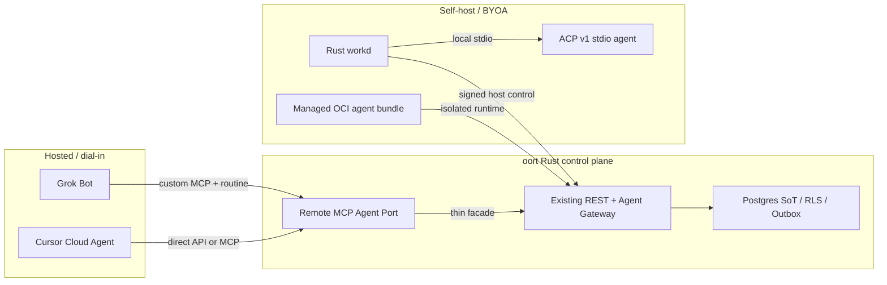

# 외부 에이전트 수용·Grok Bot·ACP·셀프호스팅 계획 감사

- 작성일: 2026-08-12 (Asia/Seoul)
- 코드 기준: `main@541ccdda714622595af308129e5a9e0962900f97`, 문서 작업 base `track/engine@1b623576fd05be3c370d6560b7822eb008823b1a`
- 범위: Grok Bot 동향, hosted-agent 수용, MCP Agent Port, ACP 재랜딩, self-host agent bundle/catalog/update 계획
- 방법: 공식 1차 문서, GitHub 이력, 현행 Rust/Swift/infra 코드 독립 교차검수
- 변경 경계: 이 보고서는 판단 근거다. 같은 #1343 변경에서 관련 Proposed 문서의 사실 오류를 교정하지만 runtime 구현이나 ADR 승인을 수행하지 않는다.

## 1. 최종 판정

제품 방향은 유효하다. 다만 초기 초안의 구현 전제를 그대로 승인하면 안 된다.

1. **Grok Bot 기회는 실재한다.** 포지션은 “Grok 전용 통합”보다 **Bring your hosted agent**가 맞고, Grok Bot은 첫 setup preset이자 실증 클라이언트다.
2. **Hosted agent 수용과 ACP는 다른 계층이다.** Grok Bot은 외부 routine이 깨워 원격 MCP를 소비하는 dial-in 경로다. ACP는 self-host/BYOA host가 로컬 coding-agent 프로세스를 구동하는 stdio 경로다.
3. **Agent Port 설계는 수정이 필요하다.** Rust MCP server가 없고, 단일 `after_seq`는 channel-local `message.seq`와 맞지 않으며, 새 task state machine은 기존 gateway lease/run과 중복된다.
4. **Bot discovery는 roster import가 아니라 pairing이어야 한다.** 공개 Bot roster/control API가 문서화돼 있지 않은 상태에서 account scraping을 하지 않는다. Bot의 one-time handshake 뒤 사람이 확인한다.
5. **Disconnect는 local revoke와 provider cleanup을 분리해야 한다.** 공개 routine/connector delete API가 문서화돼 있지 않으므로 oort 권한을 즉시 폐기한 뒤 `cleanup_pending`에서 수동 정리 확인을 받는다.
6. **ACP는 전체 부재가 아니다.** schema와 일부 Rust/Swift/web 자산은 이미 있다. 실제 잔여 gap은 Rust live-chain과 v1 conformance다.
7. **Self-host catalog는 packaging contract 뒤에 와야 한다.** 현행 adapter들은 같은 image/runtime kind가 아니며 installed/latest 비교에 필요한 version heartbeat도 없다.
8. **Grok 실증은 trial-first다.** 개인 one-time trial을 먼저 확인하고 노출되지 않으면 구매 없이 account-gated로 남긴다.

권장 상태:

- ADR-0162/0163: `Proposed` 유지, 기술 승인 전 구현 머지 금지
- #1343: 사실·protocol boundary·roadmap/issue governance 정합
- #1344: trial-first Grok MCP/auth/routine/cleanup capability spike
- #1345: ACP 전체 재건이 아니라 Rust live-chain delta와 ACP v1 conformance 감사·분해
- 구현: generic MCP foundation → pairing/credential → durable inbox → gateway binding → UX/Grok E2E

## 2. Grok Bot 사실 감사

판정 표기:

- **C:** 공식 문서 또는 코드로 확인
- **H:** 실제 계정/runtime 실측 필요
- **M:** 기존 초안의 오류 또는 과도한 단정

| 항목 | 판정 | 감사 결과 |
|---|---:|---|
| 관심 상승 | C | 2026-08-11 공식 출시·beta 확대가 발표됐다. 공개 활성 사용자나 전환율 수치는 없다. |
| 계정 한도 | M→C | **Bot과 group chat 합계 최대 50**이다. Bot 50개 단독 한도가 아니다. |
| routine 한도 | C | **Bot당 routine 최대 50**이다. 계정 한도와 별개다. |
| 개인 trial | M→C/H | 개인 one-time trial이 문서화돼 있다. 실제 계정 노출은 UI 확인이 필요하다. |
| 가격·구독 | M/H | 선결제를 spike 조건으로 고정하지 않는다. live checkout 전 특정 가격을 issue contract에 박지 않는다. |
| 공개 Bot control API | C | 2026-08-12 공개 문서에서 Bot ID/roster/group/run을 열거·호출하는 API를 찾지 못했다. xAI 모델 API 전체가 없다는 뜻은 아니다. |
| 공개 cleanup API | C | routine/connector를 제3자 서비스가 생성·삭제하는 문서화된 control API를 찾지 못했다. 자동 cleanup을 약속하지 않는다. |
| custom MCP | C/H | custom remote MCP 개념은 공식 문서에 있다. 개인 Grok Bot trial에서의 실제 노출·auth는 실측 대기다. |
| routine wake-up | C/H | routine과 schedule/event 개념은 공식이다. 최소 주기와 event→MCP 폐곡선은 실측 대기다. |
| 격리 | C | 같은 사용자의 Bot들은 persistent computer의 파일·cookie·browser session·CLI credential을 공유한다. |
| provider 선택 | C | Bot은 provider/runtime bundle이고 oort가 모델을 선택하는 경로가 아니다. |

공식 근거:

- [Introducing Grok Bot](https://x.ai/news/introducing-grok-bot)
- [Grok Bot — Bots](https://docs.x.ai/grok-bot/bots)
- [Get started](https://docs.x.ai/grok-bot/get-started)
- [Skills, routines and automations](https://docs.x.ai/grok-bot/skills-routines-and-automations)
- [Computer and apps](https://docs.x.ai/grok-bot/computer-and-apps)
- [Approvals, security and privacy](https://docs.x.ai/grok-bot/approvals-security-and-privacy)
- [Teams and enterprises](https://docs.x.ai/grok-bot/teams-and-enterprises)
- [Grok connectors](https://docs.x.ai/grok/connectors)
- [Custom MCP tunneling](https://docs.x.ai/grok/connectors/custom-mcp-tunneling)

정책 경계는 공식 UI, custom MCP, routine, 공개 API로 제한한다. reverse API, credential replay, scraping, 계정 session 수집은 제외한다. 이는 법률 자문이 아니며 상용 런칭 전 계약·법무 검토가 필요하다.

- [xAI Acceptable Use Policy](https://x.ai/legal/acceptable-use-policy)
- [xAI Consumer Terms](https://x.ai/legal/terms-of-service)
- [Cursor Terms](https://cursor.com/terms-of-service)

## 3. Cursor Cloud Agents 감사

Cursor Cloud Agents는 별도의 direct API 기회다.

- durable agent와 follow-up run
- repository/environment를 생략한 no-repo agent
- cloud/self-hosted pool과 machine
- remote/stdio MCP
- SSE, artifact, usage 표면

그러나 공개 문서는 Grok Bot ID, Bot roster 또는 group chat을 노출하지 않는다. **Grok Bot 우회 API로 포장하지 않고 별도 hosted-agent direct API spike로 평가**한다.

- [Cursor Cloud Agents API endpoints](https://cursor.com/docs/cloud-agent/api/endpoints)

## 4. MCP Agent Port 코드 감사

### 4.1 Rust MCP 기반은 없다

`/v1/mcp/drive` 검색 결과는 다음 위치에 남는다.

- `docs/api/openapi.yaml`
- `scripts/verify_drive_mcp.sh`, `scripts/verify_openapi_contract.sh`
- `server/Sources/MomoServer/Routes/DriveMCPRoutes.swift`
- Swift test/fixture/migration 계약

현행 Rust router에는 이 route가 없고 MCP 전용 crate도 없다. 따라서 `/v1/mcp/drive`는 **은퇴 구현의 보안·grant 계약 참고 자료**이지 현행 Rust foundation이 아니다.

신규 Agent Port는 [MCP 2026-07-28 specification](https://modelcontextprotocol.io/specification/2026-07-28), [authorization](https://modelcontextprotocol.io/specification/2026-07-28/basic/authorization), [release notes](https://blog.modelcontextprotocol.io/posts/2026-07-28/)를 기준으로 stateless request, discovery, authorization boundary를 설계해야 한다. Swift의 2025-06-18 initialize wire shape를 복사하지 않는다.

### 4.2 `message.seq`는 channel-local이다

현행 messaging/read-state 코드는 `channel_seq.last_seq`와 channel별 gapless `message.seq`를 순서 권위로 사용한다. 서로 다른 두 channel은 동시에 `seq=1`을 가질 수 있다.

따라서 여러 channel의 mention/assignment를 한 `after_seq`로 poll하면 충돌·skip이 생긴다. 선택지는 두 가지였고, 제품/API 단순성과 재접속 검증을 위해 ADR-0162는 별도 durable `inbox_seq`를 제안한다.

- inbox row는 원본 `(channel_id, message_id, message_seq)`를 참조한다.
- `inbox_seq`는 delivery cursor이며 message order의 새 SoT가 아니다.
- 외부 API는 내부 숫자 대신 agent/connection/schema version에 묶인 opaque cursor를 반환한다.
- current membership과 원본 가시성을 read 때 다시 검사한다.
- reconnect와 duplicate consumer는 at-least-once로 처리한다.

### 4.3 새 task state machine은 중복이다

현행 Rust에는 이미 다음 gateway 경로가 있다.

- pending job claim
- lease renew/release
- run event append
- complete
- lease ownership·expiry·replay·audit 규율

근거는 `server-rust/bins/momo-server/src/routes/agent_gateway.rs`와 `server-rust/crates/momo-outbox/src/gateway.rs`다.

MCP `task_claim/task_complete/task_release`를 새 상태기계로 구현하면 job SoT가 둘이 된다. Agent Port는 기존 gateway route/domain의 thin binding이어야 한다. MCP Tasks extension은 long-running RPC result handle이지 oort의 queue lease와 동일하지 않다.

단, 현행 mention의 gateway/publish 선택은 서버 전역 `AGENT_GATEWAY_MODE`라 mixed managed+hosted 구성을 표현하지 못한다. 새 ledger가 아니라 active hosted connection을 기준으로 기존 두 delivery 목적지 중 하나를 고르는 per-agent selector가 필요하며, managed+hosted 동시 mention에서 각자의 경로와 권한이 섞이지 않는 RED/GREEN 증거가 필수다.

### 4.4 credential lifecycle 자산과 gap

현행 `token` schema와 Rust agent bearer에는 hash-only secret, scope, expiry, revoke, last-used, audit 기반이 있다. 따라서 active credential 자체를 위해 새 token table을 만들 필요는 없다.

남은 gap:

- agent credential issue/list/rotate/revoke API
- connection-scoped authority/audience
- one-time pairing secret과 lifecycle persistence
- raw credential one-time response/no-store/log redaction
- disconnect와 gateway authorization 결속

## 5. Pairing/disconnect 설계 감사

### 5.1 감지

공개 Bot roster가 없는 환경에서 안전한 v0 감지는 bot-initiated handshake다.

```text
pairing_pending → detected → active credential proof + dedicated member unpause → active → cleanup_pending → disconnected
       └──────────────→ expired
```

- `pairing_pending`: hash-only, 짧은 만료, 1회 pairing secret
- `detected`: client proof는 도착했지만 conversation/job capability는 0
- `active`: 사람이 dedicated agent member/channel/scope를 확인하고 별도 active credential proof와 같은 activation 경계의 member unpause를 완료한 뒤
- `cleanup_pending`: oort credential은 이미 revoke, provider routine/connector 정리 대기
- `disconnected`: API verification 또는 명시적 사용자 cleanup 확인

client가 보내는 Bot 이름/provider metadata는 표시용 힌트일 뿐 권한의 근거가 아니다.

### 5.2 연결 해제

연결 해제 시 local security action과 external hygiene action을 분리한다.

**즉시·자동:**

- credential revoke
- connection 전용 dedicated agent member pause
- 새 inbox/message/gateway operation 거부
- lease renew 거부와 기존 expiry 회수
- history 보존

**후속·provider UI:**

- deterministic routine 제거/비활성화
- 해당 MCP connector 제거
- provider UI에 남은 oort secret 제거
- 완료 확인

공개 cleanup API가 없는 동안 oort가 routine까지 자동 제거했다고 주장하면 안 된다. 반대로 cleanup 확인을 기다리느라 oort credential revoke를 늦춰서도 안 된다.

## 6. ACP 재랜딩 감사

“ACP가 전부 좌초했고 Rust에 `work_tool_profile`이 없다”는 전제는 틀렸다.

현행에 이미 있는 것:

- `029_work_tool_profile.sql`, `034_work_tool_profile_env_policy.sql`
- Rust spawn gating 일부
- signed polling/terminal attach 일부
- Swift `MomoACPHost`, stdio client, PTY, relay와 test 자산
- `momo-core`/web의 work-session·ACP 관전 UI
- #600/#601/#604/#623 등 랜딩 이력

실제 Rust live-chain gap:

1. Rust `momo-workd` binary와 ACP client
2. Rust work-tool-profile list/admin CRUD와 signed host projection
3. signed work-session create/event/lifecycle/PTY binding arms
4. auth/capability/cancel/close/terminal bound를 지키는 ACP v1 client
5. `toolCallId/status/kind`를 잃지 않는 lossless projection
6. durable human approval bridge
7. crash/restart/orphan reconcile와 isolation test matrix
8. Rust cutover 뒤 Swift workd retirement

ACP production 기준은 stable v1 stdio다. v2와 remote transport는 draft로 추적하되 기본 경로로 두지 않는다.

- [ACP v1 overview](https://agentclientprotocol.com/protocol/v1/overview)
- [ACP v1 transports](https://agentclientprotocol.com/protocol/v1/transports)
- [ACP v2 Draft](https://agentclientprotocol.com/protocol/v2/overview)
- [ACP registry](https://agentclientprotocol.com/get-started/registry)

Grok Build는 `grok agent stdio`의 ACP 사용을 공식 문서화한 BYOA/self-host smoke 후보다. proprietary license이므로 permissive managed bundle에 그대로 동봉하지 않는다.

- [Grok Build headless/ACP](https://docs.x.ai/build/cli/headless-scripting)

## 7. Self-host agent bundle/catalog 감사

현행 adapter/infra를 단일 `adapter_image` 모델로 취급할 수 없다.

- Rust app image는 server/relay/agent-worker 등 여러 역할을 제공하지만 ACP workd와 모든 adapter를 담은 agent host distribution이 아니다.
- `infra/rust`에는 agent-worker가 있으나 Rust workd가 없다.
- hermes는 Python plugin, prime은 별도 container 경로, codex-workbench는 shell/BYOA 성격이다.
- heartbeat에는 adapter/image version이 없어 installed/latest 자동 비교 근거가 없다.
- 과거 선행 이슈 #1228/#1229는 이미 닫혀 있어 dependency 표기를 갱신해야 한다.

catalog UI 전에 필요한 최소 packaging contract:

| 계약 | 최소 요구사항 |
|---|---|
| runtime kind | built-in worker / OCI sidecar / local ACP workd / remote dial-in 구분 |
| identity | agent member, runtime host identity, provider/ACP identity 별도 결속 |
| supply chain | immutable digest, arch, SBOM/provenance, license/NOTICE, schema version |
| isolation | agent별 process/container, secret namespace, filesystem/network/resource cap |
| credentials | host-local provider secret, agent별 최소 scope, revoke/audit, server DB 비유입 |
| lifecycle | install/health/drain/update/rollback, mutable tag 금지 |
| update authority | v0 verified command, v1 최소권한 host helper, app server Docker socket 금지 |

첫 목표는 “catalog에 N개 agent”가 아니라 canonical permissive agent 1종을 선택 설치 → provider 연결 → mention 응답 → update/rollback까지 닫는 vertical slice다. catalog/latest UI는 package manifest와 version heartbeat 이후에 온다.

공개 배포에는 #1332 NOTICE/재배포 귀속과 사람 법무 검토가 계속 hard gate다.

## 8. 권장 제품·protocol 경계



- MCP: hosted/dial-in agent가 기존 conversation/job 계약을 소비하는 remote data/tool surface
- ACP: trusted self-host workd가 local agent process와 session/approval/terminal을 주고받는 stdio surface
- Gateway: job/run/lease/events의 유일 SoT
- Postgres/outbox: message write와 order의 유일 SoT
- Catalog: runtime package metadata이며 실행 상태의 새 SoT가 아님

## 9. 권장 roadmap 재편성

### Wave R — 사실·거버넌스 수리

1. #1343에 본 감사와 교정 문서를 랜딩
2. ADR-0162/0163 `Proposed` 유지와 blocker 명시
3. #1343~#1345 assignee/label/milestone/Project/claim 정합
4. #599 등 merge됐지만 열린 과거 ACP 이슈의 상태 drift 별도 정리

### Wave 0 — 작은 실측

- Grok Bot individual one-time trial custom MCP/auth/routine/cleanup spike
- Cursor Cloud Agents direct API/no-repo/MCP spike
- Grok Build ACP v1 auth/handshake manual smoke

각 spike는 non-production data만 쓰고 비용·계정·법무·beta 경계를 기록한다.

### Wave 1 — Agent Port foundation

1. ADR-0162 auth/cursor/gateway/pairing/cleanup 승인
2. agent credential issue/rotate/revoke API
3. Rust MCP 2026-07-28 discovery/transport/auth/revoke/rate-limit/audit
4. one-time pairing과 connection lifecycle
5. existing conversation REST/domain thin facade
6. durable cross-channel inbox cursor
7. existing gateway binding
8. generic client reconnect/concurrency/revoke E2E
9. Grok preset web/Tauri setup·disconnect UX와 real account E2E

### Deferred lane — ACP live-chain (#1345 audit + 별도 승인 필요)

아래는 #1345가 현행 gap을 다시 검증한 뒤 ADR-0130 addendum와 별도 roadmap/issue 승인을 받아야 하는 후보 순서다. Wave 1의 선행조건이나 이미 편성된 구현 wave가 아니다.

1. ADR-0130 addendum와 v1 conformance matrix
2. Rust profile CRUD/signed projection
3. signed work-session/PTY arms
4. Rust `momo-workd`와 crash/reconcile
5. ACP v1 client auth/capability/cancel/close/terminal
6. durable approval와 lossless projection
7. isolation/supply-chain/real-agent matrix
8. Swift retirement

### Deferred lane — self-host agent bundle (ADR-0163 Accepted + 별도 승인 필요)

아래는 ADR-0163이 Accepted 되고 license/supply-chain/host-control 경계가 별도 issue로 봉인된 뒤에만 편성할 후보 순서다. 현재 hosted-agent 런칭의 active wave가 아니다.

1. runtime/package manifest contract
2. canonical permissive agent 1종 vertical slice
3. signed catalog manifest와 installed-version heartbeat
4. v0 verified update command/rollback
5. v1 최소권한 host helper
6. 이후 catalog onboarding UI와 여러 agent 확장

Wave 1과 deferred ACP lane은 구현 파일은 대부분 독립이지만 identity/token/audit 계약을 ADR에서 맞춘다. self-host bundle 후보는 ACP lane의 workd와 supply-chain 계약을 소비한다. 현행 M1 production, #1332 legal/NOTICE, M7 release gate를 우회하지 않는다.

## 10. Issue 정리 제안

| Issue | 권장 계약 |
|---|---|
| #1343 | 사실 오류 정정, protocol boundary 확정, roadmap/issue split, governance metadata 완료 |
| #1344 | 가격/선결제 전제를 제거한 trial-first Grok capability/auth/routine/cleanup spike |
| #1345 | `work_tool_profile` 전체 부재 전제를 제거하고 Rust live-chain delta와 ACP v1 conformance 분해 |

신규 구현 issue 후보:

- MCP foundation/auth
- agent credential lifecycle
- hosted connection pairing lifecycle
- conversation facade
- durable inbox cursor
- gateway binding
- Grok E2E/setup guide
- web/Tauri pairing UX
- web/Tauri disconnect cleanup UX
- mobile read-only connection status
- Cursor Cloud Agents direct API spike
- ACP addendum/profile/session/workd/client/approval/isolation/retirement
- self-host package manifest/canonical bundle/version heartbeat/update helper

각 구현은 1 issue = 1 PR이고, engine과 UXUI 파일 소유를 나눈다. 공유 core 변경은 engine handoff와 merge-tree gate를 거친다.

## 11. 필수 수용·보안 gate

### Hosted/MCP

- expired/revoked/wrong-audience token 즉시 거부
- pairing secret hash-only/short TTL/single-use/replay 거부
- `detected`에서 data capability 0, human confirm + separate active proof + dedicated member unpause 뒤에만 active
- cross-workspace/channel RLS와 current membership 재검증
- message post idempotency와 outbox atomicity
- two-channel same `message.seq` 충돌 red proof
- reconnect/duplicate consumer에서 누락 없음
- gateway lease expiry/renew/release/complete 경쟁 동일성
- disconnect 즉시 local revoke, history 보존
- cleanup 확인 전 `cleanup_pending` 유지

### ACP/workd

- ACP v1 version/auth/capability negotiation
- malformed/oversize NDJSON, unknown extension, cancel/close
- dynamic permission option, expiry/duplicate/late approval
- terminal output bound, signal, kill/release, root/env escape
- daemon crash, spawn-before-ack, restart orphan/duplicate process
- interleaved `toolCallId` correlation

### Self-host bundle

- immutable digest/attestation/SBOM/license/NOTICE
- agent별 secret/filesystem/network/resource isolation
- server Docker socket 미마운트
- update intent→pull→health→drain→rollback fail-closed loop
- 0-agent 설치와 canonical 1-agent 설치 모두 지원
- 실제 새 machine에서 select→provider link→mention response 재현

## 12. Runtime-unverified와 계획 이탈

### Runtime-unverified

- 개인 Grok Bot trial 노출 여부
- 개인 Bot UI의 custom MCP와 지원 auth
- Cursor backend proxy의 network/header/redirect 특성
- routine 최소 간격과 event→MCP 폐곡선
- disconnect UI에서 routine/connector cleanup 동선
- Grok Build ACP authMethods와 새 Rust client 실왕복
- Cursor Cloud Agents no-repo agent의 실제 UX/비용
- self-host 공개 registry/supply-chain 배포

### 기존 계획 대비 이탈

- “Bot 50 미확인” → Bot+group chat 합계 50 공식 확인
- “50은 routine만” → Bot당 routine 50도 별도 공식 확인
- 유료 계정 선결제 → individual one-time trial-first
- Bot API 절대 부재 → 공개 Bot control API **미문서화**, official MCP/routine 경로 실측
- Cursor repo-only → 별도 no-repo/direct API opportunity
- Rust MCP 존재 → retired Swift contract reference, Rust foundation 신규
- global `message.seq` cursor → invalid, durable inbox cursor 필요
- MCP task state 신규 → existing gateway thin binding
- Rust `work_tool_profile` 부재 → DDL/gating 존재, CRUD/live workd arms가 gap
- uniform adapter image/catalog → runtime-kind/package contract 선행
- 연결 해제 단일 상태 → immediate revoke + `cleanup_pending` provider cleanup

## 13. 실행 승인 경계

사용자가 승인한 것은 제품 방향과 권장 순서다. ADR-0162의 API/auth/schema 기술 결정은 이 문서의 리뷰를 거쳐 별도로 `Accepted`로 전환해야 한다.

즉시 가능한 것:

- #1343 문서·issue governance 정합
- #1344 trial availability 확인 준비
- generic read-only/code audit와 issue split

추가 사용자 동의가 필요한 것:

- Grok Bot 앱 설치
- 본인이 수행하는 Grok/Cursor 로그인·consent
- trial이 없을 때 유료 결제
- ADR-0162 기술 결정 `Accepted`
- track→main 통합

password, MFA, token, cookie, 결제 정보는 사용자에게 전달받지 않는다.
