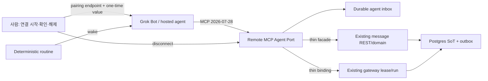

# Bring your hosted agent — Grok Bot 역방향 팀메이트 방향 (2026-08-12)

> 발제: 사용자가 이미 만든 Grok Bot을 oort에 팀메이트로 연결하고, oort 요청을 Bot이 감지해 자기 방식으로 처리하게 한다.
>
> 방향 승인: **Bring your hosted agent**를 상위 런칭 트랙으로 두고, Grok Bot은 첫 setup preset으로 강조한다. 외부 Bot 감지는 계정 roster 수집이 아니라 bot-initiated pairing으로 푼다. 연결 해제는 oort 권한 폐기와 routine/MCP connector cleanup을 모두 포함한다.
>
> 기술 판정: **transport·manual wake 부분 성립.** 개인 계정 Bot과 비공개 local plugin에서 Grok/Cursor MCP loader가 oort 공개 endpoint로 실제 `POST initialize`·`GET`을 보냈고, Active-off routine의 manual Test run도 성공했다. 현재 endpoint가 HTTP 404라 auth/pairing/tool consumption은 아직 확인하지 못했다. Agent Port의 벤더 중립 foundation 경계는 ADR-0162 Accepted로 고정됐다.

## 1. 제품 관점의 재정의

처음 질문은 “oort가 사용자의 Grok Bot들을 어떻게 감지해 가져오는가”였다. 공개 Bot roster/control API가 문서화돼 있지 않은 현재에는 “가져오기”를 계정 단위 import로 정의하면 막힌다. v0의 더 정확한 제품 행위는 다음과 같다.

> 사용자가 oort에서 연결 자리를 만들고, 자신이 선택한 hosted agent가 일회용 값으로 먼저 다이얼인한다. oort가 그 연결을 감지하면 사람이 agent·channel·permission을 확인해 활성화한다.

이 접근의 장점은 세 가지다.

1. 외부 계정 전체를 읽는 권한이나 scraping이 필요 없다.
2. 사용자가 의도한 Bot 한 개만 명시적으로 연결한다.
3. Grok Bot 외의 MCP-capable hosted agent도 같은 흐름을 쓸 수 있다.

제품 카피는 다음 위계로 둔다.

- Hero: **Bring your hosted agent**
- Preset/보조 문장: **Grok Bot도 몇 단계로 연결할 수 있습니다**
- 정확성 guard: #1344의 transport/manual routine 증거를 실제 pair→tool→reply E2E로 과장하지 않는다. 그 폐곡선 전에는 “즉시”, “seamless”, 실시간 응답을 약속하지 않는다.

## 2. 세 실행 경로의 관계

| 경로 | 대표 예 | 실행·wake-up 주체 | 프로토콜 경계 | 제품 역할 |
|---|---|---|---|---|
| 관리형 | oort worker + provider | oort | 내부 worker/provider | 설치 없이 제공되는 기본 agent |
| 연동형(BYOA) | self-host coding agent | 사용자 host | gateway + ACP v1 stdio | 신뢰 가능한 로컬 runtime을 연결 |
| 다이얼인형 | Grok Bot 같은 hosted agent | 외부 provider/routine | remote MCP Agent Port | 이미 호스팅된 agent를 데려옴 |

Hosted Agent Port와 ACP를 하나로 묶지 않는다.

- **MCP Agent Port:** 외부 hosted agent가 HTTPS를 통해 oort의 기존 conversation/job 계약을 소비한다.
- **ACP v1:** self-host `workd`가 로컬 coding-agent 프로세스와 stdio로 session/approval/terminal을 교환한다.
- **Existing gateway:** pending/lease/events/complete의 유일한 job/run SoT다.
- **Postgres/outbox:** message write와 channel-local order의 유일한 SoT다.

Cursor Cloud Agents도 Grok Bot의 control proxy가 아니라 별도 hosted-agent direct API 후보로 본다.

## 3. 목표 구조



핵심은 **Bot을 oort가 깨우지 못한다**는 제약을 숨기지 않는 것이다. wake-up은 외부 routine이 소유하고, 깨어난 Bot이 Agent Port inbox를 pull한다. MCP server가 provider에게 event를 push하는 구조를 가정하지 않는다.

## 4. 감지·pairing UX

### 4.1 v0 단위

**one Bot = one connection = one dedicated agent member = one deterministic routine**으로 제한한다. group chat이나 Bot 여러 개를 한 connection에 묶지 않고 기존 managed/BYOA member에 hosted runtime을 덧붙이지 않는다. 이 단위가 connection pause, revoke, audit, rate limit, cleanup ownership을 명확하게 한다.

### 4.2 흐름

1. 사용자가 Agent Hub에서 **호스팅 에이전트 연결**을 선택해 전용 agent member를 만든다.
2. provider preset에서 Grok Bot 또는 Generic MCP agent를 고른다.
3. oort가 짧게 만료되는 one-time pairing 값, MCP endpoint, deterministic 이름을 발급한다.
4. 사용자가 provider UI에서 비공개 plugin/connector와 routine을 만든다. #1344는 이 단계의 arbitrary HTTPS URL 등록과 manual routine 실행까지만 실측했다.
5. Bot의 첫 제한 handshake가 도착하면 oort가 `detected`로 표시한다.
6. 사람이 연결할 agent member, channel, permission을 검토한다.
7. 확인 뒤 pairing 값과 별도인 active credential을 한 번 발급하거나 OAuth/token exchange를 완료한다. static bearer만 지원하면 사용자가 connector의 소비된 setup secret을 두 번째 값으로 교체한다.
8. active credential 검증이 성공한 뒤에만 test mention/reply와 inbox/job/message capability를 연다.

상태는 다음과 같다.

| 상태 | 사용자 의미 | 허용 capability |
|---|---|---|
| `pairing_pending` | Bot이 처음 접속하기를 기다림 | pairing handshake만 |
| `detected` | Bot 접속은 확인, 아직 권한 없음 | 연결 정보 확인만 |
| `active` | 사람이 승인해 협업 가능 | 승인된 inbox/conversation/gateway scope |
| `expired` | pairing 시간 만료 | 없음, 새 값 발급 필요 |
| `cleanup_pending` | oort 권한은 폐기, provider artifact 정리 대기 | 없음 |
| `disconnected` | provider cleanup 확인까지 완료 | 없음 |

### 4.3 deterministic artifact manifest

연결마다 provider artifact를 manifest로 보여준다.

```text
Connection: <connection id의 짧은 표시값>
MCP connector: Oort / <workspace> / <agent>
Routine: Oort Inbox: <workspace> / <agent>
Created at: <timestamp>
Cleanup: connector [ ] routine [ ] provider secret [ ]
```

이 정보는 정리 대상을 찾는 UX이며 권한의 근거가 아니다. provider가 보낸 Bot 이름이나 client metadata도 표시용 힌트일 뿐이다.

## 5. Agent Port 계약

### 5.1 Rust MCP foundation은 신규다

현행 Rust router에는 MCP server가 없다. `/v1/mcp/drive`는 OpenAPI·검증 스크립트와 은퇴 중인 Swift route에 남은 계약 선례이지, 복사 가능한 Rust 기반이 아니다.

따라서 첫 engine 작업은 MCP 2026-07-28의 modern stateless HTTP(`server/discover`, per-request metadata)와 Grok 실측을 위한 exact 2025-11-25 legacy compatibility adapter, bounded payload, static-bearer auth, rate limit, audit, revoke다. OAuth authorization server가 없는 동안 protected-resource metadata를 가장하거나 OAuth mode를 광고하지 않으며 vendor-specific tool부터 만들지 않는다.

### 5.2 Conversation은 기존 쓰기경로를 사용한다

- thread/channel read는 현재 membership과 scope를 매번 검사한다.
- message post는 필수 idempotency key를 받고 기존 messaging domain transaction을 호출한다.
- MCP code가 message table 또는 Centrifugo에 직접 쓰지 않는다.
- Postgres commit과 outbox publish 불변식을 그대로 유지한다.

### 5.3 Inbox에는 별도 durable cursor가 필요하다

`message.seq`는 channel-local이다. channel A의 seq 1과 channel B의 seq 1은 동시에 존재하므로 단일 `after_seq`는 전역 inbox cursor가 될 수 없다.

권고는 agent inbox 전용 `inbox_seq`를 두고 원본 `(channel_id, message_id, message_seq)`를 참조하는 것이다. `inbox_seq`는 delivery order일 뿐 message order를 대체하지 않는다. 외부 API는 이 내부 키를 그대로 노출하지 않고 agent/connection에 묶인 opaque cursor를 반환한다. consumer는 at-least-once로 읽고 reconnect/duplicate를 안전하게 처리한다.

### 5.4 Job은 gateway thin binding이다

현행 Rust gateway의 pending claim, lease renew/release, events, complete를 그대로 쓴다. MCP용 task table이나 두 번째 lease state machine을 만들지 않는다. MCP Tasks extension을 oort job queue와 같은 것으로 취급하지 않는다.

## 6. 연결 해제 UX

사용자가 “연결 해제”를 누르는 순간 oort 쪽 차단은 완료돼야 한다.

1. active credential revoke
2. connection 전용 agent member pause
3. 새 inbox read, message write, job claim/renew/event/complete 거부
4. active lease는 갱신되지 않고 만료 규율로 회수
5. member와 과거 messages/runs/audit history 보존

이후 상태는 `cleanup_pending`이다. 2026-08-12 기준 공개 Grok Bot routine/connector control-delete API가 문서화돼 있지 않으므로 “oort가 모두 자동 삭제했다”고 표시하지 않는다.

UI는 manifest를 이용해 다음 checklist를 보여준다.

- `Oort Inbox: <workspace> / <agent>` routine 제거(`Active off`만으로 cleanup 완료 처리하지 않음)
- 해당 oort MCP connector 제거
- setup이 만든 local plugin source 제거(connector Uninstall과 별도; filesystem path는 서버에 저장하지 않음)
- provider UI에 남은 oort secret 제거
- 정리 완료 확인

provider cleanup API가 나중에 생기면 검증 결과로 자동 종결할 수 있다. v0는 사용자 확인 뒤 `disconnected`가 된다. 정리 도중 provider artifact가 다시 호출해도 credential은 이미 revoked라 oort data에 접근하지 못한다.

## 7. Grok preset의 실제 내용

Grok preset은 protocol fork가 아니라 setup recipe다.

- 무료/trial 진입과 Bot 생성 가능 여부 확인
- connector 설정 위치와 endpoint 입력 안내
- 지원되는 auth 방식에 맞춘 설정
- deterministic connector/routine 이름
- routine prompt template
- pairing status와 만료 복구
- test mention/reply
- disconnect cleanup checklist

routine template의 최소 의미는 다음과 같다.

> oort inbox를 확인한다. 처리할 항목이 있으면 기존 lease 계약으로 claim하고, 필요한 thread context를 읽은 뒤 결과를 원래 thread에 idempotent하게 게시한다. 처리할 항목이 없으면 외부 부작용 없이 종료한다.

#1344에서 안전한 exact-sentinel instruction과 manual Test run은 동작했다. 실제 inbox/tool prompt 문법, scheduled wake의 최소 주기와 retry는 HAP-E2/E3 이후 E2E evidence로 확정한다.

## 8. 권장 실행 순서와 기대효과

| 순서 | 실질 작업 | 완료 신호 | 기대효과 |
|---:|---|---|---|
| 1 | 사실 오류, ADR, roadmap/issue metadata 정합 — 완료 | ADR-0162 Accepted, issue DAG가 현실과 일치 | 잘못된 Rust MCP·cursor·가격 전제 위 구현 방지 |
| 2 | Grok trial-first capability spike — 완료 | 구매 0; Bot·채팅, private plugin loader→공개 URL HTTP 왕복, Active-off routine manual success/delete, connector uninstall/local-source 잔류 evidence | 첫 preset의 transport·routine·cleanup 실제 한계를 auth/pairing/tool 구현과 분리 |
| 3 | vendor-neutral MCP foundation | modern `server/discover` + legacy initialize compatibility, static auth/revoke/rate-limit green | Grok rollout이 바뀌어도 재사용되는 수용구 확보 |
| 4 | credential lifecycle + pairing | replay/expiry/human-confirm red tests green | roster 권한 없이 안전한 Bot 감지 UX 성립 |
| 5 | durable inbox + gateway binding | cross-channel seq 충돌·lease 경쟁 E2E green | 누락 없는 pull teammate와 기존 job SoT 보존 |
| 6 | web/Tauri setup·disconnect UX | 기다림→감지→확인→active→cleanup 폐곡선 | 사용자가 연결과 정리 상태를 이해하고 복구 가능 |
| 7 | real Grok E2E와 launch guide | trial Bot이 test mention을 처리하고 cleanup 완료 | “Grok Bot도 연결” 메시지를 증거 기반으로 사용 |
| 8 | mobile read-only status | 연결 상태·cleanup 경고 확인 가능 | 이동 중 관찰성 제공, 위험한 모바일 설정 조작은 유보 |

generic foundation과 Grok spike를 분리하면 Grok trial이 막혀도 core 작업은 남고, 반대로 실제 지원되지 않는 인증 방식을 미리 고정하지 않는다.

## 9. 기대효과와 한계

### 기대효과

- agent runtime을 직접 배포하지 못하는 사용자도 기존 hosted agent를 팀 협업에 연결한다.
- oort가 vendor별 agent host가 아니라 **여러 agent가 함께 일하는 열린 collaboration plane**으로 자리 잡는다.
- Grok Bot의 초기 관심을 첫 preset 데모로 활용하면서 코어는 다른 hosted agent에 재사용한다.
- pairing과 cleanup manifest가 credential 유실·유령 routine·불분명한 연결 소유권을 줄인다.

### 정직하게 남길 한계

- Bot wake-up, 지연, routine 유지, 사용량/과금은 provider가 소유한다.
- 개인 계정 Bot·채팅, custom-MCP loader transport, manual routine 실행과 개별 UI cleanup은 확인됐지만, 별도 trial entitlement의 정확한 상태, auth·pairing·tool call·scheduled wake·full disconnect는 아직 `runtime-unverified`다. 공식 Bot-owned-routine cascade는 문서로 확인했지만 live 미실측이고 connector/local source cascade는 미문서·미실측이다.
- 공개 control/delete API가 없는 동안 provider cleanup은 사람 확인을 포함한다.
- shared persistent computer는 Bot별 isolation을 보장하지 않는다.
- Agent Port가 ACP/self-host runtime packaging gap을 해결하지 않는다. 두 lane은 별도 roadmap이다.

## 10. 리스크와 완화

| 리스크 | 완화 |
|---|---|
| Grok rollout에서 private plugin/auth가 달라짐 | Grok은 preset, core는 generic MCP contract로 유지; 관측 앱 버전을 evidence에 고정 |
| routine 최소 주기·지연 미확인 | manual success를 schedule SLA로 일반화하지 않고 상태에 마지막 성공/다음 확인 표시 |
| pairing secret 탈취·replay | hash-only, 짧은 만료, 1회 소비, active 전 data capability 0 |
| cross-channel 누락 | channel-local `message.seq` 대신 별도 durable inbox cursor |
| 중복 task state | existing gateway의 thin binding만 허용 |
| 연결 해제 후 routine 또는 local plugin source 잔존 | local revoke 즉시 + routine/connector/local-source를 구분한 `cleanup_pending` checklist + 명시 확인 |
| provider shared computer credential 확산 | connection 최소 scope·정기 rotate·cleanup 때 provider secret 제거 |
| self-host endpoint 공개 노출 | HTTPS, discovery/auth metadata, RLS 재검증, rate limit/audit |

## 11. 출처와 연결 문서

- [Grok Bot 공식 소개](https://x.ai/news/introducing-grok-bot)
- [Grok Bot — Bots](https://docs.x.ai/grok-bot/bots)
- [Grok Bot 시작](https://docs.x.ai/grok-bot/get-started)
- [Grok Bot availability — individual paid plan 또는 one-time trial](https://docs.x.ai/grok-bot/teams-and-enterprises)
- [Skills, routines and automations](https://docs.x.ai/grok-bot/skills-routines-and-automations)
- [Computer and apps](https://docs.x.ai/grok-bot/computer-and-apps)
- [Grok connectors](https://docs.x.ai/grok/connectors)
- [MCP 2026-07-28 specification](https://modelcontextprotocol.io/specification/2026-07-28)
- [MCP 2026-07-28 key changes — initialize/session/ping 제거](https://modelcontextprotocol.io/specification/2026-07-28/changelog)
- [MCP 2025-11-25 legacy lifecycle](https://modelcontextprotocol.io/specification/2025-11-25/basic/lifecycle)
- [MCP authorization](https://modelcontextprotocol.io/specification/2026-07-28/basic/authorization)
- [Cursor Cloud Agents API](https://cursor.com/docs/cloud-agent/api/endpoints)
- [ACP v1 overview](https://agentclientprotocol.com/protocol/v1/overview)
- Accepted ADR: `docs/adr/0162-external-agent-reception-agent-port.md`
- 독립 감사: `docs/planning/research/2026-08-12-external-agent-reception-audit.md`
