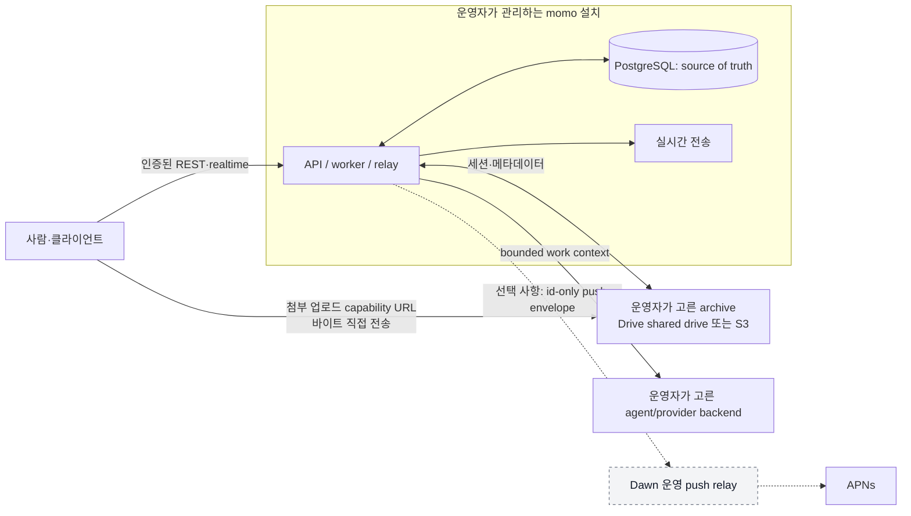

# oort 보안 판단 자료

이 문서는 조직이 oort를 도입할지 판단할 때 읽는, 구현과 결정 기록에 연결된 한국어 자료다. 취약점 신고 절차와 지원 범위는 영문 [Security Policy](../../SECURITY.md)를 따른다. 여기서 말하는 경계는 현재 저장소의 코드와 ADR에 근거하며, 인증·심사·무결함을 보증하지 않는다.

## 신뢰 경계

실선은 oort 설치가 처리하는 경로이고, 점선은 선택적인 Dawn push 경로다. 기본 API·DB·realtime·agent 실행·파일·백업 요청은 Dawn을 통과하지 않는다. relay가 받는 것은 device routing, badge, channel/message 식별자 또는 hash뿐이며 본문·prompt·첨부는 포함하지 않는다. relay를 등록하지 않으면 push만 사용할 수 없고 oort 자체는 계속 사용할 수 있다. [근거: README 55–76행](../../README.md#L55-L76), [ADR-0120 D2](../adr/0120-push-notification-boundary.md#L21-L24)

외부 agent/provider는 별도 신뢰 경계다. oort는 제한된 작업 컨텍스트를 해당 backend로 직접 보낼 수 있으나 Dawn을 경유하지 않는다. provider의 Codex/OpenAI OAuth와 원본 API key는 provider가 소유하며 oort는 이를 저장·proxy·log·persist하지 않는다. [근거: README 70–76행](../../README.md#L70-L76), [ADR-0004 8–20행](../adr/0004-codex-oauth-hermes-provider-boundary.md#L8-L20)

## 적용된 통제

### 테넌트 격리와 API 부팅

워크스페이스 행은 PostgreSQL RLS를 `ENABLE`과 `FORCE`로 켜고, `app.workspace_id`와 일치하는 행만 읽기·쓰기를 허용한다. 즉 이 경계는 애플리케이션 조건문만이 아니라 데이터베이스 정책으로도 집행된다. [근거: migration 001 381–400행](../../server/Migrations/001_init.sql#L381-L400)

API는 현재 DB role이 정확히 `momo_app`이고, superuser도 `BYPASSRLS`도 아닐 때만 부팅을 계속한다. 조건을 만족하지 않으면 오류를 던져 시작하지 않는다. [근거: `DatabaseSecurityPosture` 20–30행](../../server/Sources/MomoServer/DB/DatabaseSecurityPosture.swift#L20-L30)

감사 로그 조회는 인증된 human workspace admin에게만 허용되며, workspace 범위와 시간·행위 등의 filter를 적용해 REST 응답으로 돌려준다. [근거: `AuditRoutes` 18–85행](../../server/Sources/MomoServer/Routes/AuditRoutes.swift#L18-L85) 첨부 업로드 시작·완료·실패도 각각 audit action으로 기록된다. [근거: `AttachmentRoutes` 110–115행](../../server/Sources/MomoServer/Routes/AttachmentRoutes.swift#L110-L115), [182–192행](../../server/Sources/MomoServer/Routes/AttachmentRoutes.swift#L182-L192)

### 자격증명과 provider

Codex/OpenAI OAuth authorization/access/refresh token과 provider API key는 oort의 app·API·worker·DB·diagnostics·local gate evidence 경계 밖이다. 외부 provider verifier는 이 환경변수가 oort 검증 프로세스에 전달되면 실패한다. [근거: ADR-0004 8–15행, 37–44행](../adr/0004-codex-oauth-hermes-provider-boundary.md#L8-L15), [verifier 183–197행](../../scripts/verify_external_agent_provider.sh#L183-L197)

### 첨부

업로드 요청은 archive backend가 만든 upload URL을 클라이언트에 반환하므로 업로드 바이트는 capability URL로 직접 전송된다. oort는 세션 생성 전후에 채널 멤버십을 확인하고 pending attachment·감사 기록을 만든다. [근거: `AttachmentRoutes` 60–90행, 119–125행](../../server/Sources/MomoServer/Routes/AttachmentRoutes.swift#L60-L90) 완료 시에는 저장소가 보고한 크기·MIME·file ID를 요청 때 저장한 값과 대조한다. [근거: `AttachmentRoutes` 152–209행](../../server/Sources/MomoServer/Routes/AttachmentRoutes.swift#L152-L209)

첨부 content 조회는 같은 workspace의 archived 되지 않은 채널에 속한 active member만 통과한다. [근거: `AttachmentRoutes` 371–397행](../../server/Sources/MomoServer/Routes/AttachmentRoutes.swift#L371-L397) S3 backend의 presigned URL 기본 만료는 900초(15분)다. [근거: `S3ArchiveClient` 83–109행](../../server/Sources/MomoServer/Drive/S3ArchiveClient.swift#L83-L109)

MOMO-638 migration은 `drive_file_id` 단독 unique를 `(workspace_id, drive_file_id)` partial unique로 교체했다. 같은 Drive file ID를 서로 다른 workspace가 참조해도 unique 제약으로 다른 workspace의 존재를 드러내지 않도록 한 변경이다. [근거: migration 044 4–14행](../../server/Migrations/044_attachment_drive_file_workspace_unique.sql#L4-L14), [35–39행](../../server/Migrations/044_attachment_drive_file_workspace_unique.sql#L35-L39)

### Drive와 위임

현재 Drive 경로는 개인 Drive 연결이 아니라 service account와 운영자가 지정한 하나의 shared drive 경로로 시작한다. 개인 Drive 확장은 ADR에서 예약된 경로다. [근거: ADR-0113 D3](../adr/0113-connector-credential-plugin-boundary.md#L27-L30) Drive backend는 요청에 `driveId`를 넣고 받은 file metadata의 `driveId`도 다시 확인하며, service account token은 `drive.readonly` scope를 사용한다. [근거: `DriveBackend` 224–256행](../../server/Sources/MomoServer/Drive/DriveBackend.swift#L224-L256), [420–429행](../../server/Sources/MomoServer/Drive/DriveBackend.swift#L420-L429)

Drive plugin migration은 credential과 shared-drive identifier를 DB에 저장하지 않는다고 명시한다. plugin grant에는 `granted_by = member_id` 제약이 있어 타인이 대신 발급하는 grant를 허용하지 않으며, tool 호출은 active delegated member의 active grant를 찾아야 진행된다. [근거: migration 015 4–6행](../../server/Migrations/015_drive_mcp_plugin.sql#L4-L6), [migration 013 62–72행](../../server/Migrations/013_plugin_registry.sql#L62-L72), [`DriveMCPRoutes` 134–175행](../../server/Sources/MomoServer/Routes/DriveMCPRoutes.swift#L134-L175)

### 배포·소스 공개

oort는 Apache-2.0이고 기여에는 DCO를 사용하며 별도 CLA를 요구하지 않는다. [근거: README 187–194행](../../README.md#L187-L194), [CONTRIBUTING DCO 11–22행](../../CONTRIBUTING.md#L11-L22) Tauri **next** 채널은 minisign 업데이트 서명과 Developer ID 서명·공증·staple 절차를 문서화한다. [근거: `NEXT_CHANNEL` 31–60행](../NEXT_CHANNEL.md#L31-L60)

## 현재 한계와 도입 시 확인할 점

- 첨부에는 바이러스·멀웨어 검사가 없고, MIME은 형식 검증 및 선언값과 저장소 메타데이터의 일치만 확인한다. MIME sniffing은 하지 않는다. [근거: 조사 기록 12행](../planning/JOURNAL.md#L12), [`AttachmentRoutes` 462–467행](../../server/Sources/MomoServer/Routes/AttachmentRoutes.swift#L462-L467), [158–160행](../../server/Sources/MomoServer/Routes/AttachmentRoutes.swift#L158-L160)
- 브라우저는 refresh token을 `localStorage`에 둔다. desktop shell에서는 OS keychain을 사용하지만 브라우저 경로의 XSS 위험을 이 사실이 없애지는 않는다. [근거: `session.ts` 7–15행](../../clients/web/src/lib/session.ts#L7-L15)
- Tauri desktop shell에는 CSP가 설정돼 있고(MOMO-640), 원격 script·font·frame·object 경로를 닫는다. 다만 **`connect-src`는 의도적으로 넓다** — 접속할 서버 주소가 연결 화면에서 입력되는 런타임 값이고(HTTP LAN 서버 포함), 관전 터미널이 그와 별개인 호스트 엔드포인트를 직접 문다. 즉 이 CSP는 **주입된 스크립트가 원격 코드를 불러오는 것**을 막지, 임의 목적지로의 네트워크 연결 자체를 막지는 않는다. `style-src`의 `'unsafe-inline'`도 터미널 렌더러가 셀마다 style 속성을 쓰기 때문에 남아 있다. [근거: `tauri.conf.json` 23–25행](../../clients/desktop/src-tauri/tauri.conf.json#L23-L25), [`serverBase.ts` 1–24행](../../clients/web/src/lib/serverBase.ts#L1-L24), [`terminalRuntime.ts` 19–25행](../../clients/web/src/features/work/terminalRuntime.ts#L19-L25)
- 이 문서는 제3자 보안 감사, 침투 테스트, SOC 2 또는 ISO 인증을 주장하지 않는다. 릴리스 게이트의 Enterprise Trust 항목도 threat model·pentest plan·security whitepaper draft를 요구하는 설계 단계로 기록되어 있다. [근거: QA release gate 74행](../cicd/05-qa-release-gate.md#L74)
- 구 macOS alpha 채널의 SwiftPM development/Xcode-host build는 unsigned이며, 그 채널은 공증 배포 준비를 주장하지 않는다. Developer ID·공증·staple은 위에서 구분한 **next** 채널의 절차다. [근거: `MACOS_ALPHA_UPDATE_CHANNEL` 8–17행](../MACOS_ALPHA_UPDATE_CHANNEL.md#L8-L17), [`NEXT_CHANNEL` 33–50행](../NEXT_CHANNEL.md#L33-L50)
- 개인 Google Drive OAuth 연결은 현재 제공하지 않는다. ADR은 개인 Drive를 향후 확장으로 예약했을 뿐이다. [근거: ADR-0113 D3](../adr/0113-connector-credential-plugin-boundary.md#L27-L30)

## 읽는 방법

이 자료는 위협 모델이나 인증서가 아니라 현재 구현과 승인된 결정의 인덱스다. 운영 환경의 network egress, provider 선택, archive backend, secret 관리와 업데이트 채널은 조직의 정책과 함께 별도로 검토해야 한다. 취약점은 공개 이슈가 아니라 영문 [Security Policy](../../SECURITY.md#report-a-vulnerability)의 private advisory 절차로 신고한다. [근거: SECURITY 22–44행](../../SECURITY.md#L22-L44)
