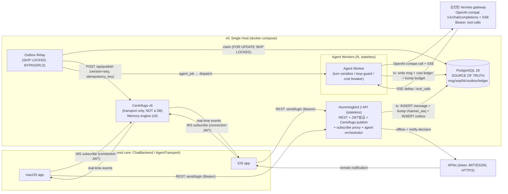
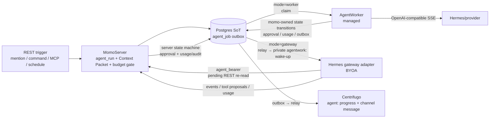

# oort — L4 빌드 스펙 (통합본)

> 에이전트 1급 멀티테넌트 메신저. 6개 설계축 + 3개 보강(outbox / 비용회계 / APNs)을 단일 정합 설계로 통합. 코딩 에이전트가 바로 구현 착수 가능한 수준. 모든 DDL은 정본 `/Users/kwakseongjae/projects/momo/schema_v0.sql`(PostgreSQL 18, `uuidv7()` PK, member 추상화, `channel_seq` 행카운터)에 정합되도록 조정함. **축 간 불일치는 §0.5에서 리드 아키텍트 권한으로 확정 조정.**
>
> 표기: `(검증됨)` = 공식문서/리포 교차확인. `(추정)` = 설계 판단. `(휴면주의)` = 불안정/미출시 의존성.

---

## 0. 개요 · 스코프 · 스택 확정

### 0.1 제품 한 줄 정의
AI 에이전트가 사람과 **동등한 1급 멤버**로 참여하는 자체구축 슬랙형 메신저. macOS 우선 + iOS, 공유 Swift 코어(`ChatBackend`/`AgentTransport`).

### 0.2 규모 (v0 1차)
- 10인 팀 / 슬랙식 채널 ~10개 / AI 에이전트 2개 이상(1급 멤버).
- 잘 되면 주변 팀 전파 → **day-1 멀티테넌트(workspace)**, 수평확장 경로 확보. 단 v0는 단일 인스턴스로 단순하게(코너 회피).

### 0.3 스택 확정 (전부 permissive — 자체배포/상용 안전)

| 컴포넌트 | 선택 | 라이선스 | 검증 |
|---|---|---|---|
| Swift API 서버 | **Hummingbird 2** (2.25.0 stable) | Apache-2.0 | (검증됨) 2.x async/await 재작성·stable |
| Realtime fan-out | **Centrifugo v6** | Apache-2.0 | (검증됨) |
| DB | **PostgreSQL 18** | PostgreSQL License | (검증됨) `uuidv7()` 네이티브 |
| Swift 클라 realtime | **SwiftCentrifuge** | MIT | (검증됨) macOS/iOS/protobuf/recovery/JWT refresh |
| Agent 게이트웨이 | 김인턴/hermes (OpenAI 호환 `/v1/chat/completions`+SSE) | (외부) | Bearer, function-call |
| APNs 클라 | **APNSwift** (`swift-server-community/APNSwift`) | Apache-2.0 | (검증됨) ES256 |
| 객체저장 | S3 호환(MinIO 로컬) | — | presigned URL |

### 0.4 스코프 경계
- **In:** 멀티테넌트 채널 메신저, 에이전트 1급 멤버화, 메시지 순서/멱등/복구, 멀티에이전트(2+) 순서·동시성·루프안전, 승인게이트, 토큰/비용 회계 + 서킷브레이커, APNs 푸시, 파일, 오프라인 동기화, 검색(trgm).
- **Out (v0):** E2EE(명시적 out-of-scope), 음성/영상, 외부 OAuth SSO(스키마 hook만), 다중 리전, RLS 샤딩(경로만 확보).

### 0.5 축 간 불일치 — 리드 아키텍트 확정 조정

| # | 충돌 | 축 입장 | **확정** | 근거 |
|---|---|---|---|---|
| C1 | 서버 프레임워크 | arch/ordering/realtime/APNs=Hummingbird, schema/api=Vapor | **Hummingbird 2** | 제품 본질이 동시성·SSE 중계·스트리밍. v2가 *지금* async/await stable. Vapor 5(구조적 동시성)는 출시 타임라인 미정 **(휴면주의)**. Fluent 부재는 작은 스키마+PostgresNIO 직접접근으로 상쇄. WS 부담은 Centrifugo 위임으로 제거. |
| C2 | PK/순서 타입 | schema/api/realtime=UUIDv7, 일부 arch/ordering DDL=BIGINT IDENTITY | **UUIDv7 PK + BIGINT seq 병행** (정본 schema_v0 채택) | PK는 UUIDv7(멀티테넌트 노출 안전·시간정렬), 채널 내 권위 순서는 `(channel_id, seq)` BIGINT 갭리스. 두 축의 의도를 모두 충족. arch/ordering의 BIGINT IDENTITY DDL은 **폐기**, schema_v0로 일원화. |
| C3 | seq 발급 | 전 축 합의: 채널 행카운터 `UPDATE...RETURNING` | **합의 유지** | `CREATE SEQUENCE`는 롤백 갭 발생(검증됨). 행카운터가 갭리스+채널별 직렬화. |
| C4 | 구독 인가 | realtime=subscribe proxy, api=subscription JWT | **Subscribe Proxy 기본 + DM/개인채널은 JWT/server-side** | proxy가 추방 즉시 반영(실시간 권한 정확성). DM은 user-limited 채널로 왕복 0, 개인 알림은 server-side subscription. |
| C5 | HLC 저장 | schema=분해(`hlc_ts`+`hlc_count`), ordering=packed int64 | **분해 저장(정본)** + 정렬 시 (hlc_ts, hlc_count) 튜플 비교 | 질의/인덱싱/디버깅 친화. 16bit 논리 한계 회피. |
| C6 | 채널 턴락 구현 | arch=in-process actor, realtime=pg_advisory_lock | **v0=`channel_seq` 행락이 이미 직렬화 제공 + agent_run 부분유니크. advisory_lock은 멀티워커 확장 시 승격** | 발급 트랜잭션의 행락이 채널별 직렬화를 공짜로 줌. 별도 turn-lock은 에이전트 동시 응답 직렬화에만 필요(§3). |

---

## 1. 시스템 아키텍처 & 배포 토폴로지

### 1.1 컴포넌트 다이어그램



### 1.2 불변식 (5축 합의, day-1 강제)
1. **Postgres = SoT, Centrifugo = 전송계층(DB 아님).** (검증됨) Centrifugo history는 "ephemeral cache, not durable queue".
2. **쓰기 경로 단일화:** 클라는 절대 Centrifugo로 직접 publish하지 않는다. 모든 상태변경 = REST → PG commit → **outbox** → relay가 publish.
3. **순서 SoT = `message.seq`** (Centrifugo offset 아님). 클라는 seq로 정렬·갭검출·복구.
4. **에이전트 = 사람과 동일 `member`** (kind='agent'). 동일 REST/채널/멱등.
5. **commit↔publish 사이 크래시 무손실:** transactional outbox로 보장(§8.1).

### 1.3 멀티테넌트 모델
`workspace → channel → membership(member)` 3계층. **모든 테넌트 행에 `workspace_id`** + RLS `FORCE`. v0는 단일 워크스페이스 1행. 격리는 `SET LOCAL app.workspace_id` 세션 변수 + RLS 정책.

### 1.4 v0 → 수평확장 경로 (코드 변경 0, config/인프라만)

| 병목 | v0 | 확장 레버 |
|---|---|---|
| API | 1 인스턴스 | stateless → N 다중화(LB 뒤) |
| Centrifugo | Memory engine | `engine.type: redis` 전환(발행/구독 코드 불변, 검증됨) |
| 순서 직렬화 | `channel_seq` 행락(in-tx) | 그대로 유지(채널별, 전역 아님) |
| 에이전트 턴락 | agent_run 부분유니크 | `pg_advisory_lock(64bit key)` 승격 |
| DB | 단일 | read replica → workspace 파티션/샤딩(workspace_id 상시 보유) |
| Outbox relay | 자체 relay | Centrifugo native PG outbox consumer로 무전환(§8.1, 검증됨) |

---

## 2. 데이터 스키마

정본은 `/Users/kwakseongjae/projects/momo/schema_v0.sql` (위 §schema 그대로). 핵심 구조만 재확인하고, **보강 3종 신규 테이블(outbox / 비용회계 / APNs)** 을 추가한다.

### 2.1 정본 스키마 핵심 (이미 구현됨)
- `workspace`(테넌트 루트) / `member`(human·agent 통일, `kind`) / `human` · `agent`(1:1 공유 PK) / `channel` · `membership` / `channel_seq`(채널별 카운터) / `message`(`seq` + `hlc_ts`/`hlc_count` + `type` + `props` + `client_msg_id` 멱등) / `thread` / `reaction` / `file` / `read_state`(`mention_count`) / `agent_run`(상태머신 + `parent_run_id` + `depth` + `idempotency_key` UNIQUE + step cap) / `approval` / `token`(actor/subject 델리게이션) / `audit_log`(actor/subject + via_token). 전 테이블 RLS FORCE.

### 2.2 신규: Transactional Outbox (DDL)

```sql
-- =============================================================================
-- OUTBOX — durable SoT→Centrifugo relay + agent job queue (single table, 2 consumers)
-- Columns are a SUPERSET of Centrifugo's native PG outbox consumer schema
-- (id BIGSERIAL, method, payload, partition, created_at) → future no-code migration.
-- =============================================================================
CREATE TYPE outbox_kind   AS ENUM ('broadcast', 'agent_job');
CREATE TYPE outbox_status AS ENUM ('pending', 'processing', 'done', 'failed');

CREATE TABLE outbox (
  id            BIGSERIAL PRIMARY KEY,           -- Centrifugo-compat
  workspace_id  uuid NOT NULL REFERENCES workspace(id) ON DELETE CASCADE,
  kind          outbox_kind NOT NULL,
  status        outbox_status NOT NULL DEFAULT 'pending',
  -- Centrifugo-compat fields (broadcast rows fill these natively):
  method        text NOT NULL DEFAULT 'publish', -- publish/broadcast
  payload       jsonb NOT NULL,                  -- {channel, data, version, idempotency_key,...}
  partition     integer NOT NULL DEFAULT 0,      -- Centrifugo per-partition order
  -- momo routing: broadcast=channel_id ordering, agent_job=agent serialization
  partition_key uuid,                            -- channel_id | agent_member_id
  attempts      integer NOT NULL DEFAULT 0,
  last_error    text,
  available_at  timestamptz NOT NULL DEFAULT now(),  -- backoff
  created_at    timestamptz NOT NULL DEFAULT now(),
  processed_at  timestamptz
);
-- hot path: pending rows only (done accumulation never bloats this index)
CREATE INDEX outbox_pending_idx ON outbox (kind, available_at, id)
  WHERE status = 'pending';
CREATE INDEX outbox_partition_idx ON outbox (partition_key, id) WHERE status = 'pending';
-- LISTEN/NOTIFY trigger for sub-second relay (fallback = 300ms poll)
CREATE OR REPLACE FUNCTION outbox_notify() RETURNS trigger AS $$
BEGIN PERFORM pg_notify('outbox', NEW.kind::text); RETURN NEW; END;
$$ LANGUAGE plpgsql;
CREATE TRIGGER outbox_notify_trg AFTER INSERT ON outbox
  FOR EACH ROW EXECUTE FUNCTION outbox_notify();

-- relay/worker role bypasses RLS (background consumers poll all tenants)
-- CREATE ROLE momo_relay LOGIN BYPASSRLS PASSWORD '...';
```

### 2.3 신규: 비용/토큰 회계 (DDL)

```sql
-- ---- 가격표: 단가만 numeric, 비용은 정수 micro_usd 누계(float 드리프트 회피) ----
CREATE TABLE model_pricing (
  id                              uuid PRIMARY KEY DEFAULT uuidv7(),
  workspace_id                    uuid REFERENCES workspace(id) ON DELETE CASCADE, -- NULL=global default
  model                           text NOT NULL,
  currency                        char(3) NOT NULL DEFAULT 'USD',
  input_micro_usd_per_token       numeric(20,6) NOT NULL DEFAULT 0,
  output_micro_usd_per_token      numeric(20,6) NOT NULL DEFAULT 0,
  cache_write_micro_usd_per_token numeric(20,6) NOT NULL DEFAULT 0,
  cache_read_micro_usd_per_token  numeric(20,6) NOT NULL DEFAULT 0,
  reasoning_micro_usd_per_token   numeric(20,6),    -- NULL → output 단가 사용
  effective_from                  timestamptz NOT NULL DEFAULT now(),
  CONSTRAINT model_pricing_uniq UNIQUE (workspace_id, model, currency, effective_from)
);

-- ---- 불변 원장(SoR): 요청당 1행. 과금·포스트모템 근거 ----
CREATE TABLE usage_ledger (
  id                uuid PRIMARY KEY DEFAULT uuidv7(),
  workspace_id      uuid NOT NULL REFERENCES workspace(id) ON DELETE CASCADE,
  run_id            uuid REFERENCES agent_run(id) ON DELETE SET NULL,
  agent_member_id   uuid NOT NULL REFERENCES member(id),
  channel_id        uuid REFERENCES channel(id) ON DELETE SET NULL,
  model             text NOT NULL,
  prompt_tokens     integer NOT NULL DEFAULT 0,
  completion_tokens integer NOT NULL DEFAULT 0,
  cached_tokens     integer NOT NULL DEFAULT 0,
  reasoning_tokens  integer NOT NULL DEFAULT 0,
  cost_micro_usd    bigint  NOT NULL DEFAULT 0,    -- 정수 누계
  was_estimated     boolean NOT NULL DEFAULT false,-- SSE usage 누락 시 추정 표시
  created_at        timestamptz NOT NULL DEFAULT now()
);
CREATE INDEX usage_ledger_run_idx ON usage_ledger (run_id);
CREATE INDEX usage_ledger_ws_time_idx ON usage_ledger (workspace_id, created_at DESC);

-- ---- 예산 그레인 + 핫행 롤업(SoT for circuit breaker) ----
CREATE TYPE budget_grain AS ENUM
  ('workspace','agent','channel','workspace_agent','agent_channel');

CREATE TABLE budget (
  id            uuid PRIMARY KEY DEFAULT uuidv7(),
  workspace_id  uuid NOT NULL REFERENCES workspace(id) ON DELETE CASCADE,
  grain         budget_grain NOT NULL,
  agent_member_id uuid REFERENCES member(id),
  channel_id    uuid REFERENCES channel(id),
  limit_micro_usd  bigint NOT NULL,
  period_seconds   integer NOT NULL DEFAULT 86400, -- 롤링 윈도우
  soft_limit_micro_usd bigint,                     -- 경고 임계
  created_at    timestamptz NOT NULL DEFAULT now()
);

-- 핫행: 차감 카운터. period_start로 lazy-inline 롤오버(별도 cron 없음)
CREATE TABLE budget_window (
  budget_id      uuid NOT NULL REFERENCES budget(id) ON DELETE CASCADE,
  period_start   timestamptz NOT NULL,
  reserved_micro_usd  bigint NOT NULL DEFAULT 0,   -- 호출 전 예약(트립 게이트)
  spent_micro_usd     bigint NOT NULL DEFAULT 0,   -- reconcile 후 실측
  updated_at     timestamptz NOT NULL DEFAULT now(),
  PRIMARY KEY (budget_id, period_start)
);
```

### 2.4 신규: APNs 디바이스/푸시토큰 (DDL)

```sql
CREATE TYPE device_platform AS ENUM ('ios','macos');
CREATE TYPE push_env        AS ENUM ('sandbox','production');

CREATE TABLE device (
  id            uuid PRIMARY KEY DEFAULT uuidv7(),
  workspace_id  uuid NOT NULL REFERENCES workspace(id) ON DELETE CASCADE,
  member_id     uuid NOT NULL REFERENCES member(id) ON DELETE CASCADE,
  platform      device_platform NOT NULL,
  app_build     text,
  last_seen_at  timestamptz NOT NULL DEFAULT now(),
  created_at    timestamptz NOT NULL DEFAULT now()
);
CREATE INDEX device_member_idx ON device (workspace_id, member_id);

CREATE TABLE push_token (
  id            uuid PRIMARY KEY DEFAULT uuidv7(),
  workspace_id  uuid NOT NULL REFERENCES workspace(id) ON DELETE CASCADE,
  device_id     uuid NOT NULL REFERENCES device(id) ON DELETE CASCADE,
  member_id     uuid NOT NULL REFERENCES member(id) ON DELETE CASCADE,
  apns_token    text NOT NULL,                  -- hex device token
  env           push_env NOT NULL,
  topic         text NOT NULL,                  -- bundle id
  invalidated_at timestamptz,                   -- set on 410/400
  created_at    timestamptz NOT NULL DEFAULT now(),
  updated_at    timestamptz NOT NULL DEFAULT now(),
  CONSTRAINT push_token_uniq UNIQUE (apns_token, env)
);
CREATE INDEX push_token_active_idx ON push_token (member_id) WHERE invalidated_at IS NULL;

CREATE TABLE push_dispatch_log (
  id            uuid PRIMARY KEY DEFAULT uuidv7(),
  workspace_id  uuid NOT NULL REFERENCES workspace(id) ON DELETE CASCADE,
  message_id    uuid REFERENCES message(id) ON DELETE SET NULL,
  member_id     uuid NOT NULL REFERENCES member(id),
  push_token_id uuid REFERENCES push_token(id) ON DELETE SET NULL,
  collapse_id   text,
  apns_status   integer,                        -- 200/400/410...
  apns_reason   text,
  created_at    timestamptz NOT NULL DEFAULT now()
);
CREATE INDEX push_dispatch_msg_idx ON push_dispatch_log (message_id);

-- 신규 테이블에도 RLS FORCE 적용 (정본 DO-block ARRAY에 추가):
--   'outbox','model_pricing','usage_ledger','budget','budget_window',
--   'device','push_token','push_dispatch_log'
-- 단 outbox/budget_window는 relay가 BYPASSRLS role로 접근.
```

---

## 3. 메시지 순서 & 멀티에이전트 동시성 & 루프 안전장치

### 3.1 채널별 모노토닉 seq 발급 (단일 트랜잭션, race-free)

```sql
-- 파라미터: $1 channel_id, $2 author_member_id, $3 type, $4 body, $5 props,
--          $6 hlc_ts, $7 hlc_count, $8 client_msg_id, $9 run_id, $10 workspace_id
WITH bumped AS (
  UPDATE channel_seq                       -- 행락 → 채널별 직렬화(채널 간 병렬)
     SET last_seq = last_seq + 1
   WHERE channel_id = $1
  RETURNING last_seq AS seq
)
INSERT INTO message
  (workspace_id, channel_id, seq, hlc_ts, hlc_count, author_member_id,
   type, body, props, client_msg_id, run_id)
SELECT $10, $1, b.seq, $6, $7, $2, $3, $4, $5, $8, $9
FROM bumped b
ON CONFLICT (channel_id, author_member_id, client_msg_id) DO NOTHING
RETURNING id, seq, hlc_ts, hlc_count;
```

- `UPDATE channel_seq`의 암묵적 행락이 채널별 직렬화를 제공 → **순차 발행 보장**(Centrifugo 채널 순서 조건 충족). READ COMMITTED로 충분, 단일행이라 데드락 없음(검증됨).
- `ON CONFLICT DO NOTHING`이 0행 → 멱등 히트(재시도). 기존 seq를 `SELECT`로 회신 → exactly-once 효과.
- **같은 트랜잭션에서 outbox INSERT**(§8.1)까지 묶어 commit↔publish 무손실.

### 3.2 HLC (분해 저장, 표준 알고리즘)

서버 노드별 상태 `(l, c)` 유지. 메시지 생성 시 `SendOrLocal`, 타 노드 메시지 관측 시 `Receive`:

```
SendOrLocal(s): l0=s.l; s.l=max(l0, now_ms()); s.c = (s.l==l0) ? s.c+1 : 0; return (s.l, s.c)
Receive(s, m_l, m_c):
  l0=s.l; s.l=max(l0, m_l, now_ms())
  if s.l==l0==m_l: s.c=max(s.c,m_c)+1
  elif s.l==l0:    s.c=s.c+1
  elif s.l==m_l:   s.c=m_c+1
  else:            s.c=0
  return (s.l, s.c)
```
v0 단일 노드는 `Receive` 미사용이나 day-1 구현(확장 대비). 클럭 스큐 `MAX_DRIFT_MS=500` 초과 시 경고 **(추정 완화책)**.

**정렬 규칙:** 채널 내 = `seq` 단독 전순서. 채널 간/검색 병합 = `ORDER BY seq, hlc_ts, hlc_count, author_member_id, id`. `reply_to_id`는 표시상 부모가 항상 자식보다 앞.

### 3.3 멀티에이전트 6중 안전 게이트 (AND 결합, 파라미터 기본값)

| # | 게이트 | 메커니즘 | 기본값 | SoT |
|---|---|---|---|---|
| G1 | 채널당 에이전트 세마포어 | `agent_run` 부분유니크(active run 직렬화) + 채널 advisory_lock(확장 시) | per-agent 동시 1 (`agent.max_concurrent_runs`) | DB |
| G2 | 연속 자동응답 상한 | `read_state`/카운터: 에이전트 연속 발화 N회 후 정지 | `MAX_CONSECUTIVE_AUTO=3` | DB |
| G3 | 스텝 하드캡 | `agent_run.step_count <= max_steps` (turn 내 무한 툴콜 차단) | `max_steps=12` (스키마 default 50, v0 오버라이드) | DB |
| G4 | 시맨틱 루프 감지 | content SimHash 윈도 비교(반복 발화 차단) | 해밍거리≤3, 윈도6, 임계3회 **(추정·튜닝필요)** | DB |
| G5 | 비용 서킷브레이커 | `budget_window` reserve 단계 결정론적 트립(§8.5) | grain별 `limit_micro_usd` | DB |
| G6 | 사람 승인 게이트 | `approval` 행 + `awaiting_approval` 상태 | 부수효과 액션(`deploy/spend/tool_call`) | DB |

### 3.4 A2A(에이전트↔에이전트) 루프 안전

- **hop depth 캡:** `agent_run.depth` — A→B→A 핑퐁은 `MAX_DEPTH=4` 초과 시 차단.
- **라운드 배리어:** 한 A2A 세션 라운드당 에이전트별 1발화, 라운드 상한 `R=4`, 라운드 간 백오프.
- **자기/직전발신자 멘션 무시:** 자가루프·즉시 핑퐁 차단.
- **사람 개입 리셋:** 사람 발화가 끼면 모든 에이전트의 `consecutive_auto`·A2A 라운드 카운터를 0으로 리셋(정상 협업은 막지 않음).

### 3.5 에이전트 잡 큐 (outbox, race-free)

```sql
-- 워커가 자기 파티션(에이전트) 직렬로 클레임. high-water-mark 커서 금지(유실 위험, 검증됨).
WITH claimed AS (
  SELECT id FROM outbox
   WHERE kind='agent_job' AND status='pending' AND available_at <= now()
   ORDER BY id
   FOR UPDATE SKIP LOCKED
   LIMIT 1
)
UPDATE outbox o SET status='processing', attempts=attempts+1
  FROM claimed c WHERE o.id=c.id
  RETURNING o.id, o.payload, o.partition_key;
```
`partition_key = agent_member_id` → 에이전트 내 1 job 직렬화. `SKIP LOCKED`는 커밋 가시성에만 의존 → 유실 구조적 불가 + 멀티워커 선형 확장.

---

## 4. 실시간 레이어 (Centrifugo)

### 4.1 채널 네이밍 규약 (멀티테넌트 day-1)
Centrifugo namespace는 정적 config라 **namespace=채널유형, workspace=채널명 prefix**:

```
형식: <namespace>:ws<workspaceUUID>.<resourceUUID>[#<userIds>]
ch       : ws<workspaceUUID>.<channelUUID>       # 그룹 채널
dm       : ws<workspaceUUID>.<dmChannelUUID>#... # user-limited, 양자만
agent    : ws<workspaceUUID>.<agentMemberUUID>   # 에이전트 작업 스트림(상태/툴콜 진행)
user     : ws<workspaceUUID>.<memberUUID>        # 개인 알림(멘션/DM신호) server-side subscription
```
presence는 **별도 채널 아님** — `ch` namespace `presence:true`로 흡수. 진짜 테넌트 격리는 regex 아닌 subscribe proxy 인가로.

### 4.2 namespace config (요건 통합)

```json
{
  "channel": {
    "namespaces": [
      { "name": "ch", "presence": true, "join_leave": true, "force_push_join_leave": true,
        "history_size": 300, "history_ttl": "720h", "history_meta_ttl": "744h",
        "force_recovery": true, "force_positioning": true,
        "channel_regex": "^ws[0-9A-Fa-f-]{36}\\.[0-9A-Fa-f-]{36}$" },
      { "name": "dm", "presence": true, "history_size": 300, "history_ttl": "720h",
        "history_meta_ttl": "744h", "force_recovery": true,
        "allow_user_limited_channels": true },
      { "name": "agent", "presence": true, "join_leave": true, "force_push_join_leave": true,
        "history_size": 100, "history_ttl": "24h", "history_meta_ttl": "48h",
        "force_recovery": true },
      { "name": "user", "history_size": 50, "history_ttl": "168h",
        "history_meta_ttl": "192h", "force_recovery": true }
    ],
    "proxy": { "subscribe_endpoint": "http://api:8080/v1/centrifugo/subscribe" }
  },
  "client": { "token": { "hmac_secret_key": "${CENT_TOKEN_HMAC}" },
              "subscription_token": { "enabled": true } },
  "http_api": { "key": "${CENT_API_KEY}" }
}
```
> 제약: `history_meta_ttl` > `history_ttl`. namespace 상속 없음(각 명시).

### 4.3 인가·발행·복구
- **구독:** Subscribe Proxy 기본(매 구독 `channel_member` 조회 → 추방 즉시 반영). DM=user-limited(왕복0). 개인채널=connection JWT `channels` claim server-side subscription.
- **server publish:** relay만 `POST /api/publish` + `X-API-Key`. `version = message.seq`(history dedup), `idempotency_key = "<channel>:<seq>"`(5분 캐시) → at-least-once relay의 중복/순서흐트러짐을 전송계층이 자동 흡수(검증됨).
- **복구:** Centrifugo offset+epoch는 보조. **진짜 복구 = REST `?after=<seq>` backfill**(Postgres SoT). epoch 변경/Memory 재시작/TTL 초과 시 클라가 자동 backfill.
- **Redis 전환:** `engine.type: redis`만 변경. 저트래픽 윈도우 + 클라 자동 backfill 전제(검증됨).

---

## 5. API 표면 + 이벤트 분류 + ChatBackend 계약

### 5.1 REST 엔드포인트 (워크스페이스 스코프)

| Method | Path | 설명 |
|---|---|---|
| POST | `/v1/auth/login` | 자격증명 → access(15m)/refresh(30d) JWT + member |
| POST | `/v1/auth/refresh` | refresh 회전 |
| POST | `/v1/auth/realtime-token` | Centrifugo connection JWT 발급(sub=memberId, exp 30m) |
| POST | `/v1/centrifugo/subscribe` | (내부) subscribe proxy 인가 콜백 |
| GET | `/v1/workspaces/{ws}/channels` | 채널 목록 |
| POST | `/v1/workspaces/{ws}/channels` | 채널 생성 |
| GET | `/v1/workspaces/{ws}/channels/{ch}/messages?limit&before&after` | cursor(seq) 페이지네이션 |
| POST | `/v1/workspaces/{ws}/channels/{ch}/messages` | 송신(`client_msg_id` 멱등, optimistic) |
| PATCH | `/v1/.../messages/{id}` | 편집 |
| DELETE | `/v1/.../messages/{id}` | 삭제(tombstone) |
| GET | `/v1/.../messages/{root}/thread` | 스레드 조회 |
| POST/DELETE | `/v1/.../messages/{id}/reactions` | 리액션 |
| POST | `/v1/.../files` | presigned upload 발급 |
| GET | `/v1/.../members` / `/presence/{ch}` | 멤버/presence |
| GET | `/v1/.../search?q=` | trgm 검색 |
| POST | `/v1/.../channels/{ch}/agents/{agent}/invoke` | 에이전트 명시 호출 |
| POST | `/v1/.../approvals/{id}/decide` | 승인/거부 |
| POST | `/v1/devices` / `/push-tokens` | 디바이스/푸시토큰 등록 |

규약: cursor=seq, `Idempotency-Key` 헤더, 에러=RFC 9457 problem+json, 시각=RFC3339 UTC+`_ms`.

### 5.2 Centrifugo 이벤트 분류 (단일 봉투)

봉투: `{ "type": "...", "v": 1, "ts": <ms>, "seq": <bigint?>, "payload": {...} }`

| 계열 | type | 발행 채널 |
|---|---|---|
| 메시지 | `message.new` / `message.edited` / `message.deleted` | `ch:` / `dm:` |
| 리액션 | `reaction.added` / `reaction.removed` | `ch:` / `dm:` |
| presence | (Centrifugo native join/leave) | namespace presence |
| typing | `typing.start` / `typing.stop` | `ch:` / `dm:` |
| 에이전트 | `agent.status`(queued/thinking/streaming/done/error) + `agent.partial`(스트리밍 델타) | `agent:` |
| 승인 | `approval.requested` / `approval.decided` | `ch:` |
| 알림 | `mention` / `dm.signal` | `user:` |

> presence·join/leave는 at-most-once → 에이전트 상태는 `agent.status` publish가 정확, presence는 재연결 스냅샷 fallback으로만(이중화).

### 5.3 ChatBackend Swift 계약

```swift
public protocol ChatBackend: Sendable {
    // 연결: REST 인증 후 realtime-token 교환 → SwiftCentrifuge 연결
    func connect(workspace: WorkspaceID, accessToken: String) async throws

    // optimistic 송신: clientMsgId 멱등. 로컬 에코 → 서버 seq로 reconcile
    func sendOptimistic(_ draft: DraftMessage, clientMsgId: UUID) async throws -> Message

    func subscribe(channel: ChannelID) async throws -> AsyncStream<RealtimeEvent>

    // 복구/갭메우기: 권위 SoT = seq (Centrifugo offset 아님)
    func history(channel: ChannelID, after seq: Int64?, limit: Int) async throws -> [Message]

    func presence(channel: ChannelID) async throws -> [PresenceEntry]
    func members(workspace: WorkspaceID) async throws -> [Member]
    func search(workspace: WorkspaceID, query: String) async throws -> [Message]
    func setTyping(channel: ChannelID, isTyping: Bool) async

    func editMessage(_ id: MessageID, body: String) async throws -> Message
    func addReaction(_ id: MessageID, emoji: String) async throws
}

public enum RealtimeEvent: Sendable {
    case message(Message)            // new
    case messageEdited(Message)
    case messageDeleted(MessageID)
    case reaction(ReactionDelta)
    case typing(TypingDelta)
    case presence(PresenceDelta)
    case agentStatus(AgentStatus)    // queued/thinking/streaming/done/error
    case agentPartial(AgentPartial)  // 1급 메시지 스트리밍 델타
    case approval(ApprovalEvent)
}
```
재연결: 지수백오프 + JWT refresh. 복구 정책 — `recovered:false`(wasRecovering:true) 수신 시 `history(after: lastSeenSeq)`로 전체 갭 backfill.

---

## 6. 에이전트 레이어

### 6.1 AgentTransport 계약 (클라이언트 공유 코어)

```swift
public protocol AgentTransport: Sendable {
    // 1급 메시지 렌더: agent 채널 스트림 구독 → 부분 렌더
    func observe(agent: MemberID, channel: ChannelID) async throws -> AsyncStream<AgentEvent>
    func invoke(agent: MemberID, channel: ChannelID, prompt: String,
                idempotencyKey: UUID) async throws -> RunID
    func decideApproval(_ id: ApprovalID, approve: Bool, reason: String?) async throws
    func cancelRun(_ id: RunID) async throws
}

public enum AgentEvent: Sendable {
    case status(RunID, RunStatus)
    case textDelta(RunID, String)               // 스트리밍 본문
    case toolCall(RunID, name: String, args: JSON)
    case toolResult(RunID, callId: String, output: JSON, isError: Bool)
    case approvalRequest(ApprovalID, action: String, payload: JSON)
    case finished(RunID, output: JSON?)
    case error(RunID, JSON)
}
```

### 6.2 역할 분리 이중 실행 경로 (ADR-0102 Option C)

에이전트 유형에 따라 두 경로가 모두 공식이다. `worker`는 oort가 runtime을 소유하는 **managed** 경로, `gateway`는 사용자가 Hermes/provider runtime을 소유하는 **BYOA** 경로다. `AGENT_GATEWAY_MODE=worker|gateway`는 전달 방식만 고르며, `agent_run`·Context Packet·approval·usage/audit·message/outbox의 권위는 항상 MomoServer/Postgres에 있다.



**managed worker 시퀀스:** AgentWorker가 `FOR UPDATE SKIP LOCKED`로 job을 claim하고 G1~G6·budget reserve를 통과한 뒤 `/v1/chat/completions` SSE를 호출한다. delta/tool_call/usage는 서버 소유 상태머신에 투영되고, 최종 응답은 `message.seq` + `usage_ledger` + budget reconcile + outbox를 같은 쓰기 경계에서 커밋한다.

**BYOA gateway 시퀀스:** OutboxRelay가 private `agentwork:`에 wake-up을 publish한다. 어댑터는 같은 agent의 `agent_bearer`로 pending endpoint를 재조회한 뒤 사용자 소유 runtime을 호출하고, `/gateway/events`와 `/gateway/complete`로 제안·진행·결과만 반환한다. realtime payload 자체는 실행 입력으로 신뢰하지 않는다.

### 6.3 서버 소유 보장 매트릭스

| 보장 | 단일 서버 계약 | managed worker 전달 | BYOA gateway 전달 |
|---|---|---|---|
| 신원/테넌시 | agent member, workspace/channel, token scope, actor/run binding | 서버가 run과 worker job을 결속 | `agent_bearer`로 realtime-token·pending·callback·message write |
| Context Packet | 권한·redaction·tool policy·budget 검사 후 서버가 bounded projection 생성 | job claim으로 읽음 | durable pending job으로 같은 projection 재조회 |
| 승인 | `approval` + `agent_run.awaiting_approval` + human decision + resume outbox | worker pause/resume | `approval_request` callback + resume `agent.job` (MOMO-349) |
| 비용/감사 | budget/`usage_ledger`/`audit_log`는 서버가 기록 | SSE usage를 증거로 제출 | completion usage를 증거로 제출 |
| 상태/부분 응답 | `agent.status`/`agent.partial`을 서버가 `agent:`에 publish | SSE delta 투영 | bounded gateway event 투영 (MOMO-350) |
| 순서/내구성 | Postgres SoT, `message.seq`, tx outbox, REST 쓰기만 허용 | 동일 | 동일; pending claim/lease는 MOMO-341 |

이 매트릭스의 동등성은 동일한 trigger→approval→resume→final 시나리오를 두 경로로 실행하는 MOMO-352 verifier가 증명한다. 구현 전인 gateway 셀은 규범 계약이며 완료 증거로 읽지 않는다.

### 6.4 BasePlatformAdapter (Hermes BYOA 플러그인)

```python
# Hermes BYOA 플러그인 — agent_bearer + durable job recovery + REST callbacks
class MomoAdapter(BasePlatformAdapter):
    async def connect(self):            # agent_bearer → realtime-token → private agentwork: 구독
        ...
    async def recover_pending(self):     # GET .../gateway/jobs/pending (actor-bound)
        ...
    async def report_event(self, run, event): # POST .../gateway/events
        ...
    async def complete(self, run, result):   # POST .../gateway/complete
        ...
    async def send(self, channel, blocks):   # REST POST messages (client_msg_id 멱등)
        ...
```
- **신원 수렴(ADR-0101):** 두 경로 모두 `agent_bearer`에 결속한다. gateway의 `MOMO_ALLOW_LEGACY_GATEWAY_SECRET`는 기본 `0`인 이관 회귀 경로뿐이며, MOMO-352 동등성 PASS 뒤 별도 change에서 물리 제거(늦어도 M7 전).
- **SSE fallback (검증됨/추정):** managed provider 호출에서 text+tool_call 혼재 시 일부 게이트웨이가 tool_calls SSE delta를 누락할 수 있으므로 non-stream fallback을 유지한다.
- **presence/감사:** observable progress는 `agent:`, private work는 `agentwork:`로 분리한다. 모든 부수효과는 `audit_log`(actor=agent, via_token, run_id)에 남는다.

---

## 7. 인증 / 권한 / 역할 모델

### 7.1 JWT 흐름
1. **App JWT(REST):** login → access(HS256, 15m) + refresh(회전, 30d). `sub=member_id`, `ws`, `scopes`.
2. **Centrifugo connection JWT:** `/auth/realtime-token`이 HMAC 서명. `sub=member_id`, `exp` 30m, `channels`(server-side 개인채널), `info`.
3. **Centrifugo subscription JWT:** DM/특수 채널만(`channel`, `sub`, `exp`).
4. **APNs provider JWT(ES256):** §8.3 (1h 수명, single-signer).

### 7.2 권한 매트릭스
- **workspace 역할:** `member.status` + membership `role`(owner/admin/member/guest).
- **channel 권한:** subscribe proxy가 `membership` 조회로 인가. public=멤버 자유가입, private=초대, dm=양자.
- **에이전트 scope:** `token.scopes`(예: `messages:write`, `tools:exec`, `approval:request`). 부수효과는 항상 G6 승인.

### 7.3 actor/subject 델리게이션
`token(kind='delegation')`: actor(agent)가 subject(human) 대신 행동. `audit_log.via_token_id`로 모든 행위 추적. `token_delegation_ck`로 subject 강제.

---

## 8. 횡단 관심사

### 8.1 Transactional Outbox (commit↔publish 무손실)
- **쓰기 = 단일 tx:** message INSERT + `channel_seq` bump + `outbox` INSERT(broadcast). commit 후 relay가 발행.
- **relay:** `FOR UPDATE SKIP LOCKED`로 pending 클레임(high-water-mark 커서 **금지** — in-flight tx 비단조 가시성 유실, 검증됨). `version=seq`, `idempotency_key`로 at-least-once 안전.
- **retention:** done 행은 시간 RANGE 파티션 + DROP PARTITION(무vacuum) 또는 v0는 pg_cron DELETE(10인 규모 충분). hot path는 partial index(`status='pending'`)로 done 누적 무영향.
- **확장:** Centrifugo native PG outbox consumer로 무전환(컬럼 superset 호환, 검증됨).

### 8.2 오프라인 동기화
클라 last-seen `seq` 저장 → 재연결 시 `history(after: seq)` REST backfill. 권위 SoT=Postgres. Centrifugo recovery는 fast-path 보조.

### 8.3 APNs 발송 경로 (검증된 운영 상수)
- **provider JWT:** ES256 only, `kid`/`iss`(Team), `iat`. **1h 초과 시 403 ExpiredProviderToken**. **20분 1회 초과 갱신 시 429**. → **프로세스당 토큰 1개 캐시 + 20~60분 갱신 액터**(요청마다 생성 금지, single-signer).
- **토큰 무효:** 410 Unregistered / 400 BadDeviceToken → `push_token.invalidated_at` 세팅.
- **notify-decision:** Slack식 결정 — `read_state.mention_count` + Centrifugo presence 연동(온라인이면 suppress). collapse-id(편집/배지 합치기), silent suppression, `apns-push-type` 필수.
- **라이브러리:** APNSwift(Apache-2.0).

### 8.4 파일저장
S3 호환. API가 presigned PUT URL 발급 → 클라 직접 업로드 → `file` 메타 행 + message(type=artifact). 다운로드도 presigned.

### 8.5 비용 추적 + 서킷브레이커 (2단계 회계)
- **reserve(호출 전):** estimate = `max_output_tokens` 상한 → `budget_window` 매칭 그레인 전부 한 tx에서 고정순서 락 + `INSERT...ON CONFLICT DO UPDATE`. 초과 시 결정론적 트립(ROLLBACK).
- **reconcile(종료):** SSE 마지막 청크 usage 실측으로 축소. 누락 시 `was_estimated=true` 보존.
- **lazy-inline 롤오버:** reserve의 ON CONFLICT가 새 `period_start` 행 생성 → 별도 reset cron 없음(LiteLLM의 "reset job 실패 → 영구차단" 함정 회피, 검증됨).
- **정수 micro_usd 누계**로 float 드리프트 차단. 가격 4차원(input/output/cache_write/cache_read)+reasoning, `effective_from` 이력.

### 8.6 검색
`message_body_trgm_idx`(gin trgm). v0는 채널/워크스페이스 스코프 LIKE/유사도. 확장 시 외부 인덱서.

### 8.7 백업/마이그레이션
PostgresNIO 직접접근 → 자체 SQL 마이그레이션 러너(번호순 .sql, `schema_migrations` 테이블). 일일 `pg_dump` + WAL 아카이빙.

### 8.8 관측성
구조화 로그(run_id/workspace_id 상관), `audit_log`(행위 추적), 메트릭: 발행 지연, outbox lag, 예산 트립율, 에이전트 턴 지연, APNs 실패율.

---

## 9. Phase 0 스파이크 + Phase 1 MVP

### 9.1 Phase 0 (~1주) — 산출물 + 수용기준

| 산출물 | 수용기준 |
|---|---|
| docker-compose(API+Centrifugo memory+PG18) 기동 | `docker compose up` 1발 기동, healthcheck green |
| schema_v0.sql + 보강 4종 적용 | 마이그레이션 멱등 재실행 OK, RLS 격리 테스트 통과 |
| seq 발급 동시성 PoC | 동일 채널 100 동시 송신 → 갭리스 1..100, 데드락 0 |
| outbox relay PoC | commit↔publish 사이 relay 강제킬 → 재기동 후 미발행 0 |
| hermes SSE 중계 PoC | streaming delta + tool_call + non-stream fallback 동작 |
| 멀티에이전트 루프가드 PoC | A↔B 핑퐁 → depth=4에서 정지, 사람 발화 시 리셋 |
| APNs provider JWT 갱신 PoC | 1h 경계 통과, 429 미발생(20~60m 갱신) |

### 9.2 Phase 1 MVP

- **In scope:** workspace/채널/DM, 메시지 송수신(optimistic+seq reconcile), 에이전트 2개 1급 멤버, agent.status/partial 스트리밍 렌더, 6중 게이트 + A2A 배리어, 승인게이트, 비용 서킷브레이커, APNs 푸시(notify-decision), 파일, trgm 검색, 오프라인 backfill, macOS 우선 + iOS.
- **Out scope:** E2EE, 음성/영상, 외부 SSO, Redis engine(memory로 충분), 다중 리전, RLS 샤딩.

### 9.3 디렉터리 구조 제안

```
momo/
├─ server/                 # Hummingbird 2 (SwiftPM)
│  ├─ Sources/App/{Routes,Auth,Realtime,Agents,Outbox,Cost,Push,DB}/
│  ├─ Migrations/NNN_*.sql
│  └─ Package.swift
├─ workers/AgentWorker/    # 잡 소비 + hermes 어댑터
├─ relay/OutboxRelay/      # SKIP LOCKED relay (BYPASSRLS)
├─ clients/
│  ├─ Core/                # ChatBackend / AgentTransport (shared)
│  ├─ macOS/  └─ iOS/
├─ infra/{docker-compose.yml, centrifugo.json}
├─ schema_v0.sql           # 정본
└─ adapters/hermes/        # 김인턴 플러그인 (MomoAdapter)
```

---

## 10. 리스크 & 남은 결정 + 출처

### 10.1 리스크 (휴면/불안정 표기)

| 리스크 | 완화 |
|---|---|
| **(휴면주의)** Vapor 5 미출시 — Hummingbird ORM 부재, PostgresNIO 보일러플레이트 | 스키마 작음, 자체 마이그레이션 러너. Vapor 5가 빨리 안정화돼도 HB HTTP 기반이라 거리 작음 |
| **(휴면주의)** hermes SSE tool_call delta 누락 가능(LiteLLM류 버그, 추정) | 어댑터 non-stream fallback 필수 |
| Centrifugo memory 재시작 history 소실(검증됨) | seq 기반 REST backfill 필수 |
| subscribe proxy 단일점(다운 시 신규구독 실패) | 멤버십 캐시(짧은 TTL) + timeout/fallback |
| channel_seq 핫채널 단일행 병목 | v0 무문제, 확장 시 HLC전용 정렬 모드 경로 확보 |
| advisory_lock hashtext 충돌(이론) | 64bit 키 사용(추정 완화) |
| APNs 토큰 갱신 누락 → 푸시 전면실패 | 캐시+만료전 재발급 액터(단일서명자) |
| RLS app.workspace_id 누락 → 행 미표시 | 풀러 transaction mode + SET LOCAL 트랜잭션마다 강제, BYPASSRLS는 relay 한정 |
| HLC 클럭 스큐(다중노드) | NTP + MAX_DRIFT 알람(v0 단일노드 무관) |
| SimHash 오탐/미탐 | 채널/에이전트별 오버라이드 + 운영 로깅 튜닝 |
| v0 단일 인스턴스 SPOF | 10인 수용, 전파 전 HA 승격 |

### 10.2 남은 결정 (구현 전 확정 필요)
1. 배포 PG 버전 = **18 확정**(uuidv7 네이티브 전제). 17 이하면 gen_random_uuid 대체 + 시간정렬 이점 상실.
2. G4 SimHash 파라미터 실측 튜닝(에이전트 발화 분포 확보 후).
3. 비용 reserve estimate 상한 정책(과대예약 홀드 vs UX) 검토.
4. PgBouncer 모드(transaction)와 RLS SET LOCAL 상호작용 검증.
5. Centrifugo native outbox consumer 전환 시점(부하 기준).

### 10.3 출처 (교차검증)
- Hummingbird 2.25.0 stable / Apache-2.0: github.com/hummingbird-project/hummingbird (검증됨, 2.x async/await stable).
- Centrifugo native PG outbox consumer 스키마(`id BIGSERIAL, method, payload jsonb, partition int, created_at`, 300ms poll, LISTEN/NOTIFY): centrifugal.dev/docs/server/consumers (검증됨).
- Centrifugo history/recovery(offset+epoch, ephemeral cache), publish(version/idempotency_key 5min cache), Redis engine: centrifugal.dev/docs (각 축 검증).
- PostgreSQL: SEQUENCE 롤백 갭 / `UPDATE...RETURNING` 행락 직렬화 / `ON CONFLICT DO UPDATE` 원자성: postgresql.org docs.
- Outbox high-water-mark 유실: event-driven.io/en/ordering_in_postgres_outbox.
- OpenAI 호환 SSE usage(마지막 청크, stream_options.include_usage, 중단 누락): OpenAI API Reference.
- LiteLLM 가격 4차원 / budget reset job 영구차단 함정(issues #20532/#25495/#27481): LiteLLM docs+issues.
- APNs ES256 1h / 20min rate-limit / single-signer / 410·400: Apple Developer docs (검증됨).
- SwiftCentrifuge MIT / APNSwift Apache-2.0: 각 GitHub.

### 10.4 검증 메모
정본 `/Users/kwakseongjae/projects/momo/schema_v0.sql`(20,877 bytes, PG18, uuidv7, member 추상화, channel_seq, RLS FORCE)는 실재하며 본 스펙의 §2.1과 일치. 보강 3종(outbox/비용/APNs) 테이블은 **아직 schema_v0.sql에 없음** → §2.2~2.4 DDL을 정본에 추가하고 RLS DO-block ARRAY에 신규 테이블 8개를 등록해야 함(구현 첫 작업).
