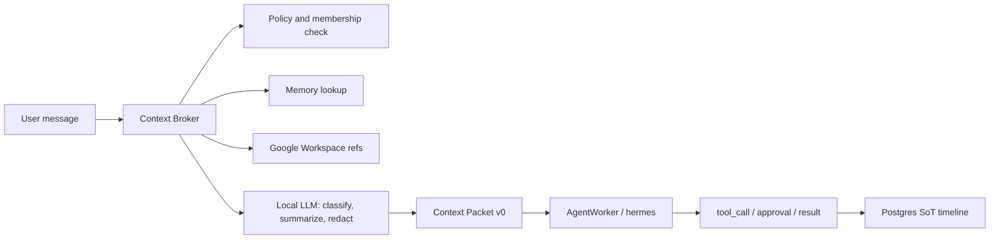

# Local LLM and Context Broker

> Updated: 2026-06-25
> Status: roadmap research, not implementation. Facts are source-linked; product choices are oort decisions.

## 1. Conclusion

oort should not treat the on-device model as a replacement for server agents. The stronger product shape is:

```
user message -> momo Context Broker -> local model for light context work
             -> server AgentWorker/hermes for long reasoning and external tool execution
             -> channel timeline with approval, cost, result, and audit records
```

The local model is best used for intent classification, summarization, context compaction, privacy redaction preview, source ranking, offline lightweight Q&A, and draft generation. Server agents remain responsible for multi-step planning, tool execution, long-running work, and actions that write to external systems.

## 2. Apple Foundation Models Facts

- Apple introduced the Foundation Models framework at WWDC25 as a Swift API for using the system on-device model in apps: [Meet the Foundation Models framework](https://developer.apple.com/videos/play/wwdc2025/286/) and [Deep dive into the Foundation Models framework](https://developer.apple.com/videos/play/wwdc2025/301/).
- Apple describes framework capabilities including guided generation, streaming snapshots, stateful sessions, and tool calling. These fit structured app tasks better than open-ended world-knowledge Q&A.
- Apple research describes the device model as a compact on-device model using a roughly 3B parameter, 2-bit design and reports around 30 tokens/sec on iPhone 15 Pro in its test context: [Introducing Apple Foundation Models](https://machinelearning.apple.com/research/introducing-apple-foundation-models).
- The user phrase "Gemma4 level" is not an Apple-published claim. The supported comparison is Apple's own Gemma-1.1/Llama-3-era benchmark discussion and Google's separate on-device Gemma 3n line: [Introducing Gemma 3n](https://developers.googleblog.com/en/introducing-gemma-3n/).

Product implication: oort should phrase this as "fast private on-device context handling" rather than "server-grade reasoning on device."

## 3. Context Broker v0

The broker is a messenger-layer service boundary that decides what context can be used, how much context to pass, which model path to use, and which approvals are required.



### Broker Inputs

- Channel, thread, root message, recent message window, mentions, slash command, and selected message context action.
- User and member permissions: workspace membership, channel membership, role, plugin grants, Google Workspace grants.
- Runtime limits: cost budget, model policy, approval policy, tenant policy, data residency policy.
- Optional external references: Drive file metadata, Gmail thread metadata, Calendar event metadata, Obsidian/local docs refs.

### Broker Outputs

`Context Packet v0` should be the stable handoff object:

```json
{
  "goal": "answer the user's question or perform the requested task",
  "constraints": ["do not write externally without approval"],
  "decisions": ["workspace policy selected server model for tool execution"],
  "sources": [{"kind": "message", "id": "..."}, {"kind": "drive_file", "url": "..."}],
  "permissions": {"workspace_id": "...", "channel_id": "...", "plugin_scopes": []},
  "budget": {"max_micro_usd": 1000},
  "redactions": [{"kind": "pii", "range": "..."}]
}
```

This packet should be generated before an agent receives broad conversation state.

## 4. Local LLM Use Cases

High-confidence v0 uses:

- Intent: detect `ask`, `summarize`, `create_ticket`, `search_docs`, `schedule`, `approve`, `deny`, `handoff`.
- Context compaction: summarize the last N messages into a bounded packet with source IDs.
- Privacy redaction preview: detect candidate PII/secrets before sending to a server agent.
- Local Q&A: answer short questions from visible channel context when no external write or world knowledge is required.
- Draft generation: write a reply draft, issue title, PR comment, or approval note that the user can edit.
- Source ranking: choose which local/external refs should be fetched before calling hermes.

Avoid in v0:

- Autonomous external writes.
- Long multi-step tool planning.
- High-risk HR/legal/finance conclusions.
- Claims requiring current world knowledge unless the source is fetched and cited.

## 5. Memory Plane v0

Raw chat exhaust should not become long-term memory by default. Memory should be typed, scoped, attributable, and deletable.

| Memory type | Examples | Required fields |
|---|---|---|
| `decision` | "Use Postgres as SoT" | source message/doc, creator, workspace_id, visibility, expiry |
| `preference` | "CEO prefers concise briefings" | subject member, source, visibility, delete path |
| `artifact` | PRD, ticket, runbook, diagram | source URL/path, permissions, checksum or version |
| `task_state` | in-progress issue, blocked PR | owner, status, source issue/PR |
| `external_source_ref` | Drive file, Gmail thread, Calendar event | provider, provider ID, URL, permission snapshot |

Principles:

- Every memory entry needs source attribution and a deletion path.
- Permission should be evaluated at retrieval time, not only at write time.
- Ambiguous permissions should produce an approval/request card rather than silent inclusion.
- Expiry should be explicit for operational or personal preference memory.

## 6. Swift Compatibility Strategy

Foundation Models integration must not break current SwiftPM packages or CI/local gates.

- Put shared types in `MomoCore`, but keep Apple framework calls in platform-specific macOS/iOS targets.
- Guard imports with `#if canImport(FoundationModels)`.
- Guard calls with OS availability checks.
- Provide a fallback implementation that routes to server AgentWorker or a deterministic local stub.
- Keep `clients/Core` Foundation-only.
- Add narrow tests for routing and fallback behavior before adding UI.

Initial tickets:

- `MOMO-130`: macOS Foundation Models capability probe.
- `MOMO-131`: Local Context Copilot.
- `MOMO-132`: Agent Protocol v0 model/card alignment.
- `MOMO-133`: Google Workspace "ask my work" UX.

## 7. Product Positioning

This makes the messenger more than a shell:

- Slack/Mattermost-style chat remains the UI entry point.
- oort owns context, memory, policy, cost, approval, and audit.
- Agents/plugins become governed work surfaces rather than sidecar bots.
- Local LLM makes privacy-sensitive, low-latency context handling feel native on Mac and iPhone.
