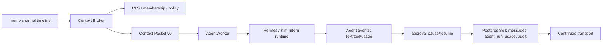

# Three Agent Runtime Analysis

> Updated: 2026-06-25
> Status: roadmap research, not implementation.
> Scope: Hermes agent, internkim/Kim Intern, and openclaw. Code is not copied from external projects.

## 1. Conclusion

oort should become the host of agent work, not another channel adapter attached to an agent runtime.

Hermes and openclaw are strongest when they connect an agent to existing messaging surfaces. oort's strongest position is the reverse: the messenger owns the context packet, permission boundary, approval pause point, audit trail, and cost ledger, then calls an agent runtime through a narrow transport.

This preserves oort's core invariant: all visible work is committed to Postgres first and then transported.

## 2. Hermes Agent

Hermes is a useful reference because it already treats messaging platforms as first-class front doors. Its gateway can connect to Telegram, Discord, Slack, Mattermost, Matrix, LINE, Teams, browser, and others, and routes each platform adapter through a per-chat session store. It also runs cron jobs and delivery flows from the same gateway process. Source: [Hermes Messaging Gateway](https://hermes-agent.nousresearch.com/docs/user-guide/messaging/).

Hermes also has memory/runtime features oort should learn from, not blindly delegate: agent-curated memory, FTS5 session search, skill improvement, subagents, terminal backends, and trajectory compression. Source: [NousResearch/hermes-agent](https://github.com/NousResearch/hermes-agent).

### oort Integration Decision

Use two distinct paths:

| Path | Direction | Purpose | Product role |
|---|---|---|---|
| Hermes platform adapter | Hermes -> oort | Lets a Hermes gateway live inside oort as a platform | Useful compatibility path |
| oort AgentWorker transport | oort -> Hermes | oort invokes Hermes/Kim Intern under oort context, approval, cost, audit | Product default path |

The second path should be canonical. If Hermes memory suggests context, oort may import it as sourced hints, but oort should not expose raw workspace history to Hermes memory without explicit context-packet construction.

### Protocol Notes

- Transport baseline: OpenAI-compatible `/v1/chat/completions` with SSE.
- Required event normalization: `text_delta`, `tool_call`, `tool_progress`, `usage`, `done`, `error`.
- Required oort-owned metadata: `workspace_id`, `channel_id`, `run_id`, `trigger_message_id`, `context_packet_id`, `idempotency_key`.
- Dangerous tool calls must pause `agent_run`; they are not just rendered as cards.

## 3. internkim / Kim Intern

Kim Intern is treated as an internal agent because no public specification can be verified. That makes the integration contract more important than the implementation.

### Recommended v0 Contract

Kim Intern should be made compatible with the same minimum contract as Hermes:

- OpenAI-compatible `POST /v1/chat/completions`.
- `stream=true` SSE.
- Function/tool calls with stable `call_id`, `name`, and JSON arguments.
- Usage reporting with prompt, completion, cached, and reasoning tokens when available.
- Idempotency key support, or oort-side idempotency around a stateless endpoint.
- No direct workspace DB access. All workspace context arrives through `Context Packet v0`.

### Memory Boundary

Kim Intern may have its own memory, but oort should treat it as untrusted external memory unless imported through the Memory Plane.

Allowed:

- Agent-authored notes with source references.
- Skill/procedure suggestions as `agent_skill_note`.
- Session summaries with source message IDs.

Not allowed by default:

- Raw cross-channel memory injection.
- Unsourced claims about users or decisions.
- Memory visible to an agent but not visible to the requesting user.

## 4. openclaw

openclaw is valuable as an adapter and approval-runtime design reference. Its channel plugin docs split native approval delivery into capability/route gates plus smaller pieces such as availability, presentation, transport, interactions, and observation. Source: [OpenClaw channel plugins](https://docs.openclaw.ai/plugins/sdk-channel-plugins).

oort should copy the architecture idea, not the code:

| openclaw lesson | oort adaptation |
|---|---|
| Channel-specific transport is isolated from core approval policy | Centrifugo/macOS/iOS renderers should not own approval policy |
| Presentation and interactions are separate | Approval card rendering differs per client, decision semantics stay server-owned |
| Dedupe, expiry, routing, and observation belong to runtime core | `approval`, `agent_run`, `audit_log`, and status events are Postgres-backed |

## 5. Competitive Reading

Hermes and openclaw both show that the next interface is not "one chatbot in one app." It is a mesh of channels, tools, memory, approvals, and long-running jobs. oort can win only if it makes those pieces inspectable in a team timeline.

The resulting product sentence:

> oort is the work ledger for human and AI teammates: every context decision, tool call, approval, cost, memory citation, and result is visible, permissioned, and replayable in the channel.

## 6. Sources

- [Hermes Messaging Gateway](https://hermes-agent.nousresearch.com/docs/user-guide/messaging/)
- [Hermes platform adapter guide](https://hermes-agent.nousresearch.com/docs/developer-guide/adding-platform-adapters/)
- [NousResearch/hermes-agent](https://github.com/NousResearch/hermes-agent)
- [OpenClaw channel plugins](https://docs.openclaw.ai/plugins/sdk-channel-plugins)
- [openclaw/openclaw](https://github.com/openclaw/openclaw)
