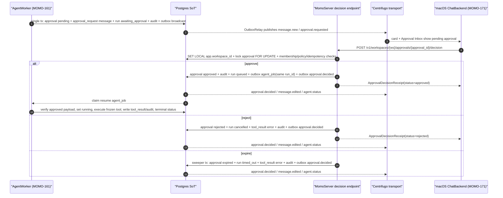

# Approval Decision Server Contract v0

> Updated: 2026-06-26
> Status: MOMO-166 canonical server contract. Documentation and fixtures only.
> Verification target: docs local gate + swift local gate. Endpoint/runtime remains `runtime-unverified`.

## 1. Purpose

MOMO-166 fixes the contract between three slices that were intentionally built separately:

| Slice | Owns | Does not own |
|---|---|---|
| MOMO-161 AgentWorker pause/resume | Pausing a risky `tool_call` into `approval(status='pending')`, `message.type='approval_request'`, `agent_run.status='awaiting_approval'`. Later, executing a resume job that references the same `agent_run.id`. | Human authorization, membership/RLS checks, client idempotency. |
| Server approval decision endpoint | Human approve/reject/expire decisions, RLS/policy checks, decision idempotency, audit rows, `approval.decided` publish, resume-job enqueue or run termination. | Rendering buttons, executing provider tools directly. |
| MOMO-171 macOS approval buttons | Turning inline card/Approval Inbox clicks into `ChatBackend.decideApproval(ApprovalDecisionRequest)` and reflecting `ApprovalDecisionReceipt` plus later realtime confirmation. | Mutating DB state directly or publishing Centrifugo messages. |

Approval is a Postgres-backed protocol checkpoint. It is not a client-only card and not a worker-local callback.

## 2. One Picture



## 3. Canonical HTTP Endpoint

```text
POST /v1/workspaces/{workspace_id}/approvals/{approval_id}/decision
```

The endpoint is a normal user-facing server write path:

- It runs under the app database role, never BYPASSRLS.
- It sets `SET LOCAL app.workspace_id` in the transaction.
- It requires the authenticated member to belong to the workspace and to be allowed to decide the approval.
- It locks the `approval` row with `FOR UPDATE`.
- It accepts decisions only while `approval.status='pending'`.
- It treats `ApprovalDecisionRequest.client_decision_id` as the idempotency key for retries.
- It rechecks workspace/channel visibility and stored capability/policy evidence before approving.

### Request Body

Canonical client request shape is the current MomoCore `ApprovalDecisionRequest`:

```json
{
  "approval_id": "00000000-0000-7000-8000-000000000901",
  "approve": true,
  "reason": "The issue title/body are safe.",
  "client_decision_id": "00000000-0000-7000-8000-000000166001"
}
```

Rules:

- Path `approval_id` is authoritative. If the body also includes `approval_id`, it must match the path.
- `approve=true` maps to DB/event status `approved`.
- `approve=false` maps to DB/event status `rejected`.
- `reason` is optional text stored as `approval.decision_reason`.
- `client_decision_id` must be stable across client retries of the same human click.

MOMO-161's older prose used `"decision": "approved"|"rejected"` as an internal description. Server v0 should expose `approve: Bool` on the public wire because that is what `MomoCore.ApprovalDecisionRequest` and macOS already encode.

### Response Body

The response is the MomoCore `ApprovalDecisionReceipt` shape:

```json
{
  "approval_id": "00000000-0000-7000-8000-000000000901",
  "status": "approved",
  "decided_by": "00000000-0000-7000-8000-000000000201",
  "decided_at_ms": 1782463200000,
  "decision_reason": "The issue title/body are safe."
}
```

Realtime confirmation still arrives through committed outbox publications. The client may optimistically update after the receipt, but `approval.decided` and `message.edited` are the cross-device confirmation.

## 4. Decision Effects

All effects below are one DB transaction per decision. `schema_v0.sql` remains unchanged for this contract; implementation may add a future `approval_decision` or idempotency table in a new migration.

| Case | Preconditions | DB effects | Outbox/realtime | Worker effect |
|---|---|---|---|---|
| Approve | `approval.status='pending'`; requester can decide; stored policy evidence still permits this action | `approval.status='approved'`, `decided_by`, `decided_at`, `decision_reason`; `agent_run.status='queued'`; `audit_log(action='approval.approved')`; `outbox(kind='agent_job')` with `resume_from_approval_id` and frozen approved payload | `approval.decided`, `message.edited` for the approval card, `agent.status` queued/running transition when worker claims | Resume same run; execute only the frozen approved payload; emit `tool_result` and audit. |
| Reject | Same pending decision checks | `approval.status='rejected'`; `agent_run.status='cancelled'`; append `message(type='tool_result', props.is_error=true)`; `audit_log(action='approval.rejected')` | `approval.decided`, `message.edited`, `message.new` tool error, `agent.status` cancelled | No tool execution. |
| Expire | `approval.status='pending'`; `expires_at <= now()`; executed by server/sweeper, not by client | `approval.status='expired'`; `agent_run.status='timed_out'`; append `message(type='tool_result', props.is_error=true)`; `audit_log(action='approval.expired')` | `approval.decided`, `message.edited`, `message.new` timeout result, `agent.status` timed_out | No tool execution. |
| Resume | Existing `approval.status='approved'`; resume job payload references same `run_id` and `resume_from_approval_id` | Worker sets `agent_run.status='running'`, then terminal `succeeded` or `failed`; writes `tool_result`; writes `audit_log(action='tool.executed'|'tool.failed')` | `agent.status`, `message.new` tool result | Worker validates payload hash/evidence and must not ask the model to mutate approved args before execution. |

## 5. Idempotency and Conflicts

Server v0 must distinguish network retries from contradictory decisions:

| Situation | Response |
|---|---|
| Same `client_decision_id`, same member, same approval, same `approve` value | Return the original receipt. |
| Same `client_decision_id`, different approval or different `approve` value | `409 Conflict` with problem detail `approval_decision_idempotency_conflict`. |
| Different `client_decision_id` after approval already left `pending` | `409 Conflict` with current receipt in `current_decision` if available. |
| Approval not visible to requester by workspace/channel policy | `404 Not Found` or `403 Forbidden` according to existing server auth convention, without leaking cross-workspace state. |
| Approval expired before click reaches server | `409 Conflict`, current status `expired`; client removes pending controls after realtime or refresh. |

Because `approval` currently has no unique decision id column, the first runtime implementation can store idempotency in a new migration or a narrow server-side idempotency table. It must not overload `message.client_msg_id`.

## 6. Realtime Contract

Server publications use the existing `RealtimeEnvelope`:

```json
{
  "type": "approval.decided",
  "v": 1,
  "ts": 1782463200000,
  "seq": 42,
  "payload": {
    "action": "decided",
    "approval_id": "00000000-0000-7000-8000-000000000901",
    "run_id": "00000000-0000-7000-8000-000000000161",
    "channel_id": "00000000-0000-7000-8000-000000000010",
    "requested_by": "00000000-0000-7000-8000-000000000101",
    "action_type": "tool_call",
    "status": "approved",
    "payload": {},
    "decided_by": "00000000-0000-7000-8000-000000000201",
    "decision_reason": "The issue title/body are safe."
  }
}
```

Notes:

- `seq` is present when the decision also edits/appends a channel timeline message in the same committed transaction.
- Clients should key pending approval rows by `approval_id`.
- Inline approval card state is read from `message.props.approval_status` first if no realtime event has arrived, then reconciled by `approval.decided`.
- The server publishes through outbox only. macOS never publishes `approval.decided` directly.

## 7. Data Ownership

| Field | Owner | Notes |
|---|---|---|
| `approval.payload` | AgentWorker pause transaction | Frozen proposal. Approve/resume uses this payload, not fresh model output. |
| `approval.status` | Server decision/expiry transaction | Single source of truth for pending/approved/rejected/expired/cancelled. |
| `agent_run.status` | Worker for running/terminal execution; server for decision checkpoint transitions | Server may set `queued`, `cancelled`, or `timed_out` as part of decision/expiry. Worker sets `running` and terminal result after resume. |
| `message.props.approval_status` | Server decision/expiry transaction | Timeline projection for offline/backfill rendering. |
| `ApprovalDecisionRequest` | Client intent | Carries only the human decision intent and retry id. |
| `ApprovalDecisionReceipt` | Server ack | Acknowledges the committed DB decision, not tool execution completion. |

## 8. Fixture Index

Fixtures live in `research/11-agent-runtime/fixtures/approval-decision-server-contract-v0/`.

| Fixture | Covers |
|---|---|
| `approve_request.json` | macOS/MomoCore request body for approve. |
| `approve_response.json` | Server receipt for approve. |
| `reject_request.json` | macOS/MomoCore request body for reject. |
| `reject_response.json` | Server receipt for reject. |
| `expire_sweeper_result.json` | Internal server/sweeper expiry effect summary and receipt projection. |
| `resume_agent_job_payload.json` | Outbox `agent_job` payload used by AgentWorker to resume the same run after approval. |
| `approval_decided_event.json` | Realtime envelope for channel subscribers. |

## 9. Implementation Boundary

In scope for MOMO-166:

- Contract document.
- JSON request/response/effect fixtures.
- STATUS/ROADMAP/BUILD_TICKETS references.
- Local docs and Swift gates.

Out of scope and left as runtime follow-up:

- Implement `POST /v1/workspaces/{ws}/approvals/{approval_id}/decision`.
- Add server-side approval decision idempotency storage.
- Add expiry sweeper.
- Add AgentWorker resume-job execution against a live provider tool.
- Add end-to-end runtime verification with mock Hermes/tool provider.

Suggested runtime tickets:

| Follow-up | Scope |
|---|---|
| MOMO-166-R1 | Server decision endpoint + idempotency migration + unit tests. |
| MOMO-166-R2 | Expiry sweeper + timeout tool_result/audit/outbox behavior. |
| MOMO-166-R3 | AgentWorker resume execution + mock-provider runtime e2e for approve/reject/expire. |
| MOMO-166-R4 | Live macOS `LiveChatBackend` REST binding to server endpoint after MOMO-171 UI button path. |
